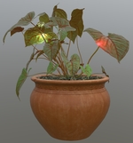
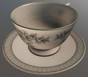
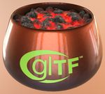
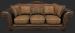

# glTF 2.0 Sample Assets

## Models tagged with **showcase**

Models that are featured in some glTF/Khronos publicity.

## Other Tagged Listings

* [#all](Models.md) - All models listed alphabetically.
* [#core](Models-core.md) - Models that only use the core glTF V2.0 features and capabilities.
* [#extension](Models-extension.md) - Models that use one or more extensions.
* [#issues](Models-issues.md) - Models with one or more issues with respect to ownership, license, or markings.
* [#showcase](Models-showcase.md) - Models that are featured in some glTF/Khronos publicity.
* [#testing](Models-testing.md) - Models that are used for testing various features or capabilities of importers, viewers, or converters.
* [#video](Models-video.md) - Models used in any glTF video tutorial.
* [#written](Models-written.md) - Models used in any written glTF tutorial or guide.

| Model   | Description |
|---------|-------------|
| [A Beautiful Game](ABeautifulGame/README.md)  [Show](https://github.khronos.org/glTF-Sample-Viewer-Release/?model=https://raw.GithubUserContent.com/KhronosGroup/glTF-Sample-Assets/main/./Models/ABeautifulGame/glTF-Binary/ABeautifulGame.glb) -- [Download GLB](https://raw.GithubUserContent.com/KhronosGroup/glTF-Sample-Assets/main/./Models/ABeautifulGame/glTF-Binary/ABeautifulGame.glb) | Chess set using transmission and volume. Credit: &copy; 2020, ASWF. [CC BY 4.0 International](https://creativecommons.org/licenses/by/4.0/legalcode)  - MaterialX Project for Original model &copy; 2022, Ed Mackey. [CC BY 4.0 International](https://creativecommons.org/licenses/by/4.0/legalcode)  - Ed Mackey for Conversion to glTF |
| [Anisotropy Barn Lamp](AnisotropyBarnLamp/README.md)  [Show](https://github.khronos.org/glTF-Sample-Viewer-Release/?model=https://raw.GithubUserContent.com/KhronosGroup/glTF-Sample-Assets/main/./Models/AnisotropyBarnLamp/glTF-Binary/AnisotropyBarnLamp.glb) -- [Download GLB](https://raw.GithubUserContent.com/KhronosGroup/glTF-Sample-Assets/main/./Models/AnisotropyBarnLamp/glTF-Binary/AnisotropyBarnLamp.glb) | Wayfair AnisotropyBarnLamp model using anisotropy, clearcoat, emissive_strength, transmission, volume, and basisu extensions. Credit: &copy; 2023, Copyright 2023 Wayfair, LLC. [CC BY 4.0 International](https://creativecommons.org/licenses/by/4.0/legalcode)  - Eric Chadwick for Everything |
| [Car Concept](CarConcept/README.md)  [Show](https://github.khronos.org/glTF-Sample-Viewer-Release/?model=https://raw.GithubUserContent.com/KhronosGroup/glTF-Sample-Assets/main/./Models/CarConcept/glTF-Binary/CarConcept.glb) -- [Download GLB](https://raw.GithubUserContent.com/KhronosGroup/glTF-Sample-Assets/main/./Models/CarConcept/glTF-Binary/CarConcept.glb) | Concept car with Khronos logos and material variants Credit: &copy; 2024, Darmstadt Graphics Group GmbH. [CC BY 4.0 International](https://creativecommons.org/licenses/by/4.0/legalcode)  - Eric Chadwick for Model and textures &copy; 2015, Khronos Group. [Khronos Trademark or Logo]()  - Non-copyrightable logo for Khronos logo &copy; 2017, Khronos Group. [Khronos Trademark or Logo]()  - Non-copyrightable logo for 3D Commerce logo |
| [Chronograph Watch](ChronographWatch/README.md)  [Show](https://github.khronos.org/glTF-Sample-Viewer-Release/?model=https://raw.GithubUserContent.com/KhronosGroup/glTF-Sample-Assets/main/./Models/ChronographWatch/glTF-Binary/ChronographWatch.glb) -- [Download GLB](https://raw.GithubUserContent.com/KhronosGroup/glTF-Sample-Assets/main/./Models/ChronographWatch/glTF-Binary/ChronographWatch.glb) | Wrist watch with Khronos logos and material variants Credit: &copy; 2025, Darmstadt Graphics Group GmbH. [CC BY 4.0 International](https://creativecommons.org/licenses/by/4.0/legalcode)  - Eric Chadwick for Model and textures &copy; 2015, Khronos Group. [Khronos Trademark or Logo]()  - Non-copyrightable logo for Khronos logo &copy; 2017, Khronos Group. [Khronos Trademark or Logo]()  - Non-copyrightable logo for 3D Commerce logo &copy; 2020, Darmstadt Graphics Group GmbH. [DGG Trademark or Logo]()  - Copyrightable logo for DGG logo |
| [Commercial Refrigerator](CommercialRefrigerator/README.md)  [Show](https://github.khronos.org/glTF-Sample-Viewer-Release/?model=https://raw.GithubUserContent.com/KhronosGroup/glTF-Sample-Assets/main/./Models/CommercialRefrigerator/glTF-Binary/CommercialRefrigerator.glb) -- [Download GLB](https://raw.GithubUserContent.com/KhronosGroup/glTF-Sample-Assets/main/./Models/CommercialRefrigerator/glTF-Binary/CommercialRefrigerator.glb) | Commercial refrigerator with glass condensation, champagne bottles, and door animation. Credit: &copy; 2025, Darmstadt Graphics Group GmbH. [CC BY 4.0 International](https://creativecommons.org/licenses/by/4.0/legalcode)  - Eric Chadwick for Model and textures and all images in the README.md &copy; 2025, Sean Thomas. [CC BY 4.0 International](https://creativecommons.org/licenses/by/4.0/legalcode)  - Sean Thomas for This work is based on 'Commercial Fridge' (https://sketchfab.com/3d-models/commercial-fridge-2174e1e4f1f24f1a95aa110ee060f473) by Sean Thomas (https://sketchfab.com/foon.) licensed under CC-BY-4.0 (http://creativecommons.org/licenses/by/4.0/) |
| [Damaged Helmet](DamagedHelmet/README.md)  [Show](https://github.khronos.org/glTF-Sample-Viewer-Release/?model=https://raw.GithubUserContent.com/KhronosGroup/glTF-Sample-Assets/main/./Models/DamagedHelmet/glTF-Binary/DamagedHelmet.glb) -- [Download GLB](https://raw.GithubUserContent.com/KhronosGroup/glTF-Sample-Assets/main/./Models/DamagedHelmet/glTF-Binary/DamagedHelmet.glb) | Flight helmet with damage Credit: &copy; 2018, ctxwing. [CC BY 4.0 International](https://creativecommons.org/licenses/by/4.0/legalcode)  - ctxwing for Rebuild and conversion to glTF &copy; 2016, theblueturtle_. [CC BY-NC 4.0 International](https://creativecommons.org/licenses/by-nc/4.0/legalcode)  - theblueturtle_ for Earlier version of model |
| [Diffuse Transmission Plant](DiffuseTransmissionPlant/README.md)  [Show](https://github.khronos.org/glTF-Sample-Viewer-Release/?model=https://raw.GithubUserContent.com/KhronosGroup/glTF-Sample-Assets/main/./Models/DiffuseTransmissionPlant/glTF-Binary/DiffuseTransmissionPlant.glb) -- [Download GLB](https://raw.GithubUserContent.com/KhronosGroup/glTF-Sample-Assets/main/./Models/DiffuseTransmissionPlant/glTF-Binary/DiffuseTransmissionPlant.glb) | Potted plant asset using Diffuse Transmission extension. Credit: &copy; 2024, Darmstadt Graphics Group GmbH. [CC BY 4.0 International](https://creativecommons.org/licenses/by/4.0/legalcode)  - Eric Chadwick for Materials and animation &copy; 2021, Public domain. [CC0 1.0 Universal](https://creativecommons.org/publicdomain/zero/1.0/legalcode)  - Rico Cilliers for Original asset |
| [Diffuse Transmission Teacup](DiffuseTransmissionTeacup/README.md)  [Show](https://github.khronos.org/glTF-Sample-Viewer-Release/?model=https://raw.GithubUserContent.com/KhronosGroup/glTF-Sample-Assets/main/./Models/DiffuseTransmissionTeacup/glTF-Binary/DiffuseTransmissionTeacup.glb) -- [Download GLB](https://raw.GithubUserContent.com/KhronosGroup/glTF-Sample-Assets/main/./Models/DiffuseTransmissionTeacup/glTF-Binary/DiffuseTransmissionTeacup.glb) | DiffuseTransmissionTeacup model using Diffuse Transmission extension. Credit: &copy; 2023, Public domain. [CC0 1.0 Universal](https://creativecommons.org/share-your-work/public-domain/cc0)  - Polyhaven.com, and Eric Chadwick for Models and Textures |
| [Flight Helmet](FlightHelmet/README.md)  [Show](https://github.khronos.org/glTF-Sample-Viewer-Release/?model=https://raw.GithubUserContent.com/KhronosGroup/glTF-Sample-Assets/main/./Models/FlightHelmet/glTF/FlightHelmet.gltf) | Displayed flight helmet on a wooden stand. Credit: &copy; 2018, Public. [CC0 1.0 Universal](https://creativecommons.org/publicdomain/zero/1.0/legalcode)  - Gary Hsu for Conversion from Maya |
| [Glass Hurricane Candle Holder](GlassHurricaneCandleHolder/README.md)  [Show](https://github.khronos.org/glTF-Sample-Viewer-Release/?model=https://raw.GithubUserContent.com/KhronosGroup/glTF-Sample-Assets/main/./Models/GlassHurricaneCandleHolder/glTF-Binary/GlassHurricaneCandleHolder.glb) -- [Download GLB](https://raw.GithubUserContent.com/KhronosGroup/glTF-Sample-Assets/main/./Models/GlassHurricaneCandleHolder/glTF-Binary/GlassHurricaneCandleHolder.glb) | Glass holder using Materials Tranmission and Materials Volume extensions. Credit: &copy; 2021, Wayfair, LLC. [CC BY 4.0 International](https://creativecommons.org/licenses/by/4.0/legalcode)  - Eric Chadwick for Model and textures &copy; 2015, Khronos Group. [Khronos Trademark or Logo]()  - Non-copyrightable logo for Khronos logo &copy; 2017, Khronos Group. [Khronos Trademark or Logo]()  - Non-copyrightable logo for glTF logo |
| [Iridescence Lamp](IridescenceLamp/README.md)  [Show](https://github.khronos.org/glTF-Sample-Viewer-Release/?model=https://raw.GithubUserContent.com/KhronosGroup/glTF-Sample-Assets/main/./Models/IridescenceLamp/glTF-Binary/IridescenceLamp.glb) -- [Download GLB](https://raw.GithubUserContent.com/KhronosGroup/glTF-Sample-Assets/main/./Models/IridescenceLamp/glTF-Binary/IridescenceLamp.glb) | Wayfair Lamp model using transmission, volume, and KHR_materials_iridescence. Credit: &copy; 2022, Wayfair, LLC. [CC BY 4.0 International](https://creativecommons.org/licenses/by/4.0/legalcode)  - Eric Chadwick for Everything |
| [Iridescent Dish with Olives](IridescentDishWithOlives/README.md)  [Show](https://github.khronos.org/glTF-Sample-Viewer-Release/?model=https://raw.GithubUserContent.com/KhronosGroup/glTF-Sample-Assets/main/./Models/IridescentDishWithOlives/glTF-Binary/IridescentDishWithOlives.glb) -- [Download GLB](https://raw.GithubUserContent.com/KhronosGroup/glTF-Sample-Assets/main/./Models/IridescentDishWithOlives/glTF-Binary/IridescentDishWithOlives.glb) | Dish using transmission, volume, IOR, and specular. [Issues: non-Khronos mark] Credit: &copy; 2020, Wayfair, LLC. [CC BY 4.0 International](https://creativecommons.org/licenses/by/4.0/legalcode)  - Eric Chadwick for Everything |
| [Materials Variants Shoe](MaterialsVariantsShoe/README.md)  [Show](https://github.khronos.org/glTF-Sample-Viewer-Release/?model=https://raw.GithubUserContent.com/KhronosGroup/glTF-Sample-Assets/main/./Models/MaterialsVariantsShoe/glTF-Binary/MaterialsVariantsShoe.glb) -- [Download GLB](https://raw.GithubUserContent.com/KhronosGroup/glTF-Sample-Assets/main/./Models/MaterialsVariantsShoe/glTF-Binary/MaterialsVariantsShoe.glb) | A model of a shoe that illustrates use of the KHR_materials_variants extension with three materials included in the asset. Credit: &copy; 2021, Shopify. [CC BY 4.0 International](https://creativecommons.org/licenses/by/4.0/legalcode)  - Shopify for Everthing |
| [Mosquito In Amber](MosquitoInAmber/README.md)  [Show](https://github.khronos.org/glTF-Sample-Viewer-Release/?model=https://raw.GithubUserContent.com/KhronosGroup/glTF-Sample-Assets/main/./Models/MosquitoInAmber/glTF-Binary/MosquitoInAmber.glb) -- [Download GLB](https://raw.GithubUserContent.com/KhronosGroup/glTF-Sample-Assets/main/./Models/MosquitoInAmber/glTF-Binary/MosquitoInAmber.glb) | Mosquito in amber by Sketchfab, using transmission, IOR, and volume. Credit: &copy; 2018, Sketchfab. [CC BY 4.0 International](https://creativecommons.org/licenses/by/4.0/legalcode)  - Loic Norgeot for Model &copy; 2019, Sketchfab. [CC BY 4.0 International](https://creativecommons.org/licenses/by/4.0/legalcode)  - Sketchfab for Real-time refraction |
| [PotOfCoals](PotOfCoals/README.md)  [Show](https://github.khronos.org/glTF-Sample-Viewer-Release/?model=https://raw.GithubUserContent.com/KhronosGroup/glTF-Sample-Assets/main/./Models/PotOfCoals/glTF-Binary/PotOfCoals.glb) -- [Download GLB](https://raw.GithubUserContent.com/KhronosGroup/glTF-Sample-Assets/main/./Models/PotOfCoals/glTF-Binary/PotOfCoals.glb) | Burnt copper pot with a clearcoat, containing emissive hot coals. Credit: &copy; 2023, Darmstadt Graphics Group GmbH. [CC BY 4.0 International](https://creativecommons.org/licenses/by/4.0/legalcode)  - Eric Chadwick for Model and textures &copy; 2015, Khronos Group. [Khronos Trademark or Logo]()  - Non-copyrightable logo for Khronos logo &copy; 2017, Khronos Group. [Khronos Trademark or Logo]()  - Non-copyrightable logo for glTF logo |
| [Pot of Coals Animation Pointer](PotOfCoalsAnimationPointer/README.md)  [Show](https://github.khronos.org/glTF-Sample-Viewer-Release/?model=https://raw.GithubUserContent.com/KhronosGroup/glTF-Sample-Assets/main/./Models/PotOfCoalsAnimationPointer/glTF-Binary/PotOfCoalsAnimationPointer.glb) -- [Download GLB](https://raw.GithubUserContent.com/KhronosGroup/glTF-Sample-Assets/main/./Models/PotOfCoalsAnimationPointer/glTF-Binary/PotOfCoalsAnimationPointer.glb) | Burnt copper pot with a clearcoat, containing emissive hot coals, and animated heat refraction. Credit: &copy; 2024, Darmstadt Graphics Group GmbH. [CC BY 4.0 International](https://creativecommons.org/licenses/by/4.0/legalcode)  - Eric Chadwick for Model and textures &copy; 2015, Khronos Group. [Khronos Trademark or Logo]()  - Non-copyrightable logo for Khronos logo &copy; 2017, Khronos Group. [Khronos Trademark or Logo]()  - Non-copyrightable logo for glTF logo |
| [Sheen Chair](SheenChair/README.md)  [Show](https://github.khronos.org/glTF-Sample-Viewer-Release/?model=https://raw.GithubUserContent.com/KhronosGroup/glTF-Sample-Assets/main/./Models/SheenChair/glTF-Binary/SheenChair.glb) -- [Download GLB](https://raw.GithubUserContent.com/KhronosGroup/glTF-Sample-Assets/main/./Models/SheenChair/glTF-Binary/SheenChair.glb) | Chair using material variants and sheen. Credit: &copy; 2020, Wayfair, LLC. [CC0 1.0 Universal](https://creativecommons.org/publicdomain/zero/1.0/legalcode)  - Eric Chadwick for Everything |
| [Sheen Cloth](SheenCloth/README.md)  [Show](https://github.khronos.org/glTF-Sample-Viewer-Release/?model=https://raw.GithubUserContent.com/KhronosGroup/glTF-Sample-Assets/main/./Models/SheenCloth/glTF/SheenCloth.gltf) | Fabric example using sheen. Credit: &copy; 2020, Microsoft. [CC0 1.0 Universal](https://creativecommons.org/publicdomain/zero/1.0/legalcode)  - Microsoft for Everything |
| [Sheen Wood Leather Sofa](SheenWoodLeatherSofa/README.md)  [Show](https://github.khronos.org/glTF-Sample-Viewer-Release/?model=https://raw.GithubUserContent.com/KhronosGroup/glTF-Sample-Assets/main/./Models/SheenWoodLeatherSofa/glTF-Binary/SheenWoodLeatherSofa.glb) -- [Download GLB](https://raw.GithubUserContent.com/KhronosGroup/glTF-Sample-Assets/main/./Models/SheenWoodLeatherSofa/glTF-Binary/SheenWoodLeatherSofa.glb) | Sofa asset using sheen, specular, and high-quality tiling textures. Credit: &copy; 2024, Darmstadt Graphics Group GmbH. [CC BY 4.0 International](https://creativecommons.org/licenses/by/4.0/legalcode)  - Eric Chadwick for Improvements &copy; 2021, Public domain. [CC0 1.0 Universal](https://creativecommons.org/publicdomain/zero/1.0/legalcode)  - Fran Calvente for Original asset |
| [Specular Silk Pouf](SpecularSilkPouf/README.md)  [Show](https://github.khronos.org/glTF-Sample-Viewer-Release/?model=https://raw.GithubUserContent.com/KhronosGroup/glTF-Sample-Assets/main/./Models/SpecularSilkPouf/glTF-Binary/SpecularSilkPouf.glb) -- [Download GLB](https://raw.GithubUserContent.com/KhronosGroup/glTF-Sample-Assets/main/./Models/SpecularSilkPouf/glTF-Binary/SpecularSilkPouf.glb) | Wayfair SpecularSilkPouf model using sheen and specular extensions. Credit: &copy; 2023, Copyright 2023 Wayfair, LLC. [CC BY 4.0 International](https://creativecommons.org/licenses/by/4.0/legalcode)  - Eric Chadwick for Everything |
| [Stained Glass Lamp](StainedGlassLamp/README.md)  [Show](https://github.khronos.org/glTF-Sample-Viewer-Release/?model=https://raw.GithubUserContent.com/KhronosGroup/glTF-Sample-Assets/main/./Models/StainedGlassLamp/glTF/StainedGlassLamp.gltf) | A real product, a Tiffany-style stained glass table lamp sold on the Wayfair website. Credit: &copy; 2021, Wayfair. [CC BY 4.0 International](https://creativecommons.org/licenses/by/4.0/legalcode)  - Eric Chadwick for Everything |
| [Sunglasses Khronos](SunglassesKhronos/README.md)  [Show](https://github.khronos.org/glTF-Sample-Viewer-Release/?model=https://raw.GithubUserContent.com/KhronosGroup/glTF-Sample-Assets/main/./Models/SunglassesKhronos/glTF-Binary/SunglassesKhronos.glb) -- [Download GLB](https://raw.GithubUserContent.com/KhronosGroup/glTF-Sample-Assets/main/./Models/SunglassesKhronos/glTF-Binary/SunglassesKhronos.glb) | Sunglasses with Khronos logos and iridescent lenses Credit: &copy; 2024, Darmstadt Graphics Group GmbH. [CC BY 4.0 International](https://creativecommons.org/licenses/by/4.0/legalcode)  - Eric Chadwick for Model and textures and all images in the README.md &copy; 2015, Khronos Group. [Khronos Trademark or Logo]()  - Non-copyrightable logo for Khronos logo &copy; 2017, Khronos Group. [Khronos Trademark or Logo]()  - Non-copyrightable logo for 3D Commerce logo |
| [Toy Car](ToyCar/README.md)  [Show](https://github.khronos.org/glTF-Sample-Viewer-Release/?model=https://raw.GithubUserContent.com/KhronosGroup/glTF-Sample-Assets/main/./Models/ToyCar/glTF-Binary/ToyCar.glb) -- [Download GLB](https://raw.GithubUserContent.com/KhronosGroup/glTF-Sample-Assets/main/./Models/ToyCar/glTF-Binary/ToyCar.glb) | Toy car example using transmission, clearcoat, and sheen. Credit: &copy; 2020, Public. [CC0 1.0 Universal](https://creativecommons.org/publicdomain/zero/1.0/legalcode)  - Guido Odendahl for Initial car model &copy; 2020, Public. [CC0 1.0 Universal](https://creativecommons.org/publicdomain/zero/1.0/legalcode)  - Eric Chadwick for Extensions and scene composition |
---

### Copyright

&copy; 2023, The Khronos Group.

**License:** [Creative Commons Attribtution 4.0 International](https://creativecommons.org/licenses/by/4.0/legalcode)

#### Generated by modelmetadata
