# glTF 2.0 Sample Assets

## Models tagged with **testing**

Models that are used for testing various features or capabilities of importers, viewers, or converters.

## Other Tagged Listings

* [#all](Models.md) - All models listed alphabetically.
* [#core](Models-core.md) - Models that only use the core glTF V2.0 features and capabilities.
* [#extension](Models-extension.md) - Models that use one or more extensions.
* [#issues](Models-issues.md) - Models with one or more issues with respect to ownership, license, or markings.
* [#showcase](Models-showcase.md) - Models that are featured in some glTF/Khronos publicity.
* [#testing](Models-testing.md) - Models that are used for testing various features or capabilities of importers, viewers, or converters.
* [#video](Models-video.md) - Models used in any glTF video tutorial.
* [#written](Models-written.md) - Models used in any written glTF tutorial or guide.

| Model   | Description |
|---------|-------------|
| [Alpha Blend Mode Test](AlphaBlendModeTest/README.md) [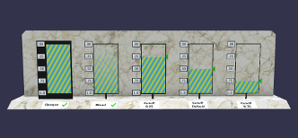](AlphaBlendModeTest/README.md) [Show](https://github.khronos.org/glTF-Sample-Viewer-Release/?model=https://raw.GithubUserContent.com/KhronosGroup/glTF-Sample-Assets/main/./Models/AlphaBlendModeTest/glTF-Binary/AlphaBlendModeTest.glb) -- [Download GLB](https://raw.GithubUserContent.com/KhronosGroup/glTF-Sample-Assets/main/./Models/AlphaBlendModeTest/glTF-Binary/AlphaBlendModeTest.glb) | Tests alpha modes and settings. Credit: &copy; 2018, Analytical Graphics, Inc.. [CC BY 4.0 International](https://creativecommons.org/licenses/by/4.0/legalcode)  - Ed Mackey for Everything |
| [Animated Cube](AnimatedCube/README.md)  [Show](https://github.khronos.org/glTF-Sample-Viewer-Release/?model=https://raw.GithubUserContent.com/KhronosGroup/glTF-Sample-Assets/main/./Models/AnimatedCube/glTF/AnimatedCube.gltf) | Same as 'Cube', but having a linear rotation animation. Credit: &copy; 2017, UX3D. [CC0 1.0 Universal](https://creativecommons.org/publicdomain/zero/1.0/legalcode)  - Norbert Nopper for Everything |
| [Animated Morph Cube](AnimatedMorphCube/README.md)  [Show](https://github.khronos.org/glTF-Sample-Viewer-Release/?model=https://raw.GithubUserContent.com/KhronosGroup/glTF-Sample-Assets/main/./Models/AnimatedMorphCube/glTF-Binary/AnimatedMorphCube.glb) -- [Download GLB](https://raw.GithubUserContent.com/KhronosGroup/glTF-Sample-Assets/main/./Models/AnimatedMorphCube/glTF-Binary/AnimatedMorphCube.glb) | Demonstrates a simple cube with two simple morph targets and an animation that transitions between them both. Credit: &copy; 2017, Public. [CC0 1.0 Universal](https://creativecommons.org/publicdomain/zero/1.0/legalcode)  - Microsoft for Everything |
| [Animated Morph Sphere](AnimatedMorphSphere/README.md)  [Show](https://github.khronos.org/glTF-Sample-Viewer-Release/?model=https://raw.GithubUserContent.com/KhronosGroup/glTF-Sample-Assets/main/./Models/AnimatedMorphSphere/glTF-Binary/AnimatedMorphSphere.glb) -- [Download GLB](https://raw.GithubUserContent.com/KhronosGroup/glTF-Sample-Assets/main/./Models/AnimatedMorphSphere/glTF-Binary/AnimatedMorphSphere.glb) | This sample is similar to the Animated Morph Cube, but the two morph targets move many more vertices and are more extreme than with the cube. Credit: &copy; 2017, Public. [CC0 1.0 Universal](https://creativecommons.org/publicdomain/zero/1.0/legalcode)  - Microsoft for Everything |
| [AnimatedTriangle](AnimatedTriangle/README.md)  [Show](https://github.khronos.org/glTF-Sample-Viewer-Release/?model=https://raw.GithubUserContent.com/KhronosGroup/glTF-Sample-Assets/main/./Models/AnimatedTriangle/glTF/AnimatedTriangle.gltf) | This sample is similar to the Triangle, but the node has a rotation property that is modified with a simple animation Credit: &copy; 2017, Public. [CC0 1.0 Universal](https://creativecommons.org/publicdomain/zero/1.0/legalcode)  - javagl for Everything |
| [Anisotropy Disc Test](AnisotropyDiscTest/README.md) [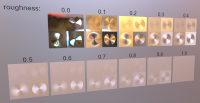](AnisotropyDiscTest/README.md) [Show](https://github.khronos.org/glTF-Sample-Viewer-Release/?model=https://raw.GithubUserContent.com/KhronosGroup/glTF-Sample-Assets/main/./Models/AnisotropyDiscTest/glTF-Binary/AnisotropyDiscTest.glb) -- [Download GLB](https://raw.GithubUserContent.com/KhronosGroup/glTF-Sample-Assets/main/./Models/AnisotropyDiscTest/glTF-Binary/AnisotropyDiscTest.glb) | This model tests the texturemap for KHR_materials_anisotropy. Credit: &copy; 2023, Public. [CC0 1.0 Universal](https://creativecommons.org/publicdomain/zero/1.0/legalcode)  - Eric Chadwick for Everything |
| [Anisotropy Rotation Test](AnisotropyRotationTest/README.md)  [Show](https://github.khronos.org/glTF-Sample-Viewer-Release/?model=https://raw.GithubUserContent.com/KhronosGroup/glTF-Sample-Assets/main/./Models/AnisotropyRotationTest/glTF-Binary/AnisotropyRotationTest.glb) -- [Download GLB](https://raw.GithubUserContent.com/KhronosGroup/glTF-Sample-Assets/main/./Models/AnisotropyRotationTest/glTF-Binary/AnisotropyRotationTest.glb) | This model tests rotational offsets for KHR_materials_anisotropy. Credit: &copy; 2023, Analytical Graphics, Inc.. [CC BY 4.0 International](https://creativecommons.org/licenses/by/4.0/legalcode)  - Ed Mackey for Everything |
| [Anisotropy Strength Test](AnisotropyStrengthTest/README.md)  [Show](https://github.khronos.org/glTF-Sample-Viewer-Release/?model=https://raw.GithubUserContent.com/KhronosGroup/glTF-Sample-Assets/main/./Models/AnisotropyStrengthTest/glTF-Binary/AnisotropyStrengthTest.glb) -- [Download GLB](https://raw.GithubUserContent.com/KhronosGroup/glTF-Sample-Assets/main/./Models/AnisotropyStrengthTest/glTF-Binary/AnisotropyStrengthTest.glb) | This model tests the strength parameter for KHR_materials_anisotropy. Credit: &copy; 2023, Public. [CC0 1.0 Universal](https://creativecommons.org/publicdomain/zero/1.0/legalcode)  - Ed Mackey for Everything |
| [Antique Camera](AntiqueCamera/README.md)  [Show](https://github.khronos.org/glTF-Sample-Viewer-Release/?model=https://raw.GithubUserContent.com/KhronosGroup/glTF-Sample-Assets/main/./Models/AntiqueCamera/glTF-Binary/AntiqueCamera.glb) -- [Download GLB](https://raw.GithubUserContent.com/KhronosGroup/glTF-Sample-Assets/main/./Models/AntiqueCamera/glTF-Binary/AntiqueCamera.glb) | Static model of old camera on a tripod. [Issues: non-Khronos mark] Credit: &copy; 2018, UX3D. [CC0 1.0 Universal](https://creativecommons.org/publicdomain/zero/1.0/legalcode)  - Maximillan Kamps for Everything &copy; 2017, UX3D. [UX3D Trademark or Logo]()  - Non-copyrightable logo for UX3D logo |
| [Attenuation Test](AttenuationTest/README.md)  [Show](https://github.khronos.org/glTF-Sample-Viewer-Release/?model=https://raw.GithubUserContent.com/KhronosGroup/glTF-Sample-Assets/main/./Models/AttenuationTest/glTF-Binary/AttenuationTest.glb) -- [Download GLB](https://raw.GithubUserContent.com/KhronosGroup/glTF-Sample-Assets/main/./Models/AttenuationTest/glTF-Binary/AttenuationTest.glb) | Tests the interactions between attenuation, thickness, and scale. Credit: &copy; 2021, Analytical Graphics, Inc.. [CC BY 4.0 International](https://creativecommons.org/licenses/by/4.0/legalcode)  - Ed Mackey for Everything |
| [Avocado](Avocado/README.md)  [Show](https://github.khronos.org/glTF-Sample-Viewer-Release/?model=https://raw.GithubUserContent.com/KhronosGroup/glTF-Sample-Assets/main/./Models/Avocado/glTF-Binary/Avocado.glb) -- [Download GLB](https://raw.GithubUserContent.com/KhronosGroup/glTF-Sample-Assets/main/./Models/Avocado/glTF-Binary/Avocado.glb) | A natural object created with Core glTF 2.0 Credit: &copy; 2017, Public. [CC0 1.0 Universal](https://creativecommons.org/publicdomain/zero/1.0/legalcode)  - Microsoft for Everything |
| [Barramundi Fish](BarramundiFish/README.md)  [Show](https://github.khronos.org/glTF-Sample-Viewer-Release/?model=https://raw.GithubUserContent.com/KhronosGroup/glTF-Sample-Assets/main/./Models/BarramundiFish/glTF-Binary/BarramundiFish.glb) -- [Download GLB](https://raw.GithubUserContent.com/KhronosGroup/glTF-Sample-Assets/main/./Models/BarramundiFish/glTF-Binary/BarramundiFish.glb) | A fish created with Core glTF 2.0 Credit: &copy; 2017, Public. [CC0 1.0 Universal](https://creativecommons.org/publicdomain/zero/1.0/legalcode)  - Microsoft for Everything |
| [Boom Box](BoomBox/README.md)  [Show](https://github.khronos.org/glTF-Sample-Viewer-Release/?model=https://raw.GithubUserContent.com/KhronosGroup/glTF-Sample-Assets/main/./Models/BoomBox/glTF-Binary/BoomBox.glb) -- [Download GLB](https://raw.GithubUserContent.com/KhronosGroup/glTF-Sample-Assets/main/./Models/BoomBox/glTF-Binary/BoomBox.glb) | A common object with glowing front panel created with Core glTF 2.0. Credit: &copy; 2017, Public. [CC0 1.0 Universal](https://creativecommons.org/publicdomain/zero/1.0/legalcode)  - Microsoft for Everything |
| [Boom Box with Axes](BoomBoxWithAxes/README.md) [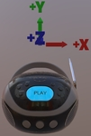](BoomBoxWithAxes/README.md) [Show](https://github.khronos.org/glTF-Sample-Viewer-Release/?model=https://raw.GithubUserContent.com/KhronosGroup/glTF-Sample-Assets/main/./Models/BoomBoxWithAxes/glTF/BoomBoxWithAxes.gltf) | Shows X, Y, and Z axis default orientations. Credit: &copy; 2018, Public. [CC0 1.0 Universal](https://creativecommons.org/publicdomain/zero/1.0/legalcode)  - Microsoft for Everything |
| [Box](Box/README.md)  [Show](https://github.khronos.org/glTF-Sample-Viewer-Release/?model=https://raw.GithubUserContent.com/KhronosGroup/glTF-Sample-Assets/main/./Models/Box/glTF-Binary/Box.glb) -- [Download GLB](https://raw.GithubUserContent.com/KhronosGroup/glTF-Sample-Assets/main/./Models/Box/glTF-Binary/Box.glb) | One mesh and one material. Start with this. Credit: &copy; 2017, Cesium. [CC BY 4.0 International](https://creativecommons.org/licenses/by/4.0/legalcode)  - Cesium for Everything |
| [Box With Spaces](Box With Spaces/README.md) [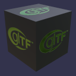](Box With Spaces/README.md) [Show](https://github.khronos.org/glTF-Sample-Viewer-Release/?model=https://raw.GithubUserContent.com/KhronosGroup/glTF-Sample-Assets/main/./Models/Box%20With%20Spaces/glTF/Box%20With%20Spaces.gltf) | Box with URI-encoded spaces in the texture names used by a simple PBR material. Credit: &copy; 2017, Analytical Graphics, Inc.. [CC0 1.0 Universal](https://creativecommons.org/publicdomain/zero/1.0/legalcode)  - Ed Mackey for Everything &copy; 2017, Khronos Group. [Khronos Trademark or Logo]()  - Non-copyrightable logo for glTF logo |
| [Box Animated](BoxAnimated/README.md)  [Show](https://github.khronos.org/glTF-Sample-Viewer-Release/?model=https://raw.GithubUserContent.com/KhronosGroup/glTF-Sample-Assets/main/./Models/BoxAnimated/glTF-Binary/BoxAnimated.glb) -- [Download GLB](https://raw.GithubUserContent.com/KhronosGroup/glTF-Sample-Assets/main/./Models/BoxAnimated/glTF-Binary/BoxAnimated.glb) | Rotation and Translation Animations. Start with this to test animations. Credit: &copy; 2017, Cesium. [CC BY 4.0 International](https://creativecommons.org/licenses/by/4.0/legalcode)  - Cesium for Everything |
| [Box with interleaved position and normal attributes](BoxInterleaved/README.md) [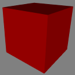](BoxInterleaved/README.md) [Show](https://github.khronos.org/glTF-Sample-Viewer-Release/?model=https://raw.GithubUserContent.com/KhronosGroup/glTF-Sample-Assets/main/./Models/BoxInterleaved/glTF-Binary/BoxInterleaved.glb) -- [Download GLB](https://raw.GithubUserContent.com/KhronosGroup/glTF-Sample-Assets/main/./Models/BoxInterleaved/glTF-Binary/BoxInterleaved.glb) | Box example with interleaved position and normal attributes. Credit: &copy; 2017, Cesium. [CC BY 4.0 International](https://creativecommons.org/licenses/by/4.0/legalcode)  - Cesium for Everything |
| [Box Textured](BoxTextured/README.md)  [Show](https://github.khronos.org/glTF-Sample-Viewer-Release/?model=https://raw.GithubUserContent.com/KhronosGroup/glTF-Sample-Assets/main/./Models/BoxTextured/glTF-Binary/BoxTextured.glb) -- [Download GLB](https://raw.GithubUserContent.com/KhronosGroup/glTF-Sample-Assets/main/./Models/BoxTextured/glTF-Binary/BoxTextured.glb) | Box with a power-of-2 texture. [Issues: non-Khronos mark] Credit: &copy; 2017, Cesium. [CC-BY 4.0 International with Trademark Limitations]()  - Cesium for Everything &copy; 2015, Cesium. [Cesium Trademark or Logo]()  - Non-copyrightable logo for Cesium logo |
| [Box Textured not 2^N](BoxTexturedNonPowerOfTwo/README.md) [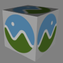](BoxTexturedNonPowerOfTwo/README.md) [Show](https://github.khronos.org/glTF-Sample-Viewer-Release/?model=https://raw.GithubUserContent.com/KhronosGroup/glTF-Sample-Assets/main/./Models/BoxTexturedNonPowerOfTwo/glTF-Binary/BoxTexturedNonPowerOfTwo.glb) -- [Download GLB](https://raw.GithubUserContent.com/KhronosGroup/glTF-Sample-Assets/main/./Models/BoxTexturedNonPowerOfTwo/glTF-Binary/BoxTexturedNonPowerOfTwo.glb) | Box with a non-power-of-2 (NPOT) texture. Not all implementations support NPOT textures. [Issues: non-Khronos mark] Credit: &copy; 2017, Cesium. [CC-BY 4.0 International with Trademark Limitations]()  - Cesium for Everything &copy; 2015, Cesium. [Cesium Trademark or Logo]()  - Non-copyrightable logo for Cesium logo |
| [Box Vertex Colors](BoxVertexColors/README.md) [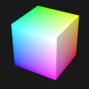](BoxVertexColors/README.md) [Show](https://github.khronos.org/glTF-Sample-Viewer-Release/?model=https://raw.GithubUserContent.com/KhronosGroup/glTF-Sample-Assets/main/./Models/BoxVertexColors/glTF-Binary/BoxVertexColors.glb) -- [Download GLB](https://raw.GithubUserContent.com/KhronosGroup/glTF-Sample-Assets/main/./Models/BoxVertexColors/glTF-Binary/BoxVertexColors.glb) | A simple unit cube that uses vertex colors, stored in the `COLORS_0` attribute.  Credit: &copy; 2023, Public. [CC0 1.0 Universal](https://creativecommons.org/publicdomain/zero/1.0/legalcode)  - Marco Hutter for Everything |
| [BrainStem](BrainStem/README.md)  [Show](https://github.khronos.org/glTF-Sample-Viewer-Release/?model=https://raw.GithubUserContent.com/KhronosGroup/glTF-Sample-Assets/main/./Models/BrainStem/glTF-Binary/BrainStem.glb) -- [Download GLB](https://raw.GithubUserContent.com/KhronosGroup/glTF-Sample-Assets/main/./Models/BrainStem/glTF-Binary/BrainStem.glb) | Animations. Skins. Credit: &copy; 2017, Smith Micro Software, Inc.. [Poser EULA](https://archive.org/stream/poser-pro-2014-reference-manual/Poser_Pro_2014_reference_manual_djvu.txt)  - Keith Hunter for Everything |
| [Cameras](Cameras/README.md) [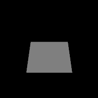](Cameras/README.md) [Show](https://github.khronos.org/glTF-Sample-Viewer-Release/?model=https://raw.GithubUserContent.com/KhronosGroup/glTF-Sample-Assets/main/./Models/Cameras/glTF/Cameras.gltf) | A sample with two different camera objects Credit: &copy; 2017, Public. [CC0 1.0 Universal](https://creativecommons.org/publicdomain/zero/1.0/legalcode)  - javagl for Everything |
| [Cesium Man](CesiumMan/README.md)  [Show](https://github.khronos.org/glTF-Sample-Viewer-Release/?model=https://raw.GithubUserContent.com/KhronosGroup/glTF-Sample-Assets/main/./Models/CesiumMan/glTF-Binary/CesiumMan.glb) -- [Download GLB](https://raw.GithubUserContent.com/KhronosGroup/glTF-Sample-Assets/main/./Models/CesiumMan/glTF-Binary/CesiumMan.glb) | Textured. Animations. Skins. [Issues: non-Khronos mark] Credit: &copy; 2017, Cesium. [CC-BY 4.0 International with Trademark Limitations]()  - Cesium for Everything &copy; 2015, Cesium. [Cesium Trademark or Logo]()  - Non-copyrightable logo for Cesium logo |
| [Cesium Milk Truck](CesiumMilkTruck/README.md)  [Show](https://github.khronos.org/glTF-Sample-Viewer-Release/?model=https://raw.GithubUserContent.com/KhronosGroup/glTF-Sample-Assets/main/./Models/CesiumMilkTruck/glTF-Binary/CesiumMilkTruck.glb) -- [Download GLB](https://raw.GithubUserContent.com/KhronosGroup/glTF-Sample-Assets/main/./Models/CesiumMilkTruck/glTF-Binary/CesiumMilkTruck.glb) | Textured. Multiple nodes/meshes. Animations. [Issues: non-Khronos mark] Credit: &copy; 2017, Cesium. [CC-BY 4.0 International with Trademark Limitations]()  - Cesium for Everything &copy; 2015, Cesium. [Cesium Trademark or Logo]()  - Non-copyrightable logo for Cesium logo |
| [Clear Coat Car Paint](ClearCoatCarPaint/README.md)  [Show](https://github.khronos.org/glTF-Sample-Viewer-Release/?model=https://raw.GithubUserContent.com/KhronosGroup/glTF-Sample-Assets/main/./Models/ClearCoatCarPaint/glTF-Binary/ClearCoatCarPaint.glb) -- [Download GLB](https://raw.GithubUserContent.com/KhronosGroup/glTF-Sample-Assets/main/./Models/ClearCoatCarPaint/glTF-Binary/ClearCoatCarPaint.glb) | This model is a sphere using the glTF ClearCoat extension overtop a car paint base material.  Credit: &copy; 2023, Public. [CC0 1.0 Universal](https://creativecommons.org/publicdomain/zero/1.0/legalcode)  - Eric Chadwick for Everything |
| [KHR_materials_clearcoat Test](ClearCoatTest/README.md)  [Show](https://github.khronos.org/glTF-Sample-Viewer-Release/?model=https://raw.GithubUserContent.com/KhronosGroup/glTF-Sample-Assets/main/./Models/ClearCoatTest/glTF-Binary/ClearCoatTest.glb) -- [Download GLB](https://raw.GithubUserContent.com/KhronosGroup/glTF-Sample-Assets/main/./Models/ClearCoatTest/glTF-Binary/ClearCoatTest.glb) | Tests if the KHR_materials_clearcoat extension is supported properly. Credit: &copy; 2020, Analytical Graphics, Inc.. [CC BY 4.0 International](https://creativecommons.org/licenses/by/4.0/legalcode)  - Ed Mackey for Everything |
| [Clearcoat Wicker](ClearcoatWicker/README.md)  [Show](https://github.khronos.org/glTF-Sample-Viewer-Release/?model=https://raw.GithubUserContent.com/KhronosGroup/glTF-Sample-Assets/main/./Models/ClearcoatWicker/glTF-Binary/ClearcoatWicker.glb) -- [Download GLB](https://raw.GithubUserContent.com/KhronosGroup/glTF-Sample-Assets/main/./Models/ClearcoatWicker/glTF-Binary/ClearcoatWicker.glb) | This model is a sphere using the glTF ClearCoat to create a wicker material covered with a wrinkled plastic clearcoat material. Credit: &copy; 2023, Public. [CC0 1.0 Universal](https://creativecommons.org/publicdomain/zero/1.0/legalcode)  - Eric Chadwick for Everything |
| [Corset](Corset/README.md)  [Show](https://github.khronos.org/glTF-Sample-Viewer-Release/?model=https://raw.GithubUserContent.com/KhronosGroup/glTF-Sample-Assets/main/./Models/Corset/glTF-Binary/Corset.glb) -- [Download GLB](https://raw.GithubUserContent.com/KhronosGroup/glTF-Sample-Assets/main/./Models/Corset/glTF-Binary/Corset.glb) |   Credit: &copy; 2017, UX3D. [CC0 1.0 Universal](https://creativecommons.org/publicdomain/zero/1.0/legalcode)  - Microsoft for Everything |
| [Cube](Cube/README.md)  [Show](https://github.khronos.org/glTF-Sample-Viewer-Release/?model=https://raw.GithubUserContent.com/KhronosGroup/glTF-Sample-Assets/main/./Models/Cube/glTF/Cube.gltf) | A cube with non-smoothed faces. Credit: &copy; 2017, UX3D. [CC0 1.0 Universal](https://creativecommons.org/publicdomain/zero/1.0/legalcode)  - Norbert Nopper for Everything |
| [Damaged Helmet](DamagedHelmet/README.md)  [Show](https://github.khronos.org/glTF-Sample-Viewer-Release/?model=https://raw.GithubUserContent.com/KhronosGroup/glTF-Sample-Assets/main/./Models/DamagedHelmet/glTF-Binary/DamagedHelmet.glb) -- [Download GLB](https://raw.GithubUserContent.com/KhronosGroup/glTF-Sample-Assets/main/./Models/DamagedHelmet/glTF-Binary/DamagedHelmet.glb) | Flight helmet with damage Credit: &copy; 2018, ctxwing. [CC BY 4.0 International](https://creativecommons.org/licenses/by/4.0/legalcode)  - ctxwing for Rebuild and conversion to glTF &copy; 2016, theblueturtle_. [CC BY-NC 4.0 International](https://creativecommons.org/licenses/by-nc/4.0/legalcode)  - theblueturtle_ for Earlier version of model |
| [Duck](Duck/README.md)  [Show](https://github.khronos.org/glTF-Sample-Viewer-Release/?model=https://raw.GithubUserContent.com/KhronosGroup/glTF-Sample-Assets/main/./Models/Duck/glTF-Binary/Duck.glb) -- [Download GLB](https://raw.GithubUserContent.com/KhronosGroup/glTF-Sample-Assets/main/./Models/Duck/glTF-Binary/Duck.glb) | The COLLADA duck. One texture. Credit: &copy; 2006, Sony. [SCEA Shared Source License, Version 1.0](https://spdx.org/licenses/SCEA.html)  - Sony for Everything |
| [Emissive Strength Test](EmissiveStrengthTest/README.md)  [Show](https://github.khronos.org/glTF-Sample-Viewer-Release/?model=https://raw.GithubUserContent.com/KhronosGroup/glTF-Sample-Assets/main/./Models/EmissiveStrengthTest/glTF-Binary/EmissiveStrengthTest.glb) -- [Download GLB](https://raw.GithubUserContent.com/KhronosGroup/glTF-Sample-Assets/main/./Models/EmissiveStrengthTest/glTF-Binary/EmissiveStrengthTest.glb) | Tests if the KHR_materials_emissive_strength extension is supported properly. Credit: &copy; 2022, AGI. [CC BY 4.0 International](https://creativecommons.org/licenses/by/4.0/legalcode)  - Ed Mackey for Everything |
| [Environment Test](EnvironmentTest/README.md)  [Show](https://github.khronos.org/glTF-Sample-Viewer-Release/?model=https://raw.GithubUserContent.com/KhronosGroup/glTF-Sample-Assets/main/./Models/EnvironmentTest/glTF/EnvironmentTest.gltf) | A simple scene with metal and dielectric spheres that range between 0 and 1 roughness. Useful for testing environment lighting. Credit: &copy; 2017, Adobe. [Adobe Stock License](https://stock.adobe.com/license-terms?prev_url=detail&comparison-full#enhanced-license-terms)  - Adobe for Everything |
| [Flight Helmet](FlightHelmet/README.md)  [Show](https://github.khronos.org/glTF-Sample-Viewer-Release/?model=https://raw.GithubUserContent.com/KhronosGroup/glTF-Sample-Assets/main/./Models/FlightHelmet/glTF/FlightHelmet.gltf) | Displayed flight helmet on a wooden stand. Credit: &copy; 2018, Public. [CC0 1.0 Universal](https://creativecommons.org/publicdomain/zero/1.0/legalcode)  - Gary Hsu for Conversion from Maya |
| [Fox](Fox/README.md)  [Show](https://github.khronos.org/glTF-Sample-Viewer-Release/?model=https://raw.GithubUserContent.com/KhronosGroup/glTF-Sample-Assets/main/./Models/Fox/glTF-Binary/Fox.glb) -- [Download GLB](https://raw.GithubUserContent.com/KhronosGroup/glTF-Sample-Assets/main/./Models/Fox/glTF-Binary/Fox.glb) | Multiple animations cycles: Survey, Walk, Run. Credit: &copy; 2014, Public. [CC0 1.0 Universal](https://creativecommons.org/publicdomain/zero/1.0/legalcode)  - PixelMannen for Model &copy; 2014, tomkranis. [CC BY 4.0 International](https://creativecommons.org/licenses/by/4.0/legalcode)  - tomkranis for Rigging & Animation &copy; 2017, @AsoboStudio and @scurest. [CC BY 4.0 International](https://creativecommons.org/licenses/by/4.0/legalcode)  - @AsoboStudio and @scurest for Conversion to glTF |
| [Interpolation Test](InterpolationTest/README.md) [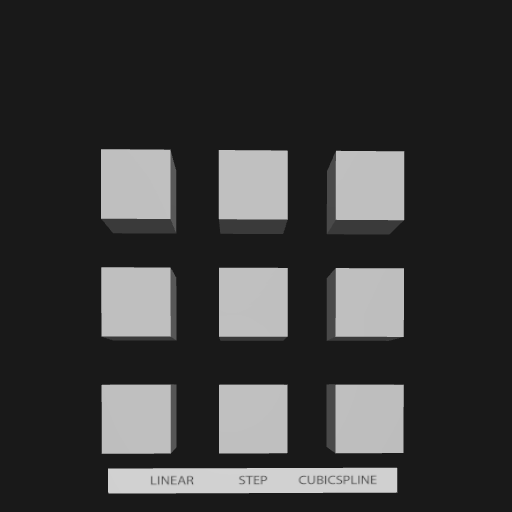](InterpolationTest/README.md) [Show](https://github.khronos.org/glTF-Sample-Viewer-Release/?model=https://raw.GithubUserContent.com/KhronosGroup/glTF-Sample-Assets/main/./Models/InterpolationTest/glTF-Binary/InterpolationTest.glb) -- [Download GLB](https://raw.GithubUserContent.com/KhronosGroup/glTF-Sample-Assets/main/./Models/InterpolationTest/glTF-Binary/InterpolationTest.glb) | A sample with three different animation interpolations Credit: &copy; 2017, Public. [CC0 1.0 Universal](https://creativecommons.org/publicdomain/zero/1.0/legalcode)  - Khronos for Everything |
| [Iridescence Dielectric Spheres](IridescenceDielectricSpheres/README.md)  [Show](https://github.khronos.org/glTF-Sample-Viewer-Release/?model=https://raw.GithubUserContent.com/KhronosGroup/glTF-Sample-Assets/main/./Models/IridescenceDielectricSpheres/glTF/IridescenceDielectricSpheres.gltf) | Tests KHR_materials_iridescence on a non-metallic material. Credit: &copy; 2019, Public. [CC0 1.0 Universal](https://creativecommons.org/publicdomain/zero/1.0/legalcode)  - Khronos for Everything |
| [Iridescence Metallic Spheres](IridescenceMetallicSpheres/README.md)  [Show](https://github.khronos.org/glTF-Sample-Viewer-Release/?model=https://raw.GithubUserContent.com/KhronosGroup/glTF-Sample-Assets/main/./Models/IridescenceMetallicSpheres/glTF/IridescenceMetallicSpheres.gltf) | Tests KHR_materials_iridescence on a metallic material. Credit: &copy; 2022, UX3D. [CC0 1.0 Universal](https://creativecommons.org/publicdomain/zero/1.0/legalcode)  - UX3D for Everything |
| [Iridescence Suzanne](IridescenceSuzanne/README.md)  [Show](https://github.khronos.org/glTF-Sample-Viewer-Release/?model=https://raw.GithubUserContent.com/KhronosGroup/glTF-Sample-Assets/main/./Models/IridescenceSuzanne/glTF-Binary/IridescenceSuzanne.glb) -- [Download GLB](https://raw.GithubUserContent.com/KhronosGroup/glTF-Sample-Assets/main/./Models/IridescenceSuzanne/glTF-Binary/IridescenceSuzanne.glb) | Further tests KHR_materials_iridescence. Credit: &copy; 2022, UX3D. [CC0 1.0 Universal](https://creativecommons.org/publicdomain/zero/1.0/legalcode)  - Mathias Kanzler for Initial version &copy; 2021, Pascal Schoen. [CC0 1.0 Universal](https://creativecommons.org/publicdomain/zero/1.0/legalcode)  - Pascal Schoen for Internal clean-up |
| [Lantern](Lantern/README.md)  [Show](https://github.khronos.org/glTF-Sample-Viewer-Release/?model=https://raw.GithubUserContent.com/KhronosGroup/glTF-Sample-Assets/main/./Models/Lantern/glTF-Binary/Lantern.glb) -- [Download GLB](https://raw.GithubUserContent.com/KhronosGroup/glTF-Sample-Assets/main/./Models/Lantern/glTF-Binary/Lantern.glb) | Old wooden street light. Credit: &copy; 2017, Microsoft. [CC0 1.0 Universal](https://creativecommons.org/publicdomain/zero/1.0/legalcode)  - sbtron for Initial version &copy; 2018, Frank Galligan. [CC0 1.0 Universal](https://creativecommons.org/publicdomain/zero/1.0/legalcode)  - Frank Galligan for Draco compression |
| [Lamp with Punctual Lights](LightsPunctualLamp/README.md)  [Show](https://github.khronos.org/glTF-Sample-Viewer-Release/?model=https://raw.GithubUserContent.com/KhronosGroup/glTF-Sample-Assets/main/./Models/LightsPunctualLamp/glTF-Binary/LightsPunctualLamp.glb) -- [Download GLB](https://raw.GithubUserContent.com/KhronosGroup/glTF-Sample-Assets/main/./Models/LightsPunctualLamp/glTF-Binary/LightsPunctualLamp.glb) | Lamp using punctual lights. Credit: &copy; 2021, DGG. [CC BY 4.0 International](https://creativecommons.org/licenses/by/4.0/legalcode)  - DGG for Everything |
| [MandarinOrange](MandarinOrange/README.md)  [Show](https://github.khronos.org/glTF-Sample-Viewer-Release/?model=https://raw.GithubUserContent.com/KhronosGroup/glTF-Sample-Assets/main/./Models/MandarinOrange/glTF/MandarinOrange.gltf) | Scattering of light through the tangerine using the glTF diffuse transmission extension is shown in this test. Credit: &copy; 2015, zamdreamer. [CC BY 4.0 International](https://creativecommons.org/licenses/by/4.0/legalcode)  - zamdreamer for Initial creation &copy; 2023, Wayfair. [CC BY 4.0 International](https://creativecommons.org/licenses/by/4.0/legalcode)  - Eric Chadwick for glTF PBR material |
| [Mesh Primitive Modes](MeshPrimitiveModes/README.md) [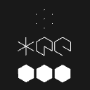](MeshPrimitiveModes/README.md) [Show](https://github.khronos.org/glTF-Sample-Viewer-Release/?model=https://raw.GithubUserContent.com/KhronosGroup/glTF-Sample-Assets/main/./Models/MeshPrimitiveModes/glTF/MeshPrimitiveModes.gltf) | An example that shows rendering modes that are supported for mesh primitives in glTF. Credit: &copy; 2023, Public. [CC0 1.0 Universal](https://creativecommons.org/publicdomain/zero/1.0/legalcode)  - Marco Hutter for Everything |
| [Metal-Rough Spheres](MetalRoughSpheres/README.md) [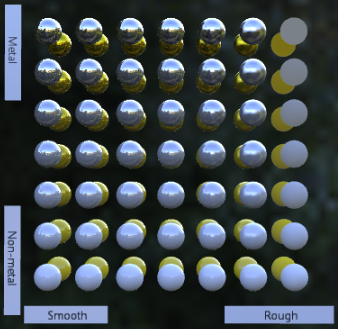](MetalRoughSpheres/README.md) [Show](https://github.khronos.org/glTF-Sample-Viewer-Release/?model=https://raw.GithubUserContent.com/KhronosGroup/glTF-Sample-Assets/main/./Models/MetalRoughSpheres/glTF-Binary/MetalRoughSpheres.glb) -- [Download GLB](https://raw.GithubUserContent.com/KhronosGroup/glTF-Sample-Assets/main/./Models/MetalRoughSpheres/glTF-Binary/MetalRoughSpheres.glb) | Tests various metal and roughness values (texture mapped). Credit: &copy; 2017, Analytical Graphics, Inc.. [CC BY 4.0 International](https://creativecommons.org/licenses/by/4.0/legalcode)  - Ed Mackey for Everything |
| [Metal-Rough Spheres (textureless)](MetalRoughSpheresNoTextures/README.md) [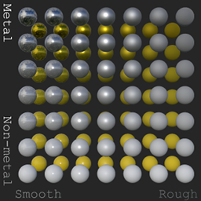](MetalRoughSpheresNoTextures/README.md) [Show](https://github.khronos.org/glTF-Sample-Viewer-Release/?model=https://raw.GithubUserContent.com/KhronosGroup/glTF-Sample-Assets/main/./Models/MetalRoughSpheresNoTextures/glTF-Binary/MetalRoughSpheresNoTextures.glb) -- [Download GLB](https://raw.GithubUserContent.com/KhronosGroup/glTF-Sample-Assets/main/./Models/MetalRoughSpheresNoTextures/glTF-Binary/MetalRoughSpheresNoTextures.glb) | Tests various metal and roughness values (textureless). Credit: &copy; 2019, Public. [CC0 1.0 Universal](https://creativecommons.org/publicdomain/zero/1.0/legalcode)  - Krill Gavrilov for Everything &copy; 2019, Public. [CC0 1.0 Universal](https://creativecommons.org/publicdomain/zero/1.0/legalcode)  - CAD Model generated by Draw Harness script using Open CASCADE Technology for Everything |
| [Morph-Primitives Test](MorphPrimitivesTest/README.md) [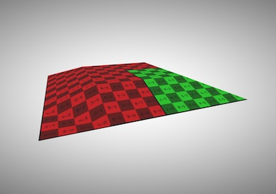](MorphPrimitivesTest/README.md) [Show](https://github.khronos.org/glTF-Sample-Viewer-Release/?model=https://raw.GithubUserContent.com/KhronosGroup/glTF-Sample-Assets/main/./Models/MorphPrimitivesTest/glTF-Binary/MorphPrimitivesTest.glb) -- [Download GLB](https://raw.GithubUserContent.com/KhronosGroup/glTF-Sample-Assets/main/./Models/MorphPrimitivesTest/glTF-Binary/MorphPrimitivesTest.glb) | Tests a morph target on multiple primitives. Credit: &copy; 2018, ft-lab. [CC BY 4.0 International](https://creativecommons.org/licenses/by/4.0/legalcode)  - ft-lab for Everything &copy; 2020, Frank Galligan. [CC BY 4.0 International](https://creativecommons.org/licenses/by/4.0/legalcode)  - Frank Galligan for DRACO compression |
| [Morph Stress Test](MorphStressTest/README.md)  [Show](https://github.khronos.org/glTF-Sample-Viewer-Release/?model=https://raw.GithubUserContent.com/KhronosGroup/glTF-Sample-Assets/main/./Models/MorphStressTest/glTF-Binary/MorphStressTest.glb) -- [Download GLB](https://raw.GithubUserContent.com/KhronosGroup/glTF-Sample-Assets/main/./Models/MorphStressTest/glTF-Binary/MorphStressTest.glb) | Tests up to 8 morph targets. Credit: &copy; 2021, Analytical Graphics, Inc.. [CC BY 4.0 International](https://creativecommons.org/licenses/by/4.0/legalcode)  - Ed Mackey for Everything |
| [Multiple Scenes](MultipleScenes/README.md) [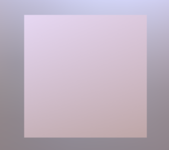](MultipleScenes/README.md) [Show](https://github.khronos.org/glTF-Sample-Viewer-Release/?model=https://raw.GithubUserContent.com/KhronosGroup/glTF-Sample-Assets/main/./Models/MultipleScenes/glTF/MultipleScenes.gltf) | A simple glTF asset with two scenes. Each scene consists of one node with one mesh.  Credit: &copy; 2017, Public. [CC0 1.0 Universal](https://creativecommons.org/publicdomain/zero/1.0/legalcode)  - Public for Everthing |
| [MultiUV Test](MultiUVTest/README.md) [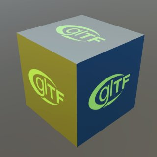](MultiUVTest/README.md) [Show](https://github.khronos.org/glTF-Sample-Viewer-Release/?model=https://raw.GithubUserContent.com/KhronosGroup/glTF-Sample-Assets/main/./Models/MultiUVTest/glTF-Binary/MultiUVTest.glb) -- [Download GLB](https://raw.GithubUserContent.com/KhronosGroup/glTF-Sample-Assets/main/./Models/MultiUVTest/glTF-Binary/MultiUVTest.glb) | This model has two uv texture coordinates and tests a second set of texture coordinates. Credit: &copy; 2017, Hilo 3D. [CC BY 4.0 International](https://creativecommons.org/licenses/by/4.0/legalcode)  - Hilo 3D for Everything &copy; 2017, Khronos Group. [Khronos Trademark or Logo]()  - Non-copyrightable logo for glTF logo |
| [Negative Scale Test](NegativeScaleTest/README.md)  [Show](https://github.khronos.org/glTF-Sample-Viewer-Release/?model=https://raw.GithubUserContent.com/KhronosGroup/glTF-Sample-Assets/main/./Models/NegativeScaleTest/glTF-Binary/NegativeScaleTest.glb) -- [Download GLB](https://raw.GithubUserContent.com/KhronosGroup/glTF-Sample-Assets/main/./Models/NegativeScaleTest/glTF-Binary/NegativeScaleTest.glb) | This model tests what happens when a glTF node has negative scaling. Credit: &copy; 2023, Analytical Graphics, Inc.. [CC BY 4.0 International](https://creativecommons.org/licenses/by/4.0/legalcode)  - Ed Mackey for Everthing |
| [Normal-Tangent Mirror Test](NormalTangentMirrorTest/README.md)  [Show](https://github.khronos.org/glTF-Sample-Viewer-Release/?model=https://raw.GithubUserContent.com/KhronosGroup/glTF-Sample-Assets/main/./Models/NormalTangentMirrorTest/glTF-Binary/NormalTangentMirrorTest.glb) -- [Download GLB](https://raw.GithubUserContent.com/KhronosGroup/glTF-Sample-Assets/main/./Models/NormalTangentMirrorTest/glTF-Binary/NormalTangentMirrorTest.glb) | Tests an engine's ability to load supplied tangent vectors for a normal map. Credit: &copy; 2018, Analytical Graphics, Inc.. [CC BY 4.0 International](https://creativecommons.org/licenses/by/4.0/legalcode)  - Ed Mackey for Everything |
| [Normal-Tangent Test](NormalTangentTest/README.md) [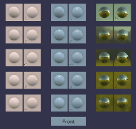](NormalTangentTest/README.md) [Show](https://github.khronos.org/glTF-Sample-Viewer-Release/?model=https://raw.GithubUserContent.com/KhronosGroup/glTF-Sample-Assets/main/./Models/NormalTangentTest/glTF-Binary/NormalTangentTest.glb) -- [Download GLB](https://raw.GithubUserContent.com/KhronosGroup/glTF-Sample-Assets/main/./Models/NormalTangentTest/glTF-Binary/NormalTangentTest.glb) | Tests an engine's ability to automatically generate tangent vectors for a normal map. Credit: &copy; 2018, Analytical Graphics, Inc.. [CC0 1.0 Universal](https://creativecommons.org/publicdomain/zero/1.0/legalcode)  - Ed Mackey for Everything |
| [Orientation Test](OrientationTest/README.md) [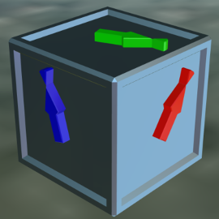](OrientationTest/README.md) [Show](https://github.khronos.org/glTF-Sample-Viewer-Release/?model=https://raw.GithubUserContent.com/KhronosGroup/glTF-Sample-Assets/main/./Models/OrientationTest/glTF-Binary/OrientationTest.glb) -- [Download GLB](https://raw.GithubUserContent.com/KhronosGroup/glTF-Sample-Assets/main/./Models/OrientationTest/glTF-Binary/OrientationTest.glb) | Tests node translations and rotations. Credit: &copy; 2017, Unknown. [CC BY 4.0 International](https://creativecommons.org/licenses/by/4.0/legalcode)  - Khronos for Everything |
| [Recursive Skeletons](RecursiveSkeletons/README.md)  [Show](https://github.khronos.org/glTF-Sample-Viewer-Release/?model=https://raw.GithubUserContent.com/KhronosGroup/glTF-Sample-Assets/main/./Models/RecursiveSkeletons/glTF-Binary/RecursiveSkeletons.glb) -- [Download GLB](https://raw.GithubUserContent.com/KhronosGroup/glTF-Sample-Assets/main/./Models/RecursiveSkeletons/glTF-Binary/RecursiveSkeletons.glb) | Tests unusual skinning cases with reused meshes and recursive skeletons. Credit: &copy; 2017, Cesium. [CC BY 4.0 International](https://creativecommons.org/licenses/by/4.0/legalcode)  - Cesium for Everything |
| [Rigged Figure](RiggedFigure/README.md)  [Show](https://github.khronos.org/glTF-Sample-Viewer-Release/?model=https://raw.GithubUserContent.com/KhronosGroup/glTF-Sample-Assets/main/./Models/RiggedFigure/glTF-Binary/RiggedFigure.glb) -- [Download GLB](https://raw.GithubUserContent.com/KhronosGroup/glTF-Sample-Assets/main/./Models/RiggedFigure/glTF-Binary/RiggedFigure.glb) | Animations. Skins. Credit: &copy; 2017, Cesium. [CC BY 4.0 International](https://creativecommons.org/licenses/by/4.0/legalcode)  - Cesium for Everything |
| [Rigged Simple](RiggedSimple/README.md)  [Show](https://github.khronos.org/glTF-Sample-Viewer-Release/?model=https://raw.GithubUserContent.com/KhronosGroup/glTF-Sample-Assets/main/./Models/RiggedSimple/glTF-Binary/RiggedSimple.glb) -- [Download GLB](https://raw.GithubUserContent.com/KhronosGroup/glTF-Sample-Assets/main/./Models/RiggedSimple/glTF-Binary/RiggedSimple.glb) | Animations. Skins. Start with this to test skinning. Credit: &copy; 2017, Cesium. [CC BY 4.0 International](https://creativecommons.org/licenses/by/4.0/legalcode)  - Cesium for Everything |
| [SciFi Helmet](SciFiHelmet/README.md)  [Show](https://github.khronos.org/glTF-Sample-Viewer-Release/?model=https://raw.GithubUserContent.com/KhronosGroup/glTF-Sample-Assets/main/./Models/SciFiHelmet/glTF/SciFiHelmet.gltf) | Futuristic helmet Credit: &copy; 2017, Public. [CC0 1.0 Universal](https://creativecommons.org/publicdomain/zero/1.0/legalcode)  - Michael Pavlovic for Everything &copy; 2017, Public. [CC0 1.0 Universal](https://creativecommons.org/publicdomain/zero/1.0/legalcode)  - Norbert Nopper for Conversion to glTF |
| [Simple Instancing](SimpleInstancing/README.md)  [Show](https://github.khronos.org/glTF-Sample-Viewer-Release/?model=https://raw.GithubUserContent.com/KhronosGroup/glTF-Sample-Assets/main/./Models/SimpleInstancing/glTF-Binary/SimpleInstancing.glb) -- [Download GLB](https://raw.GithubUserContent.com/KhronosGroup/glTF-Sample-Assets/main/./Models/SimpleInstancing/glTF-Binary/SimpleInstancing.glb) | A simple example for the EXT_mesh_gpu_instancing extension. Credit: &copy; 2023, Public. [CC0 1.0 Universal](https://creativecommons.org/publicdomain/zero/1.0/legalcode)  - Marco Hutter for Everything |
| [SimpleMeshes](SimpleMeshes/README.md)  [Show](https://github.khronos.org/glTF-Sample-Viewer-Release/?model=https://raw.GithubUserContent.com/KhronosGroup/glTF-Sample-Assets/main/./Models/SimpleMeshes/glTF/SimpleMeshes.gltf) | A simple scene with two nodes, both containing the same mesh, namely a mesh with a single mesh.primitive with a single indexed triangle with multiple attributes (positions, normals and texture coordinates), but without a material Credit: &copy; 2017, Public. [CC0 1.0 Universal](https://creativecommons.org/publicdomain/zero/1.0/legalcode)  - javagl for Everything |
| [SimpleMorph](SimpleMorph/README.md) [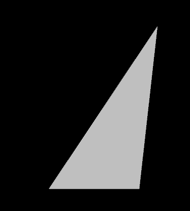](SimpleMorph/README.md) [Show](https://github.khronos.org/glTF-Sample-Viewer-Release/?model=https://raw.GithubUserContent.com/KhronosGroup/glTF-Sample-Assets/main/./Models/SimpleMorph/glTF/SimpleMorph.gltf) | A triangle with a morph animation applied Credit: &copy; 2017, Public. [CC0 1.0 Universal](https://creativecommons.org/publicdomain/zero/1.0/legalcode)  - javagl for Everything |
| [SimpleSkin](SimpleSkin/README.md)  [Show](https://github.khronos.org/glTF-Sample-Viewer-Release/?model=https://raw.GithubUserContent.com/KhronosGroup/glTF-Sample-Assets/main/./Models/SimpleSkin/glTF/SimpleSkin.gltf) | A simple example of vertex skinning in glTF Credit: &copy; 2017, Public. [CC0 1.0 Universal](https://creativecommons.org/publicdomain/zero/1.0/legalcode)  - javagl for Everything |
| [SimpleSparseAccessor](SimpleSparseAccessor/README.md)  [Show](https://github.khronos.org/glTF-Sample-Viewer-Release/?model=https://raw.GithubUserContent.com/KhronosGroup/glTF-Sample-Assets/main/./Models/SimpleSparseAccessor/glTF/SimpleSparseAccessor.gltf) | A simple mesh that uses sparse accessors Credit: &copy; 2017, Public. [CC BY 4.0 International](https://creativecommons.org/licenses/by/4.0/legalcode)  - javagl for Everything |
| [SpecGlossVsMetalRough](SpecGlossVsMetalRough/README.md)  [Show](https://github.khronos.org/glTF-Sample-Viewer-Release/?model=https://raw.GithubUserContent.com/KhronosGroup/glTF-Sample-Assets/main/./Models/SpecGlossVsMetalRough/glTF-Binary/SpecGlossVsMetalRough.glb) -- [Download GLB](https://raw.GithubUserContent.com/KhronosGroup/glTF-Sample-Assets/main/./Models/SpecGlossVsMetalRough/glTF-Binary/SpecGlossVsMetalRough.glb) | Tests if the KHR_materials_pbrSpecularGlossiness extension is supported properly. Credit: &copy; 2017, Microsoft. [CC BY 4.0 International](https://creativecommons.org/licenses/by/4.0/legalcode)  - Microsoft for Everything |
| [Specular Test](SpecularTest/README.md)  [Show](https://github.khronos.org/glTF-Sample-Viewer-Release/?model=https://raw.GithubUserContent.com/KhronosGroup/glTF-Sample-Assets/main/./Models/SpecularTest/glTF-Binary/SpecularTest.glb) -- [Download GLB](https://raw.GithubUserContent.com/KhronosGroup/glTF-Sample-Assets/main/./Models/SpecularTest/glTF-Binary/SpecularTest.glb) | Tests if the KHR_materials_specular extension is supported correctly. Credit: &copy; 2021, Analytical Graphics, Inc.. [CC BY 4.0 International](https://creativecommons.org/licenses/by/4.0/legalcode)  - Ed Mackey for Everything |
| [Suzanne](Suzanne/README.md)  [Show](https://github.khronos.org/glTF-Sample-Viewer-Release/?model=https://raw.GithubUserContent.com/KhronosGroup/glTF-Sample-Assets/main/./Models/Suzanne/glTF/Suzanne.gltf) | Blender's test model of the chimpanzee Suzanne. Credit: &copy; 2017, UX3D. [CC0 1.0 Universal](https://creativecommons.org/publicdomain/zero/1.0/legalcode)  - Norbert Nopper for Everything |
| [Texture Coordinate Test](TextureCoordinateTest/README.md) [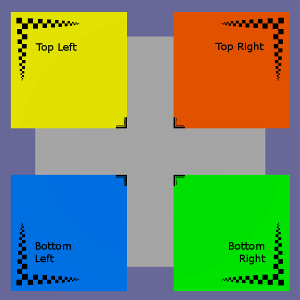](TextureCoordinateTest/README.md) [Show](https://github.khronos.org/glTF-Sample-Viewer-Release/?model=https://raw.GithubUserContent.com/KhronosGroup/glTF-Sample-Assets/main/./Models/TextureCoordinateTest/glTF-Binary/TextureCoordinateTest.glb) -- [Download GLB](https://raw.GithubUserContent.com/KhronosGroup/glTF-Sample-Assets/main/./Models/TextureCoordinateTest/glTF-Binary/TextureCoordinateTest.glb) | Shows how XYZ and UV positions relate to displayed geometry. Credit: &copy; 2017, Analytical Graphics, Inc.. [CC0 1.0 Universal](https://creativecommons.org/publicdomain/zero/1.0/legalcode)  - Ed Mackey for Everything |
| [Texture Encoding Test](TextureEncodingTest/README.md) [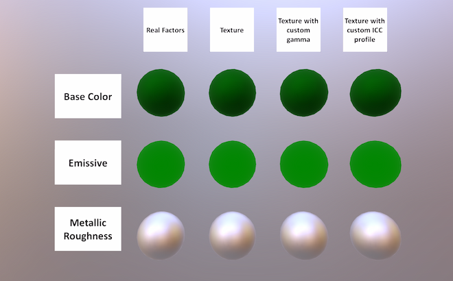](TextureEncodingTest/README.md) [Show](https://github.khronos.org/glTF-Sample-Viewer-Release/?model=https://raw.GithubUserContent.com/KhronosGroup/glTF-Sample-Assets/main/./Models/TextureEncodingTest/glTF-Binary/TextureEncodingTest.glb) -- [Download GLB](https://raw.GithubUserContent.com/KhronosGroup/glTF-Sample-Assets/main/./Models/TextureEncodingTest/glTF-Binary/TextureEncodingTest.glb) | This asset tests that textures are sampled with correct transfer functions. Credit: &copy; 2017, Public. [CC0 1.0 Universal](https://creativecommons.org/publicdomain/zero/1.0/legalcode)  - lexaknyazev for Everything |
| [Texture Linear Interpolation Test](TextureLinearInterpolationTest/README.md) [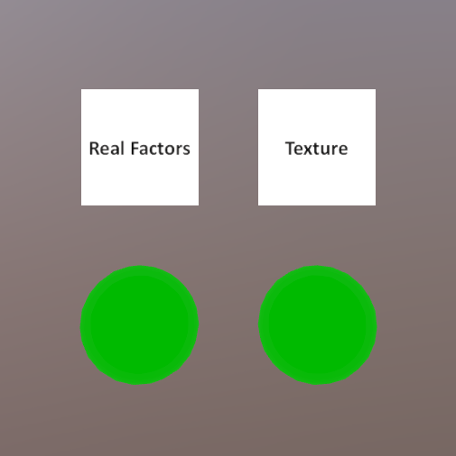](TextureLinearInterpolationTest/README.md) [Show](https://github.khronos.org/glTF-Sample-Viewer-Release/?model=https://raw.GithubUserContent.com/KhronosGroup/glTF-Sample-Assets/main/./Models/TextureLinearInterpolationTest/glTF-Binary/TextureLinearInterpolationTest.glb) -- [Download GLB](https://raw.GithubUserContent.com/KhronosGroup/glTF-Sample-Assets/main/./Models/TextureLinearInterpolationTest/glTF-Binary/TextureLinearInterpolationTest.glb) | Tests that linear texture interpolation is performed on linear values, i.e. after sRGB decoding. Credit: &copy; 2017, Public. [CC0 1.0 Universal](https://creativecommons.org/publicdomain/zero/1.0/legalcode)  - lexaknyazev for Everything |
| [Texture Settings Test](TextureSettingsTest/README.md) [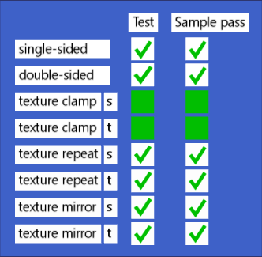](TextureSettingsTest/README.md) [Show](https://github.khronos.org/glTF-Sample-Viewer-Release/?model=https://raw.GithubUserContent.com/KhronosGroup/glTF-Sample-Assets/main/./Models/TextureSettingsTest/glTF-Binary/TextureSettingsTest.glb) -- [Download GLB](https://raw.GithubUserContent.com/KhronosGroup/glTF-Sample-Assets/main/./Models/TextureSettingsTest/glTF-Binary/TextureSettingsTest.glb) | Tests single/double-sided and various texturing modes. Credit: &copy; 2017, Analytical Graphics, Inc.. [CC BY 4.0 International](https://creativecommons.org/licenses/by/4.0/legalcode)  - Ed Mackey for Everything |
| [Texture Transform Multi Test](TextureTransformMultiTest/README.md)  [Show](https://github.khronos.org/glTF-Sample-Viewer-Release/?model=https://raw.GithubUserContent.com/KhronosGroup/glTF-Sample-Assets/main/./Models/TextureTransformMultiTest/glTF-Binary/TextureTransformMultiTest.glb) -- [Download GLB](https://raw.GithubUserContent.com/KhronosGroup/glTF-Sample-Assets/main/./Models/TextureTransformMultiTest/glTF-Binary/TextureTransformMultiTest.glb) | Tests if the KHR_texture_transform extension is supported for several inputs. Credit: &copy; 2020, Analytical Graphics, Inc.. [CC BY 4.0 International](https://creativecommons.org/licenses/by/4.0/legalcode)  - Ed Mackey for Everything |
| [Texture Transform Test](TextureTransformTest/README.md)  [Show](https://github.khronos.org/glTF-Sample-Viewer-Release/?model=https://raw.GithubUserContent.com/KhronosGroup/glTF-Sample-Assets/main/./Models/TextureTransformTest/glTF/TextureTransformTest.gltf) | Tests if the KHR_texture_transform extension is supported for BaseColor. Credit: &copy; 2018, Microsoft. [CC0 1.0 Universal](https://creativecommons.org/publicdomain/zero/1.0/legalcode)  - Microsoft for Everything |
| [Transmission Roughness Test](TransmissionRoughnessTest/README.md)  [Show](https://github.khronos.org/glTF-Sample-Viewer-Release/?model=https://raw.GithubUserContent.com/KhronosGroup/glTF-Sample-Assets/main/./Models/TransmissionRoughnessTest/glTF-Binary/TransmissionRoughnessTest.glb) -- [Download GLB](https://raw.GithubUserContent.com/KhronosGroup/glTF-Sample-Assets/main/./Models/TransmissionRoughnessTest/glTF-Binary/TransmissionRoughnessTest.glb) | Tests the interaction between roughness and IOR. Credit: &copy; 2021, Analytical Graphics, Inc.. [CC BY 4.0 International](https://creativecommons.org/licenses/by/4.0/legalcode)  - Ed Mackey for Everything |
| [Transmission Test](TransmissionTest/README.md)  [Show](https://github.khronos.org/glTF-Sample-Viewer-Release/?model=https://raw.GithubUserContent.com/KhronosGroup/glTF-Sample-Assets/main/./Models/TransmissionTest/glTF-Binary/TransmissionTest.glb) -- [Download GLB](https://raw.GithubUserContent.com/KhronosGroup/glTF-Sample-Assets/main/./Models/TransmissionTest/glTF-Binary/TransmissionTest.glb) | Tests if the KHR_materials_transmission extension is supported properly. Credit: &copy; 2020, Public. [CC0 1.0 Universal](https://creativecommons.org/publicdomain/zero/1.0/legalcode)  - Adobe for Everything |
| [Triangle](Triangle/README.md)  [Show](https://github.khronos.org/glTF-Sample-Viewer-Release/?model=https://raw.GithubUserContent.com/KhronosGroup/glTF-Sample-Assets/main/./Models/Triangle/glTF/Triangle.gltf) | A very simple glTF asset: The basic structure is the same as in 'Triangle Without Indices', but here, the mesh primitive describes an indexed geometry. Credit: &copy; 2017, Public. [CC0 1.0 Universal](https://creativecommons.org/publicdomain/zero/1.0/legalcode)  - javagl for Everything |
| [TriangleWithoutIndices](TriangleWithoutIndices/README.md) [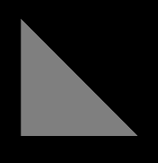](TriangleWithoutIndices/README.md) [Show](https://github.khronos.org/glTF-Sample-Viewer-Release/?model=https://raw.GithubUserContent.com/KhronosGroup/glTF-Sample-Assets/main/./Models/TriangleWithoutIndices/glTF/TriangleWithoutIndices.gltf) | The simplest possible glTF asset: A single scene with a single node and a single mesh with a single mesh.primitive with a single triangle with a single attribute, without indices and without a material Credit: &copy; 2017, Public. [CC0 1.0 Universal](https://creativecommons.org/publicdomain/zero/1.0/legalcode)  - javagl for Everything |
| [Unicode❤♻Test](Unicode❤♻Test/README.md)  [Show](https://github.khronos.org/glTF-Sample-Viewer-Release/?model=https://raw.GithubUserContent.com/KhronosGroup/glTF-Sample-Assets/main/./Models/Unicode❤♻Test/glTF-Binary/Unicode❤♻Test.glb) -- [Download GLB](https://raw.GithubUserContent.com/KhronosGroup/glTF-Sample-Assets/main/./Models/Unicode❤♻Test/glTF-Binary/Unicode❤♻Test.glb) | A sample with Unicode characters in file, material, and mesh names Credit: &copy; 2017, Public. [CC0 1.0 Universal](https://creativecommons.org/publicdomain/zero/1.0/legalcode)  - Viktor Kovács for Everything |
| [Unlit Test](UnlitTest/README.md)  [Show](https://github.khronos.org/glTF-Sample-Viewer-Release/?model=https://raw.GithubUserContent.com/KhronosGroup/glTF-Sample-Assets/main/./Models/UnlitTest/glTF-Binary/UnlitTest.glb) -- [Download GLB](https://raw.GithubUserContent.com/KhronosGroup/glTF-Sample-Assets/main/./Models/UnlitTest/glTF-Binary/UnlitTest.glb) | Tests if the KHR_materials_unlit extension is supported properly. Credit: &copy; 2019, Analytical Graphics, Inc.. [CC BY 4.0 International](https://creativecommons.org/licenses/by/4.0/legalcode)  - Ed Mackey for Everything |
| [Vertex Color Test](VertexColorTest/README.md)  [Show](https://github.khronos.org/glTF-Sample-Viewer-Release/?model=https://raw.GithubUserContent.com/KhronosGroup/glTF-Sample-Assets/main/./Models/VertexColorTest/glTF-Binary/VertexColorTest.glb) -- [Download GLB](https://raw.GithubUserContent.com/KhronosGroup/glTF-Sample-Assets/main/./Models/VertexColorTest/glTF-Binary/VertexColorTest.glb) | Tests if vertex colors are supported. Credit: &copy; 2018, Analytical Graphics, Inc.. [CC BY 4.0 International](https://creativecommons.org/licenses/by/4.0/legalcode)  - Ed Mackey for Everything |
| [Virtual City](VirtualCity/README.md)  [Show](https://github.khronos.org/glTF-Sample-Viewer-Release/?model=https://raw.GithubUserContent.com/KhronosGroup/glTF-Sample-Assets/main/./Models/VirtualCity/glTF/VirtualCity.gltf) | The 'Virtual City' model was graciously contributed by the folks at 3DRT. Credit: &copy; 2017, 3DRT. [3DRT license with allowances for glTF Testing]()  - 3DRT for Everything |
| [Water Bottle](WaterBottle/README.md)  [Show](https://github.khronos.org/glTF-Sample-Viewer-Release/?model=https://raw.GithubUserContent.com/KhronosGroup/glTF-Sample-Assets/main/./Models/WaterBottle/glTF-Binary/WaterBottle.glb) -- [Download GLB](https://raw.GithubUserContent.com/KhronosGroup/glTF-Sample-Assets/main/./Models/WaterBottle/glTF-Binary/WaterBottle.glb) | Basic metal/roughness water bottle. Credit: &copy; 2017, Public. [CC0 1.0 Universal](https://creativecommons.org/publicdomain/zero/1.0/legalcode)  - Microsoft for Everything |
---

### Copyright

&copy; 2023, The Khronos Group.

**License:** [Creative Commons Attribtution 4.0 International](https://creativecommons.org/licenses/by/4.0/legalcode)

#### Generated by modelmetadata
