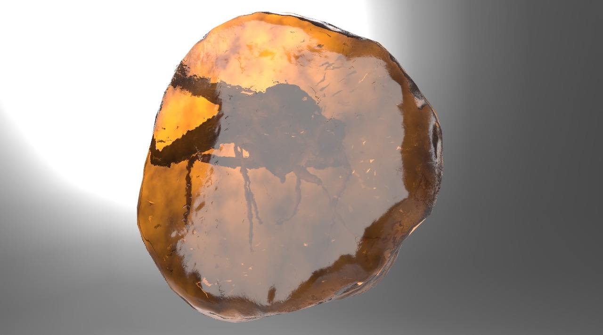

## Screenshot

## Description

glTF 3D model of a "Mosquito In Amber" using the IOR, [KHR-materials-transmission](https://github.com/KhronosGroup/glTF/blob/master/extensions/2.0/Khronos/KHR_materials_transmission/README.md) and Volume PBR extensions to add reflection and refraction to translucent materials.

Press Announcement: [https://www.khronos.org/news/press/new-gltf-extensions-raise-the-bar-on-3d-asset-visual-realism](https://www.khronos.org/news/press/new-gltf-extensions-raise-the-bar-on-3d-asset-visual-realism).