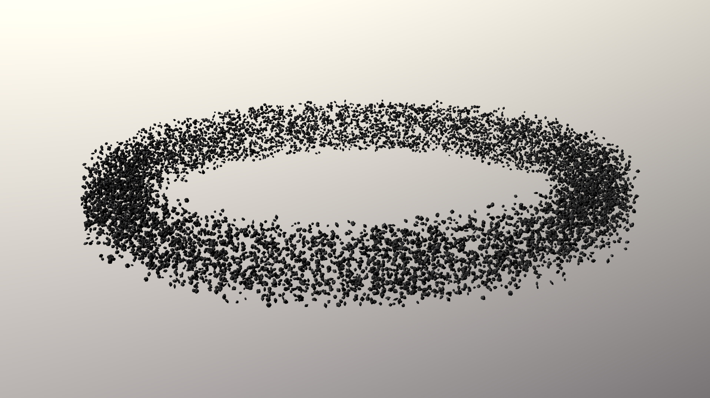

## Screenshot

Screenshot from VARG (Vulkan Accellerated Rendering Gltf) java based renderer, with background displaying irrandiance map using the included camera viewpoint.  
At render output, a value of 10000 lumen will equal to max brightness (1.0 in a unorm framebuffer).  
This value is chosen to match the directional lightsource in the model, having an intensity of 10000 lumen/m2.  

## Description

The purpose of this model is to provide a performance test for a model containing a huge number of nodes, meshes, primitives and materials.    
The model contains a flat nodehierarchy with 10000 nodes.  
Each node is referencing one unique mesh and each mesh having one primitive, referencing one unique material.   
This sums up to 10000 nodes, meshes, primitives and materials.  

In total there are 100 textures in the model (usage of the textures are randomly generated when the model is created)

This model is demanding when it comes to loading and handling a lot of nodes, materials and textures.  
The goal is to provide a performance test to allow implementations optimize loading, preparation and rendering of such a usecase.  
It is not intended to be used as a reference benchmark.  
