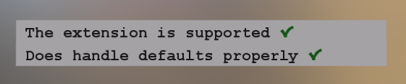
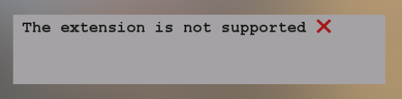
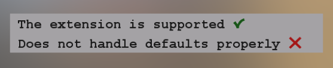
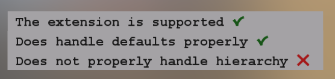

## Screenshot

## Description

A test for the [`KHR_node_visibility`](https://github.com/KhronosGroup/glTF/tree/main/extensions/2.0/Khronos/KHR_node_visibility) extension.

## Test cases

When a viewer properly supports the `KHR_node_visibility` extension, then the asset will be rendered as shown in this screenshot:

When a viewer does not support the extension, then the asset will indicate this as shown in this screenshot:

When a viewer supports the extension, but falsely defaults the `visible` flag to `true`, then this will be indicated by the asset as shown in the following screenshot:

When a viewer supports the extension, but does not follow the rule from the specification that requires a node to be visible only when itself and all its ancestors are visible, then this will be indicated by the asset as shown in this screenshot:

