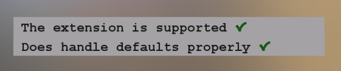
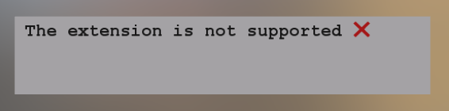
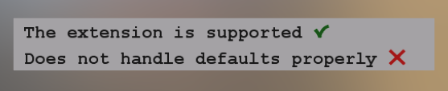
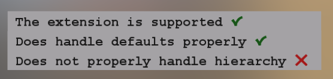

# NodeVisibilityTest

<!-- This file is auto-generated by modelmetadata. Do not edit by hand. -->

## Tags

[testing](../Models-testing.md)

## Extensions Used

* KHR_node_visibility

## Summary

A test for the KHR_node_visibility extension

## Operations

* [Display](https://github.khronos.org/glTF-Sample-Viewer-Release/?model=https://raw.githubusercontent.com/KhronosGroup/glTF-Sample-Assets/main/./Models/NodeVisibilityTest/glTF-Binary/NodeVisibilityTest.glb) in SampleViewer
* [Download GLB](https://raw.githubusercontent.com/KhronosGroup/glTF-Sample-Assets/main/./Models/NodeVisibilityTest/glTF-Binary/NodeVisibilityTest.glb)
* [Model Directory](./)

## Screenshot

## Description

A test for the [`KHR_node_visibility`](https://github.com/KhronosGroup/glTF/tree/main/extensions/2.0/Khronos/KHR_node_visibility) extension.

## Test cases

When a viewer properly supports the `KHR_node_visibility` extension, then the asset will be rendered as shown in this screenshot:

When a viewer does not support the extension, then the asset will indicate this as shown in this screenshot:

When a viewer supports the extension, but falsely defaults the `visible` flag to `false`, then this will be indicated by the asset as shown in the following screenshot:

When a viewer supports the extension, but does not follow the rule from the specification that requires a node to be visible only when itself and all its ancestors are visible, then this will be indicated by the asset as shown in this screenshot:

## Legal

&copy; 2025, Public. [Creative Commons Zero v1.0 Universal](https://creativecommons.org/publicdomain/zero/1.0/legalcode)

 - Marco Hutter (https://github.com/javagl/) for Everything

<!-- This file is auto-generated by modelmetadata. Do not edit by hand. -->
