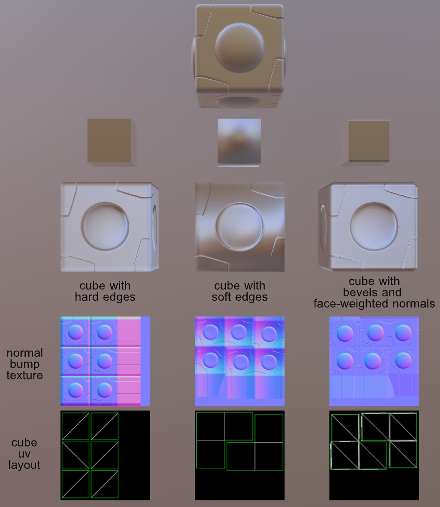
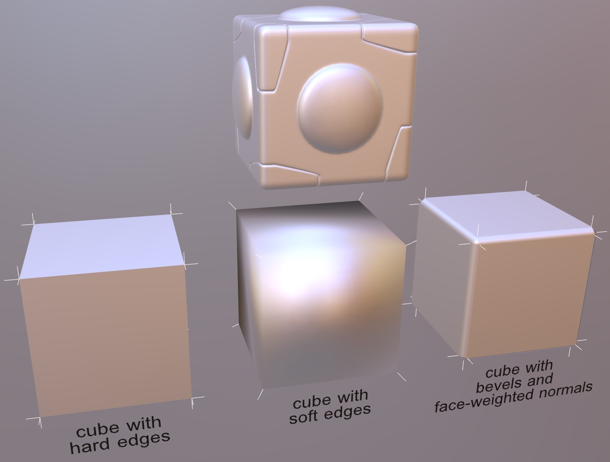
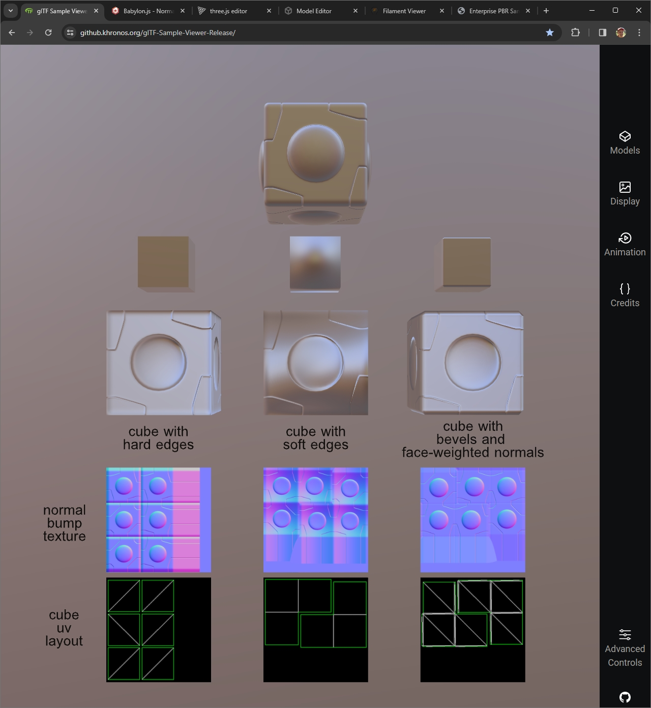
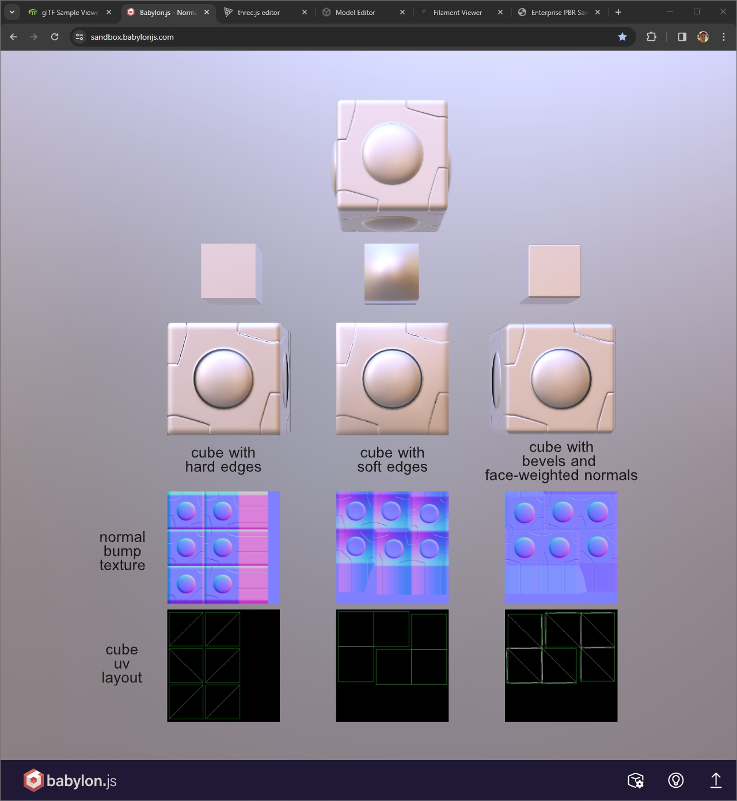
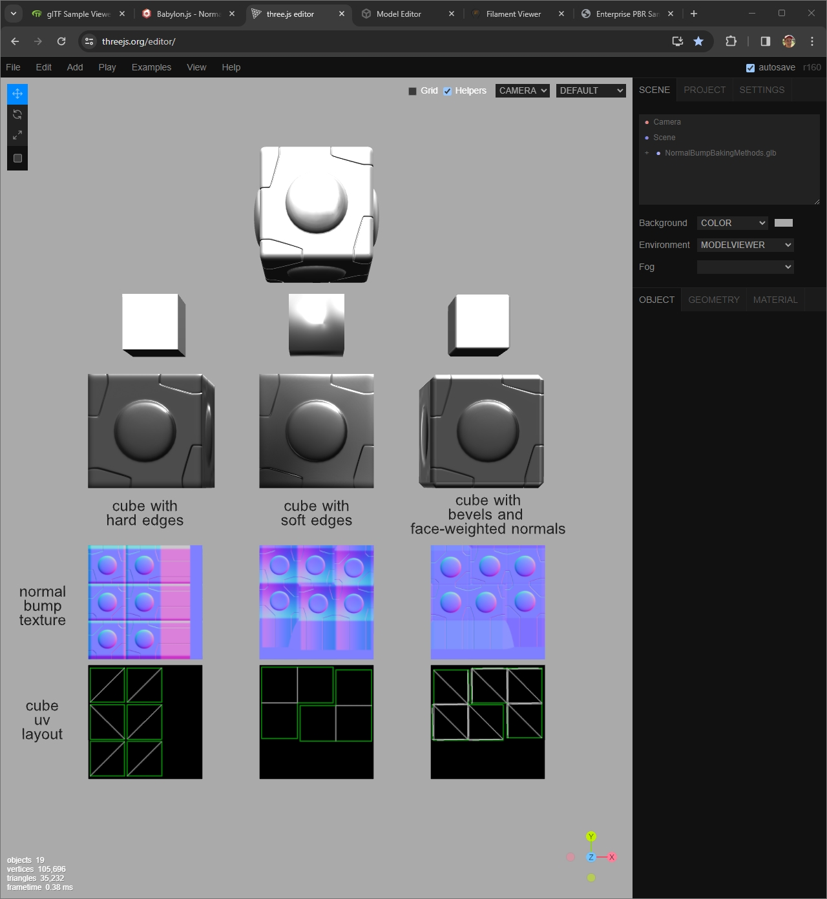
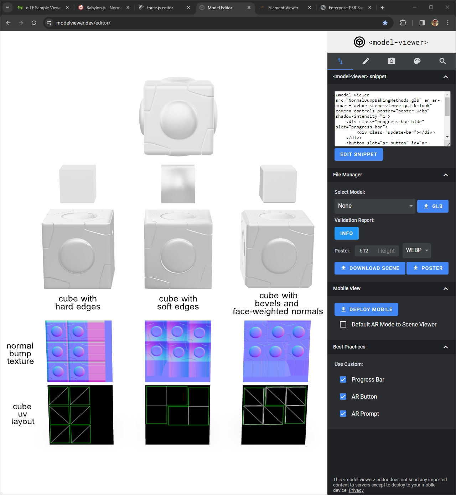

## Screenshot

 _Screenshot from [Babylon.js Sandbox](https://sandbox.babylonjs.com/)._

## Description

This asset is for testing the rendering of tangent-space normal bump maps which are "baked" to specific geometries. 

## Tangent Space

Tangent space normal bump maps are often used in two ways: 
1. To represent surface curvature from high-resolution geometry on lower-resolution geometry for use in a real-time renderer.
2. To tile high-frequency bump details across arbitrary meshes.

When the first method is used, the texture is created ("baked") for a specific geometry and cannot be reused properly on meshes with different vertex normals. The pixels in the normal map represent surface vectors which allow a shader to translate lighting from world space into the specific model's own local space. 

Each model's local tangent space is uniquely calculated from the model's vertex normals and UV coordinates. The tangents can be precalculated by the baking software and included in the glTF export, or they can be omitted from export and the renderer must  recalculate the tangents. Either way, tangents are required to reproduce the normal bump data in a renderer. To faithfully reproduce the curvature captured from the high-resolution geometry, the baking software must use [MikkTSpace](https://github.com/mmikk/MikkTSpace) which is the tangent basis used in glTF.

The glTF specification indicates that if the asset does not include tangents, then renderers should recalculate the tangents. The meshes in these assets do not include tangent data. 

## Vertex Normals

Three baking methods are demonstrated in this asset:
1. Hard edges
2. Soft edges
3. Bevels 

 _Screenshot of the vertex normals for the three cubes, with the high-resolution "source" asset at the top._

`Hard edges` means the vertex normals are split for each vertex of the cube. Each face of the cube has its own set of vertex normals perpendicular to the face. This creates hard edges between the six faces. 

When hard edges are used, the UV coordinates must be split along each hard edge. This allows the use of padding in the gutters between the hard edges, which prevents lighting discontinuities between the cube faces. Padding prevents lower MIPs of the normal texture from introducing erroreous vectors from neighboring faces.

`Soft edges` means the vertex normals are not split. Each vertex contains a single vertex normal, so neighboring cube faces are smoothly shaded with each other, with no hard edges between them. Tangent space calculations are very difficult in this case because there are no natural seams to help resolve directional differences. 

When soft edges are used, the UV coordinates do not need to be split along the edges. Neighboring faces of the cube use the same vertex normals, so vector colors are consistent across the edges and MIPs don't introduce lighting discontinuities.

This kind of layout will tend to cause the most errors in renderers. The normal map must encode complex gradients to represent the local space of the mesh. These gradients cause increased errors in texture compression, which tend to cause banding or noise when the surface is lit.

`Bevels` means the low-resolution model has additional vertices along the hard edges to allow the use of face-weighted vertex normals. The large flat surfaces can encode flat tangent spaces. The normal map does not need to use large gradients to store differences in curvature between the low-resolution mesh and high-resolution mesh. 

Bevels increase the complexity of the low-resolution model and its UVs, but the in-game vertex count is comparable with low-resolution meshes that use hard edges instead of bevels. 

## glTF-Binary Versions

Binary glTF assets are provided in the `glTF-Binary` folder to showcase normal bump textures baked in different software applications:

* `BoxBevel_3dsMaxVRay.glb` is a cube with bevels and face-weighted normals, and a normal bump texture baked in 3ds Max 2024.2 with the renderer V-Ray 6.10.08. 
* `BoxBevel_Blender.glb` cube with bevels and face-weighted normals, and a normal bump texture baked in Blender 4.0.2. 
* `BoxHard_3dsMaxVRay.glb` is a cube with hard edges and split vertex normals, and a normal bump texture baked in 3ds Max 2024.2 with the renderer V-Ray 6.10.08.
* `BoxHard_Blender.glb` is a cube with hard edges and split vertex normals, and a normal bump texture baked in Blender 4.0.2.
* `BoxHigh.glb` is a cube with complex curvature, meant to be baked into a normal map.
* `BoxSoft_3dsMaxVRay.glb` is a cube with averaged vertex normals, and a normal bump texture baked in 3ds Max 2024.2 with the renderer V-Ray 6.10.08.
* `BoxSoft_Blender.glb` is a cube with averaged vertex normals, and a normal bump texture baked in Blender 4.0.2.
* `NormalBumpBakingMethods.glb` shows the cubes arranged together with labels (as shown in the screenshot above), and normal bump textures baked in 3ds Max 2024.2 with the renderer V-Ray 6.10.08.

3ds Max was set to use Mikktspace tangent basis for baking. V-Ray uses the DirectX convention with the green channel representing Y-down, while glTF uses the OpenGL convention of Y-up. Therefore the green channel in each texture was inverted after baking.

Blender uses Mikktspace tangent basis for baking. Blender bakes with the OpenGL convention with the green channel representing Y-up, which matches the glTF convention.

## Rendering Errors

This asset can be used to stress-test glTF renderers to discover errors in handling tangent-space normal maps.

 _Screenshot from [glTF Sample Viewer](https://github.khronos.org/glTF-Sample-Viewer-Release/). All three low-resolution cubes show errors in rendering. The middle "BoxSoft" shows significant errors._

 _Screenshot from [Babylon.js Sandbox](https://sandbox.babylonjs.com/). The three cubes render correctly; the lighting direction is consistent._

 _Screenshot from [three.js Editor](https://threejs.org/editor/). The middle cube "SoftBox" shows increased errors, but shows fundamentally correct lighting directions._

 _Screenshot from [model-viewer Editor](https://modelviewer.dev/editor/). The three cubes render correctly; the lighting direction is consistent._