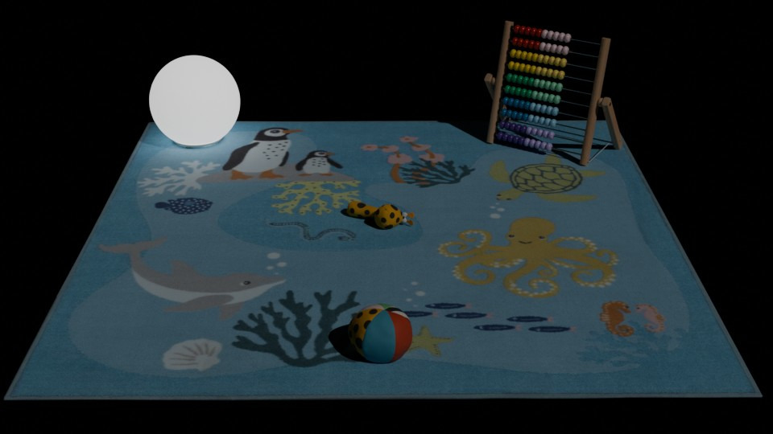
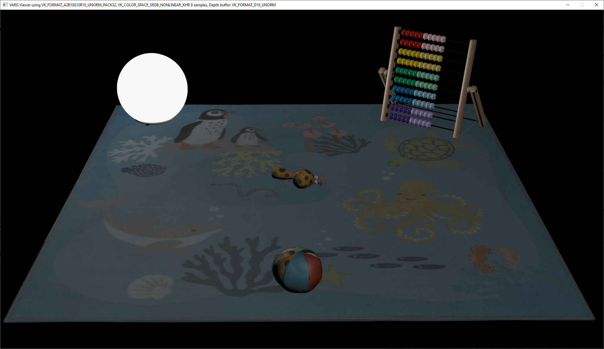

## Screenshot

Realtime render:  
  

Reference render from Blender:  
  

## Description

This is a showcase model containing a couple of IKEA assets assembled into a scene.  
One of the assets is a light with realistic light intensity values chosen from real products.  
The scene has one directiona light to provide some type of environment illumination, the intensity is chosen to be that of indoor light intensity.  
A camera is added to represent the desired viewpoint.  

The model uses KHR_lights_punctual and KHR_materials_emissive extensions.  