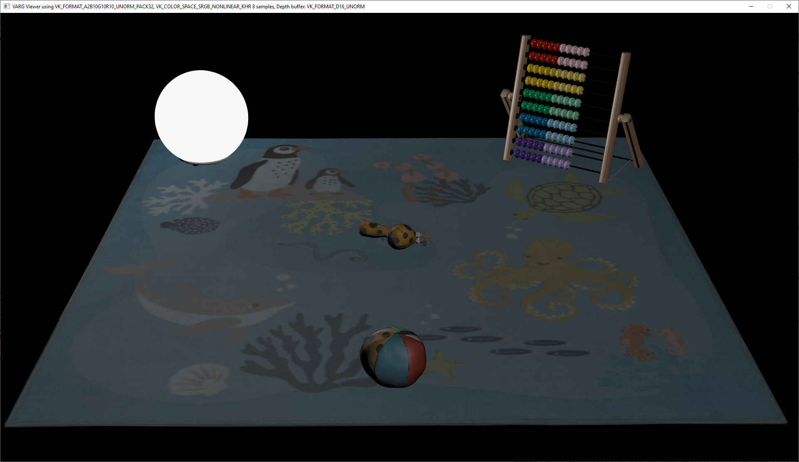
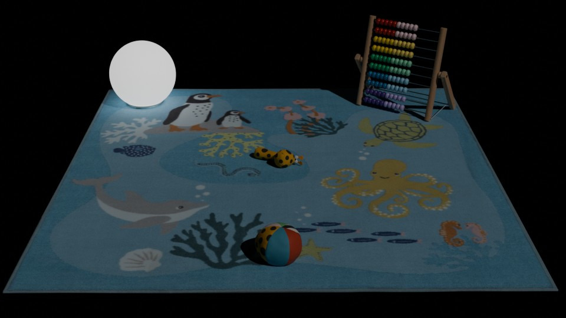

# PlaysetLightTest

## Tags

test

## Summary

A 3D scene with IKEA assets

## Operations

* [Display](https://github.khronos.org/glTF-Sample-Viewer-Release/?model=https://raw.GithubUserContent.com/KhronosGroup/glTF-Sample-Assets/main/./Models/PlaysetLightTest/glTF-Binary/PlaysetLightTest.glb) in SampleViewer
* [Download GLB](https://raw.GithubUserContent.com/KhronosGroup/glTF-Sample-Assets/main/./Models/PlaysetLightTest/glTF-Binary/PlaysetLightTest.glb)
* [Model Directory](./)

## Screenshot

Realtime render using VARG-engine (https://github.com/rsahlin/varg-engine)  
Renderer is using a max light value to scale pixel values before storing in framebuffer (exposure).  
  

Reference render from Blender:  
  

## Description

This is a showcase model containing a couple of IKEA assets assembled into a scene.  
One of the assets is a light with realistic light intensity values chosen from real products.  
The scene has one directional light to provide some type of environment illumination, the intensity is chosen to be that of indoor light intensity.  
A camera is added to represent the desired viewpoint.  
It is desired that applications render this model 'as is' and not adding environment map, ibl or other types of illumination.  

The model uses KHR_lights_punctual and KHR_materials_emissive_strength extensions.  

Engines will need to use some sort of exposure or light scale factor to limit pixel values to fit within the frambuffer range.  

## License  
  
The IKEA 3D Model [PlaysetLightTest.glb] (the “Licensed Material”) is licensed by Inter IKEA Systems B.V. (“IKEA”) under the Creative Commons, Attribution-NonCommercial-ShareAlike 4.0 International ([CC BY-NC-SA 4.0](https://creativecommons.org/licenses/by-nc-sa/4.0/)). The Licensed Material is limited to 3D modelling data/technology and does not include any IKEA products/objects. IKEA reserves the exclusive rights to the design, copyright and other intellectual property rights in the Licensed Materials as well as in its products/objects. A [copy](/LICENSE.md) of the license is available in this repository.  

## Legal

&copy; 2024, Inter IKEA Systems B.V.. [Copyright © Inter IKEA Systems B.V. 2024](https://creativecommons.org/licenses/by-nc-sa/4.0/legalcode.en)

 - Inter IKEA Systems B.V. for Everything

#### Assembled by modelmetadata