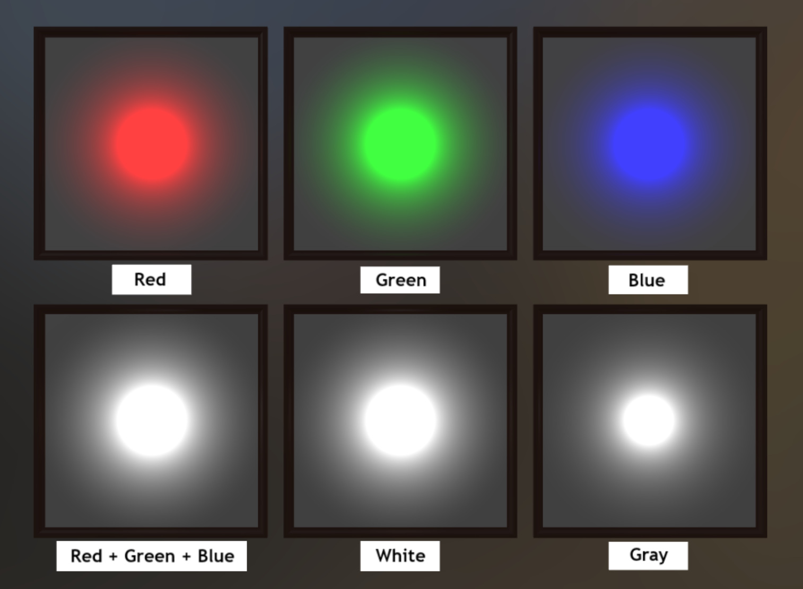

# Point Light Intensity Test

## Tags

[extension](../Models-extension.md), [testing](../Models-testing.md)

## Extensions Used

* KHR_lights_punctual
* KHR_materials_unlit

## Summary

This model tests KHR_lights_punctual intensity vs lamp color.

## Operations

* [Display](https://github.khronos.org/glTF-Sample-Viewer-Release/?model=https://raw.GithubUserContent.com/KhronosGroup/glTF-Sample-Assets/main/./Models/PointLightIntensityTest/glTF-Binary/PointLightIntensityTest.glb) in SampleViewer
* [Download GLB](https://raw.GithubUserContent.com/KhronosGroup/glTF-Sample-Assets/main/./Models/PointLightIntensityTest/glTF-Binary/PointLightIntensityTest.glb)
* [Model Directory](./)

## Screenshot

## Description

This model tests various colors of point lights (via `KHR_lights_punctual`) that all share the same intensity (1.0). It is intended to serve as a test for the following clarification that was added to the `KHR_lights_punctual` extension:

> The `intensity` represents the luminous intensity that the light would emit if it were colored pure white (`[1.0, 1.0, 1.0]`). The `color` property acts as a wavelength-specific multiplier.

In other words, the specified color works as a "filter" in front of a light source of the specified intensity.

## Expectations

As with other glTF sample assets, the exact appearance of this model need not match the screenshot exactly.  The appearance depends on the brightness of the scene's IBL, renderer exposure settings, choice of tone mapping, and other considerations.

The expectation for the bottom row of this test is that the "Red + Green + Blue" test will be identical (or very nearly so) to the "White" test, and the "Gray" test will be visibly less bright (the radius of the overexposed area will be smaller).

If the rendered image is separated into red, green, and blue monochrome channels, the expectation for each of the corresponding tests from the top row is to match (or be nearly identical) to the "White" test in the bottom row.  For example, when viewing the red channel of the output in isolation, the "Red" test and the "White" test should be very similar.  Beware that the choice of tone mapping in the renderer can skew these results, so tone mapping should be disabled or made linear to the extent possible for the test.

## Details

The test material in each case is (0.8, 0.8, 0.8).  The lights are as follows:

| Label | Color |
|-------|-------|
| Red                | (1.0, 0.0, 0.0) |
| Green              | (0.0, 1.0, 0.0) |
| Blue               | (0.0, 0.0, 1.0) |
| Red + Green + Blue | Three co-located lights, matching the above |
| White              | (1.0, 1.0, 1.0) |
| Gray               | (0.5, 0.5, 0.5) |

## Legal

&copy; 2025, Public. [CC0 1.0 Universal](https://creativecommons.org/publicdomain/zero/1.0/legalcode)

 - Ed Mackey for Everything

#### Assembled by modelmetadata