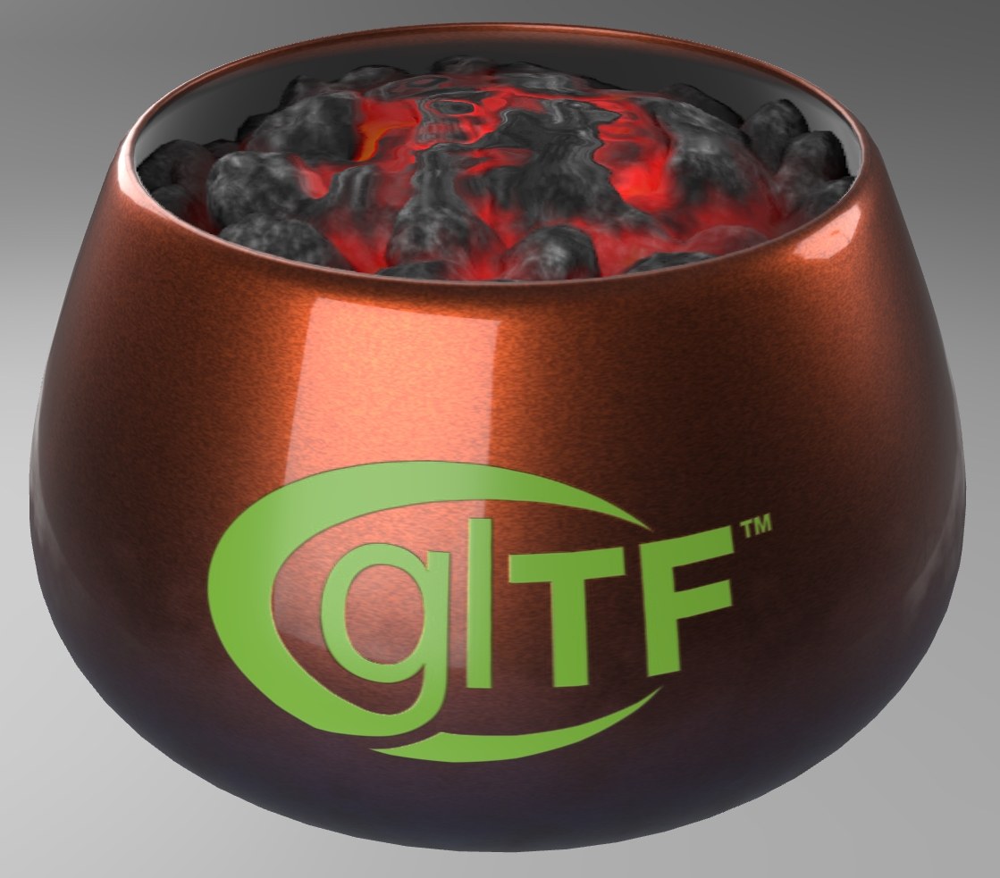
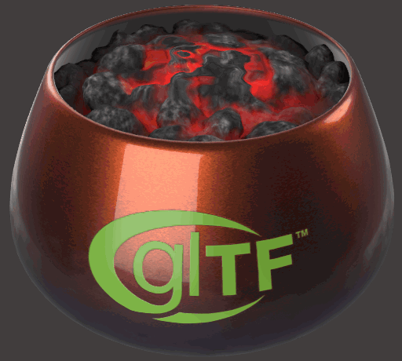
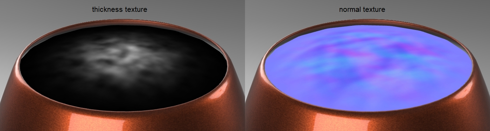
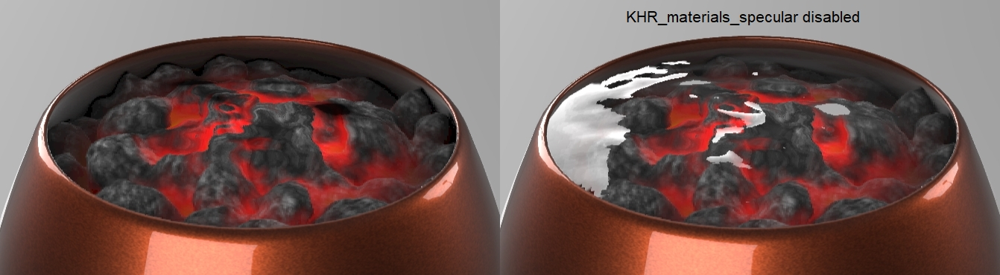

## Screenshot

 _Screenshot from [Babylon.js Sandbox](https://sandbox.babylonjs.com/)._

## Description

This asset uses the extension [KHR_animation_pointer](https://github.com/KhronosGroup/glTF/tree/main/extensions/2.0/Khronos/KHR_animation_pointer#khr_animation_pointer) to animate a heat refraction effect over the [PotOfCoals asset](../PotOfCoals/README.md).

 _The animated heat refraction effect._

## Animation

 _The refraction effect uses two counter-rotating textures._

A mesh was placed above the coals and assigned a refractive material with [KHR_materials_transmission](https://github.com/KhronosGroup/glTF/blob/main/extensions/2.0/Khronos/KHR_materials_transmission/README.md#khr_materials_transmission-) and [KHR_materials_volume](https://github.com/KhronosGroup/glTF/tree/main/extensions/2.0/Khronos/KHR_materials_volume#khr_materials_volume). The volume thickness texture was animated to rotate counter-clockwise, and the normal texture was animated to rotate in the opposite direction. This causes the refraction animation to be less noticeable as a rotating effect, as the two distortions produce an interference pattern. Each texture uses a radial gradient to gradually flatten the texture towards the outside edges, which helps separate the refraction from the edges of the copper pot.

## Specular

 _The specular extension was used to remove reflections._

The extension [KHR_materials_specular](https://github.com/KhronosGroup/glTF/tree/main/extensions/2.0/Khronos/KHR_materials_specular#khr_materials_specular) was added to the refraction mesh to disable all reflections. This prevents the mesh from looking like reflective glass or water, but more like non-reflective air being refracted by heat.