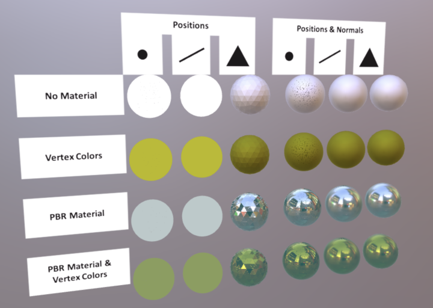

# Primitive Mode Normals Test

## Tags

[core](../../Models-core.md), [issues](../../Models-issues.md), [testing](../../Models-testing.md)

## Summary

Tests rendering of points, lines, and triangles with and without normals.

## Operations

* [Display](https://github.khronos.org/glTF-Sample-Viewer-Release/?model=https://raw.GithubUserContent.com/KhronosGroup/glTF-Sample-Assets/main/./Models/PrimitiveModeNormalsTest/glTF/PrimitiveModeNormalsTest.gltf) in SampleViewer
* [Model Directory](./)

## Screenshot

## Description

This asset tests rendering of point, line, and triangle primitive modes with and without vertex normals.

- The first two columns, points and lines without normals, should be rendered as solid colors without lighting.

- The third column, triangles without normals, should be rendered with flat shading and full PBR material model.

- The remaining columns, all three modes with normals, should be rendered with smooth shading and full PBR material model.

## Legal

&copy; 2020, public. [CC0 1.0 Universal](https://creativecommons.org/publicdomain/zero/1.0/legalcode)

 - Unknown for Everything

#### Assembled by modelmetadata