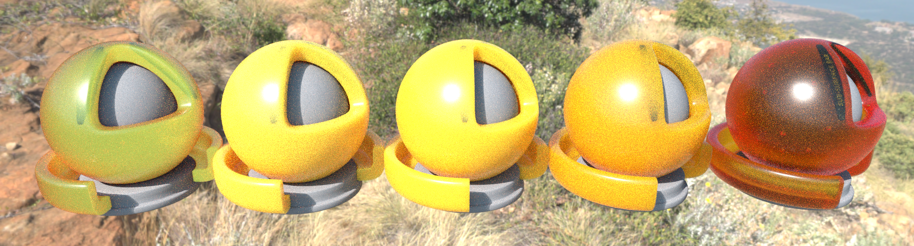
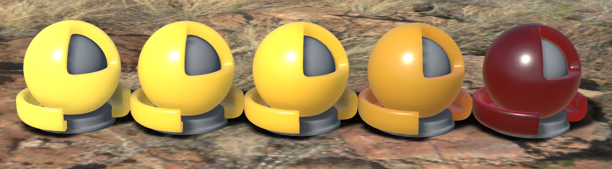

## Screenshot

 _Pathtraced render from [Adobe Substance 3D Stager](https://www.adobe.com/products/substance3d/apps/stager.html) with the environment Harties Cliff View._

 _Rendered in Babylon.js using OpenPBR material._

## Description
This asset demonstrates the effect of anisotropic scattering. Each shader ball uses the `KHR_materials_volume_scatter` extension with values for `scatterAnisotropy` ranging from -1 (backscattering) to +1 (forward scattering).

## Editing and Export
The shader ball asset is the USD Standard Shader Ball, converted to glTF. The material setup and export was done in Babylon.js.