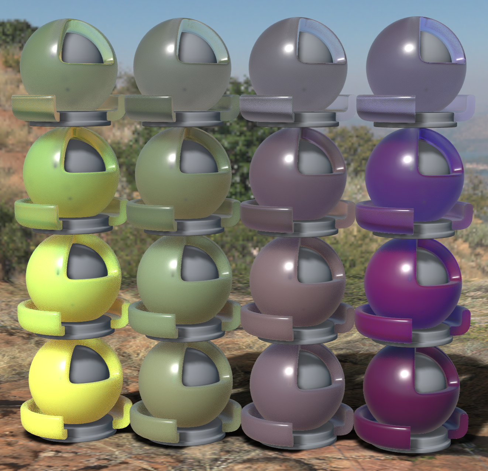

## Screenshot

 _Pathtraced render from [Adobe Substance 3D Stager](https://www.adobe.com/products/substance3d/apps/stager.html) with the environment Harties Cliff View._

 _Rendered in Babylon.js using OpenPBR material._

## Description
This asset demonstrates varying amounts of scattering and absorption. Note that because this asset includes non-dense scattering, it makes use of the KHR_materials_transmission extension and not the KHR_materials_diffuse_transmission extension.

## Editing and Export
The shader ball asset is the USD Standard Shader Ball, converted to glTF. The material setup and export was done in Babylon.js.