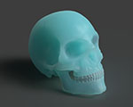
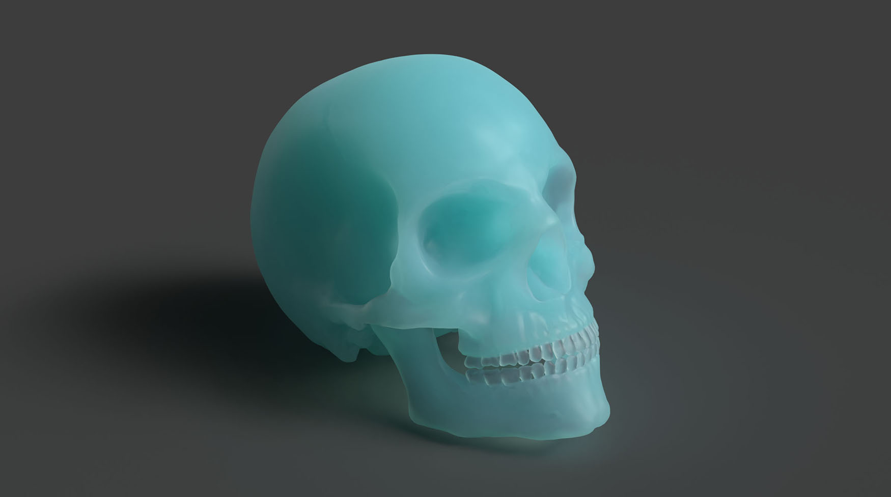

## Screenshot

## Description

This human skull model uses the subsurface scattering extension to create a material that resembles frosted glass.
Screenshot rendered in Adobe Substance 3D Stager.

