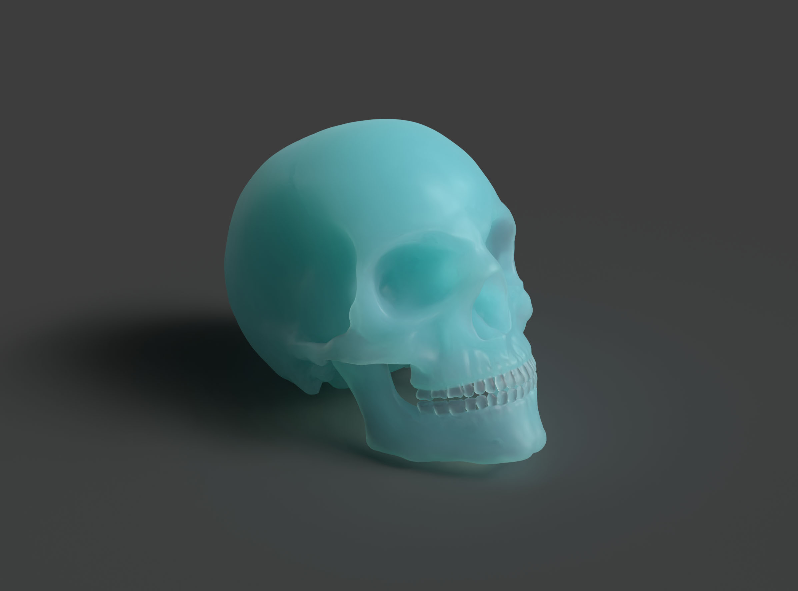

# Skull

## Tags

[core](../../Models-core.md), [testing](../../Models-testing.md)

## Extensions Used

* KHR_xmp_json_ld
* KHR_materials_diffuse_transmission
* KHR_materials_volume
* KHR_materials_dispersion
* KHR_materials_volume_scatter
* KHR_materials_ior

## Summary

Human skull model with subsurface scattering.

## Operations

* [Display](https://github.khronos.org/glTF-Sample-Viewer-Release/?model=https://raw.GithubUserContent.com/KhronosGroup/glTF-Sample-Assets/main/./Models/ScatteringSkull/glTF-Binary/ScatteringSkull.glb) in SampleViewer
* [Download GLB](https://raw.GithubUserContent.com/KhronosGroup/glTF-Sample-Assets/main/./Models/ScatteringSkull/glTF-Binary/ScatteringSkull.glb)
* [Model Directory](./)

## Screenshot

## Description

This human skull model uses the subsurface scattering extension to create a material that resembles frosted glass.
Screenshot rendered in Adobe Substance 3D Stager.

## Legal

&copy; 2025, Public. [CC0 1.0 Universal](https://creativecommons.org/publicdomain/zero/1.0/legalcode)

 - Vladimir Petkovic for Everything

#### Assembled by modelmetadata