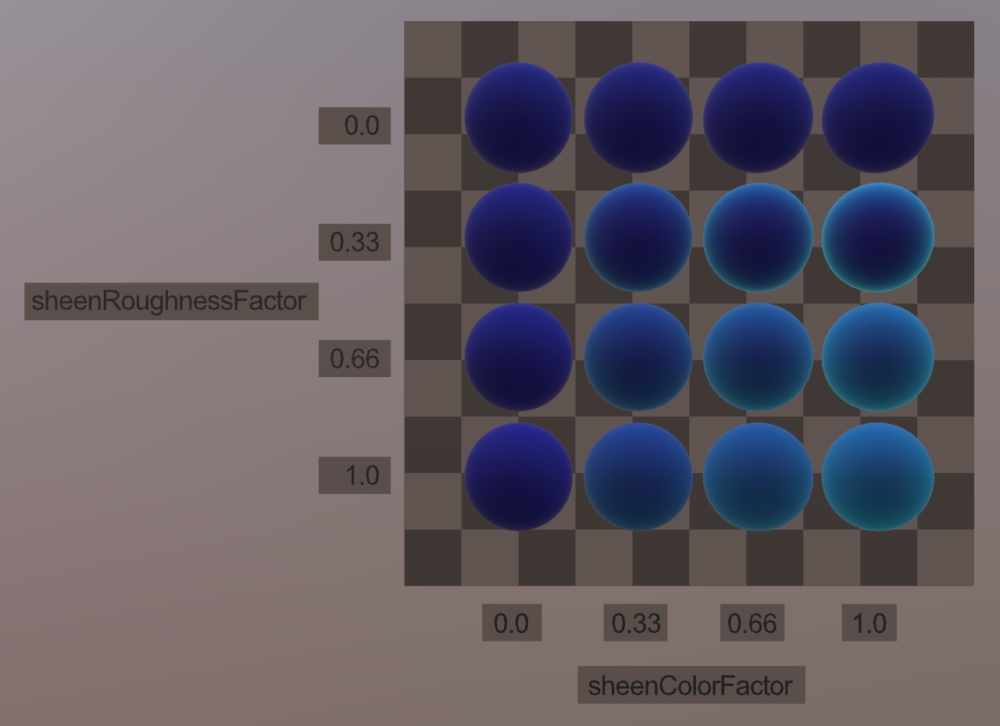
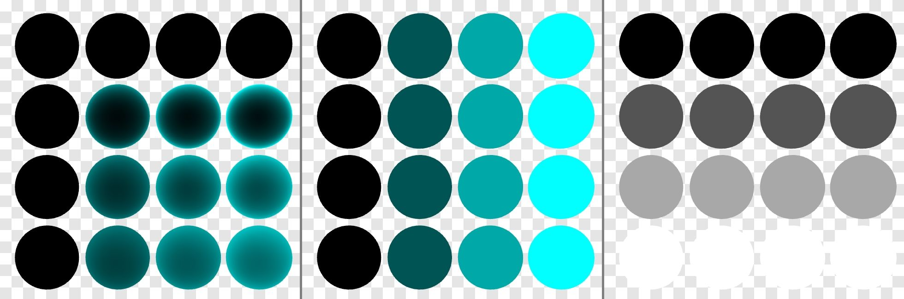
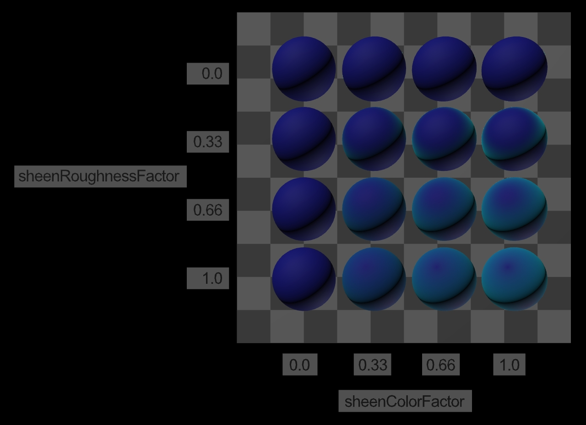

## Screenshot

 _Screenshot from [glTF Sample Viewer](https://github.khronos.org/glTF-Sample-Viewer-Release/) using the Environment "Footprint Court"._

## Description

This model tests sheenColorFactor versus sheenRoughnessFactor using the extension [KHR_materials_sheen](https://github.com/KhronosGroup/glTF/tree/main/extensions/2.0/Khronos/KHR_materials_sheen). 

The baseColorFactor for all spheres is 0.5 blue, and the sheenColorFactor varies from 0 black to 0,1,1 cyan. 

The sheen extension has been explicitly added to each of the sixteen materials, even when the sheenColorFactor is set to black and therefore the extension would usually be omitted.

 _Screenshots from [glTF Sample Viewer](https://github.khronos.org/glTF-Sample-Viewer-Release/) using the Environment "Studio Neutral" and showing debug views Sheen, Sheen Color, and Sheen Roughness._

 _Screenshot from [glTF Sample Viewer](https://github.khronos.org/glTF-Sample-Viewer-Release/) with the Punctual Lighting option, which uses two directional lights from opposing angles._