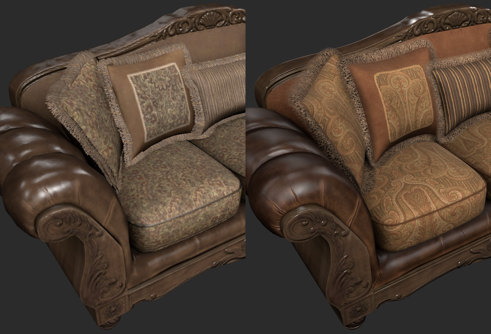

# DiffuseTransmissionPlant

## Tags

[showcase](../../Models-showcase.md), [extension](../../Models-extension.md)

## Extensions

### Required

* KHR_texture_transform
* EXT_texture_webp

### Used

* KHR_texture_transform
* EXT_texture_webp
* KHR_materials_specular
* KHR_materials_sheen
* KHR_texture_transform
* EXT_texture_webp

## Summary

Potted plant asset using Diffuse Transmission extension.

## Operations

* [Display](https://github.khronos.org/glTF-Sample-Viewer-Release/?model=https://raw.GithubUserContent.com/KhronosGroup/glTF-Sample-Assets/main/./Models/SheenWoodLeatherSofa/glTF-Binary/SheenWoodLeatherSofa.glb) in SampleViewer
* [Download GLB](https://raw.GithubUserContent.com/KhronosGroup/glTF-Sample-Assets/main/./Models/SheenWoodLeatherSofa/glTF-Binary/SheenWoodLeatherSofa.glb)
* [Model Directory](./)

## Screenshot

 _Screenshot from [three.js Editor](https://threejs.org/editor/)_

## Description

This asset demonstrates the use of three different UV methods for textured assets, plus [KHR_materials_sheen](https://github.com/KhronosGroup/glTF/blob/main/extensions/2.0/Khronos/KHR_materials_sheen/README.md) and [KHR_materials_specular](https://github.com/KhronosGroup/glTF/blob/main/extensions/2.0/Khronos/KHR_materials_specular/README.md) for fabrics. 

The original is available from [Polyhaven](https://polyhaven.com/a/sofa_03). The model was edited with 3ds Max to improve geometry, and to recreate UVs and materials. 

 
 _Before and after, screenshots from [three.js Editor](https://threejs.org/editor/)_

Three UV methods were used:
1. One texcoord with mirrored UV. The wood and leather frame was mirrored to maximize texture resolution via mirrored texture coordinates, then the textures were re-baked from 8k source files. The back-facing mirrored UVs were offset one unit on the U axis, to avoid baking errors but to keep alignment with the front-facing UVs.
2. One texcoord with atlas UV and per-texture transforms. New fabric textures were created at higher resolutions, fine-grain woven detail was added, and the UVs were re-packed into a new atlas UV layout (all UVs within 0-1 space, with no overlaps). All fabric textures use the same UV layout, and textures were repeated using [KHR_texture_transform](https://github.com/KhronosGroup/glTF/blob/main/extensions/2.0/Khronos/KHR_texture_transform/README.md). The ambient occlusion texture is the only texture to use the UV layout as-is, without KHR_texture_transform.
3. Two texcoords: tiling UV and atlas UV. New pillow fringe was created as a seamless ring around each pillow, to resolve discontinuities on the original model. New tiling textures were generated, alpha blend was used instead of alpha test, and vertex color was added for color variation. A second UV set was created for the ambient occlusion texture, using an atlas UV layout. This allows the fringe texture to be aligned to the geometry strips and repeated around the pillow perimeters (texcoord 0), while the baked ambient occlusion texture has unique space (texcoord 1).

The fabric materials use the glTF extensions KHR_materials_sheen and KHR_materials_specular for more realistic fabric shading. Specular was reduced to avoid a plastic-like specular response, and sheen emulates backscattering from fine threads sticking up from the surface.

Alpha sorting errors for the pillow fringe have been fixed by manually re-arranging the vertex order. The geometry strips were detached from each other, backfaces were duplicated manually, and front-facing strips were re-attached in order from back to front... end pillows, then mid pillows, then center pillow, attaching them by alpha draw order to force the vertices to be drawn back to front. This was repeated for the back-facing strips... center pillow first, then mid pillows, then end pillows last. 

To keep the asset at a reasonable file size (under 10mb) the textures were compressed with WEBP format, and use the glTF extension [EXT_texture_webp](https://github.com/KhronosGroup/glTF/blob/main/extensions/2.0/Vendor/EXT_texture_webp/README.md), except for the normal map for the wood and leather frame to avoid major shading errors. 

## Legal

&copy; 2024, Darmstadt Graphics Group GmbH. [CC BY 4.0 International](https://creativecommons.org/licenses/by/4.0/legalcode)

 - Eric Chadwick for Improvements

&copy; 2021, Public domain. [CC0 1.0 Universal](https://creativecommons.org/publicdomain/zero/1.0/legalcode)

 - Fran Calvente for Original asset

#### Assembled by modelmetadata