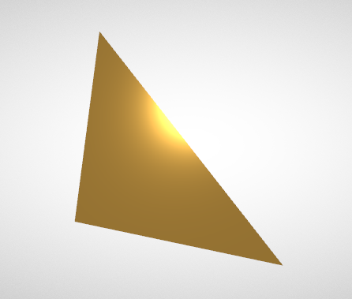
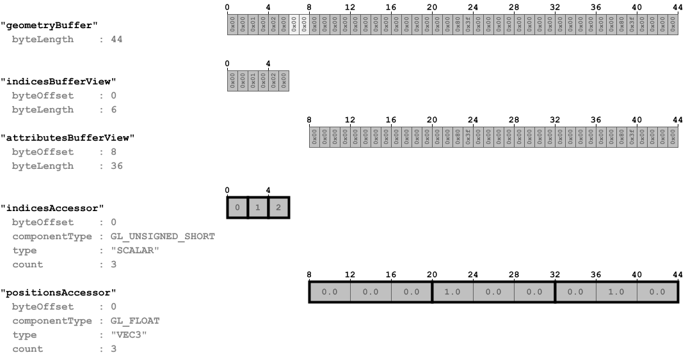

## Screenshot

## Notes

An example of a simple glTF asset with a PBR (physically based rendering) material definition, as described
in the [Simple Material](https://github.com/KhronosGroup/glTF-Tutorials/blob/master/gltfTutorial/gltfTutorial_011_SimpleMaterial.md)
section of the glTF tutorial.

## Data layout

The following image shows the data layout of this sample:

