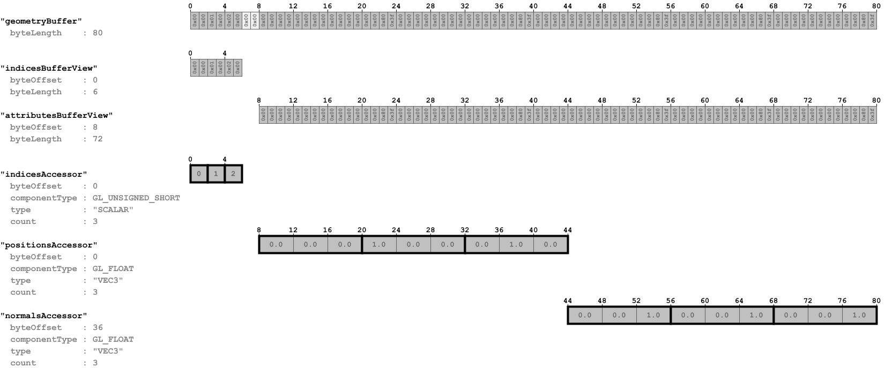

## Screenshot

## Notes##

This is an example showing how the same mesh may be appended to 
several nodes, to be rendered multiple times. It also shows 
how additional vertex attributes are defined in a `mesh.primitive` - 
namely, attributes for the vertex normals. 

**Note:** The additional vertex normal attribute in this example is
not yet used by any technique. This may cause a warning to be 
printed during the validation. The normal attribute will be used in 
the [AdvancedMaterial](../AdvancedMaterial) example.

## Data layout

The following image shows the data layout of this sample:

