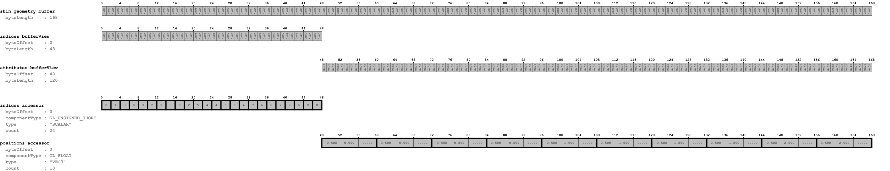
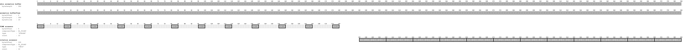
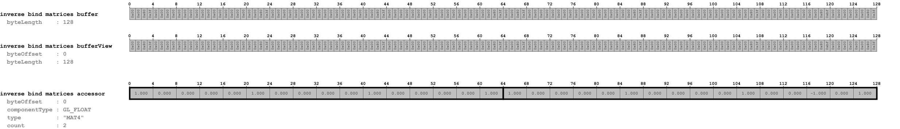
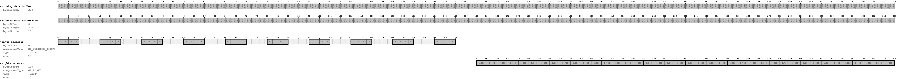

# Simple Skin

## Tags

[core](../../Models-core.md), [testing](../../Models-testing.md), [written](../../Models-written.md)

## Summary

A simple example of vertex skinning in glTF

## Operations

* [Display](https://github.khronos.org/glTF-Sample-Viewer-Release/?model=https://raw.GithubUserContent.com/KhronosGroup/glTF-Sample-Assets/main/./Models/SimpleSkin/glTF/SimpleSkin.gltf) in SampleViewer
* [Model Directory](./)

## Screenshot

## Notes

Details about skinning using this particular model are explained in the
[skinning section of the glTF tutorial](https://github.com/javagl/glTF-Tutorials/blob/master/gltfTutorial/gltfTutorial_019_SimpleSkin.md).

## Data layout

The following images show the data layout of this sample:

## Legal

&copy; 2017, Public. [CC0 1.0 Universal](https://creativecommons.org/publicdomain/zero/1.0/legalcode)

 - javagl for Everything

#### Assembled by modelmetadata