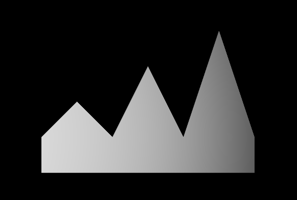
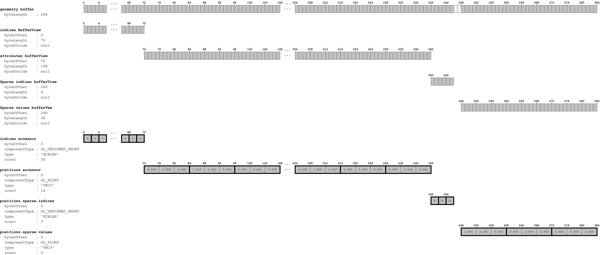
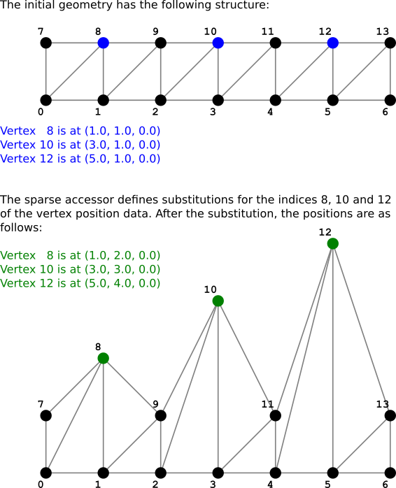

# Simple Sparse Accessor

## Tags

[core](../../Models-core.md), [testing](../../Models-testing.md)

## Summary

A simple mesh that uses sparse accessors

## Operations

* [Display](https://github.khronos.org/glTF-Sample-Viewer-Release/?model=https://raw.GithubUserContent.com/KhronosGroup/glTF-Sample-Assets/main/./Models/SimpleSparseAccessor/glTF/SimpleSparseAccessor.gltf) in SampleViewer
* [Model Directory](./)

# SimpleSparseAccessor

## Screenshot

## Data layout

The following image shows the data layout of this sample:

## Geometry

The following image shows the substitution of the values that takes place for the sparse accessor:

## License Information

Public domain ([CC0](https://creativecommons.org/publicdomain/zero/1.0/))

## Legal

&copy; 2017, Public. [CC BY 4.0 International](https://creativecommons.org/licenses/by/4.0/legalcode)

 - javagl for Everything

#### Assembled by modelmetadata