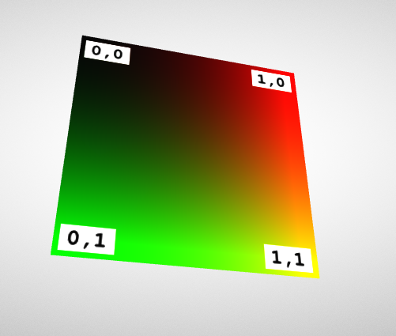

## Screenshot

## Notes

An example of a simple glTF asset with a texture, as described
in the [Simple Texture](https://github.com/KhronosGroup/glTF-Tutorials/blob/master/gltfTutorial/gltfTutorial_013_SimpleTexture.md)
section of the glTF tutorial.

