# SunglassesKhronos

## Tags

[showcase](../../Models-showcase.md), [extension](../../Models-extension.md)

## Extensions Used

* KHR_materials_transmission
* KHR_materials_specular
* KHR_materials_volume
* KHR_materials_ior
* KHR_materials_iridescence

## Summary

Sunglasses with Khronos logos and iridescent lenses

## Operations

* [Display](https://github.khronos.org/glTF-Sample-Viewer-Release/?model=https://raw.GithubUserContent.com/KhronosGroup/glTF-Sample-Assets/main/./Models/SunglassesKhronos/glTF-Binary/SunglassesKhronos.glb) in SampleViewer
* [Download GLB](https://raw.GithubUserContent.com/KhronosGroup/glTF-Sample-Assets/main/./Models/SunglassesKhronos/glTF-Binary/SunglassesKhronos.glb)
* [Model Directory](./)

## Screenshot

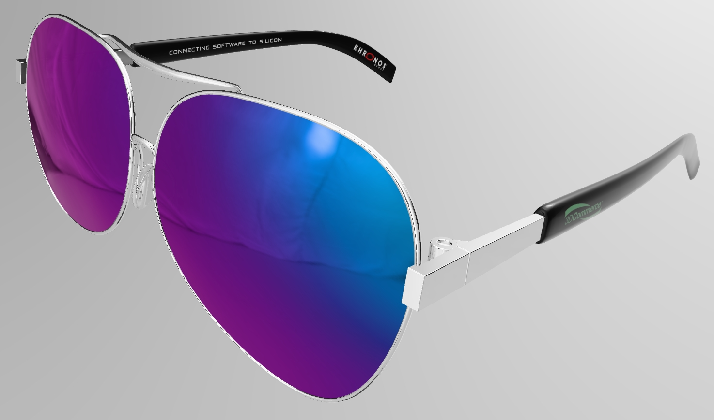
 _Screenshot from [glTF Sample Viewer](https://github.khronos.org/glTF-Sample-Viewer-Release/) with the environment Studio Neutral._

## Description

This asset represents a pair of sunglasses with iridescent coated lenses, including the 3D Commerce and Khronos Group logos. 

The asset was created to demonstrate a high quality asset for e-commerce use, and to provide instructions on how to create similar assets using current industry-accepted 3D content creation techniques. 

## Preparation

To begin creating a 3D asset it helps to gather reference photography. If possible, obtain a physical sample to examine the item from all angles.

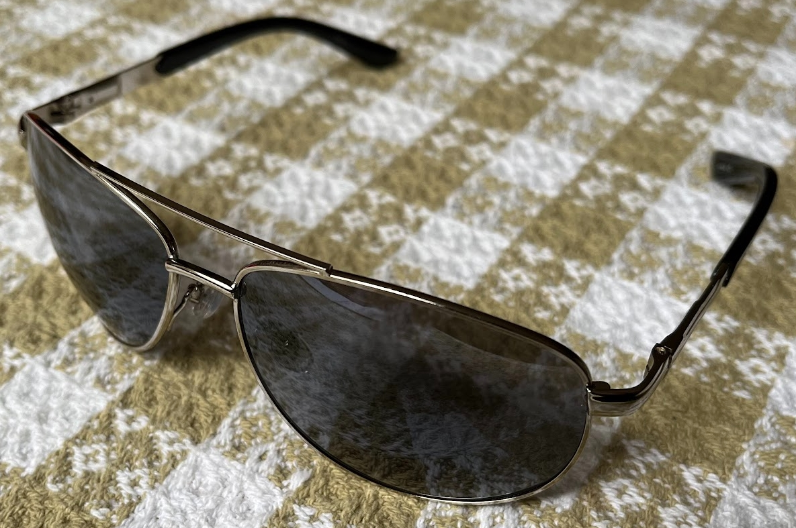
 _A photograph of real sunglasses, a physical sample being used as reference._

The glTF asset was designed to be similar to a pair of inexpensive sunglasses in the author's possession. Usually e-commerce 3D assets are used to sell a real product, so matching the real object is crucial. However in this case, the 3D model is being released in the glTF Sample Assets repository with a permissive license, therefore key design elements were altered to avoid infringing on third-party designs and trademarks. 

On the real sunglasses, the insides of the lenses are coated with a subtle iridescent layer. However for the 3D asset, an iridescent glaze was added on the outside for a stronger visual impact.

## Dimensions and Units

For e-commerce assets (and for most 3D assets in general) it is best to model using real-world dimensions. The [official glTF Specification](https://registry.khronos.org/glTF/specs/2.0/glTF-2.0.html#coordinate-system-and-units) indicates models are to use a scale of 1 unit = 1 meter. The real sunglasses measure 14.5 cm across, so the glTF asset was createdat a similar size, about 15 cm across. 

Accurate dimensions allow the 3D asset to be used properly in real spaces via augmented reality, or alongside other 3D models in other contexts like in web 3D viewers or in virtual reality.

## Modeling with Subdivision

Two main techniques were used to create the 3D model. For the curvy parts (shown in red), subdivision surface modeling was used. For the rectilinear parts (shown in green), face-weighted normals were used.

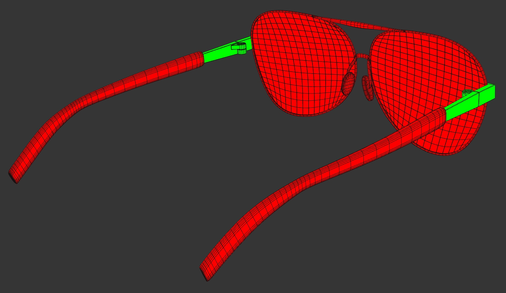
 _Wireframe view of the 3D model with modeling methods shown in colors._

Subdivision surface modeling allows economical control for the shapes by using a lower-resolution mesh which is automatically smoothed and tesselated. This is often ideal for mechanical forms that represent curved surfaces. The lenses, frames, and earhooks use this method.

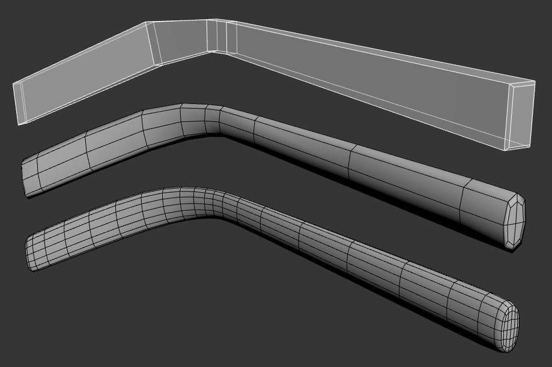
 _Wireframe views of subdivision surfaces._

From top to bottom: the low-resolution control mesh, the mesh subdivided once, the mesh subdivided twice.

## Modeling with Face-Weighted Normals

Face-weighted normals are a good choice for flat surfaces with curved bevels along the edges. The articulated "temples" on the sides of the sunglasses use this technique to create the illusion of rounded bevels but using very few vertices. 

For fast real-time rendering and quick downloading of e-commerce 3D models, it is best to use as few vertices as possible while maintaining the necessary details. 

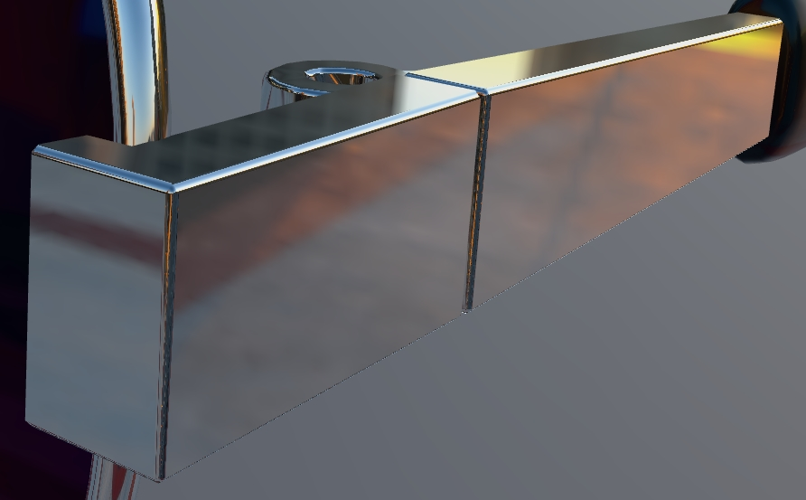
 _Flat surfaces with smooth bevels._

Each vertex of a 3D surface has one or more "vertex normals" which contribute to the shading (shown below in green). These normals can be manipulated with tools in 3ds Max, Blender, Maya, etc. and the modified normals are supported in glTF.

 _Bevels can be added, and vertex normals can be adjusted for clean shading._

Left to right in the image above:
1. Simple geometry with face-aligned vertex normals (flat shading).
2. Vertex normals averaged across neighboring faces (smooth shading). 
3. Bevels added.
4. Vertex normals weighted to align with the largest faces. 

With this technique, the transitions in smooth shading are confined to the beveled faces of the model, resulting in clean well-ordered shading with a minimal number of vertices.

## Pivots for Articulation

Eyeglasses often have hinges at the temples, allowing the earhooks to be rotated inwards. To allow for manipulation and animation of the 3D model, the pivots of the metal temples have been set to the same location and orientation as the cylindrical hinges. 

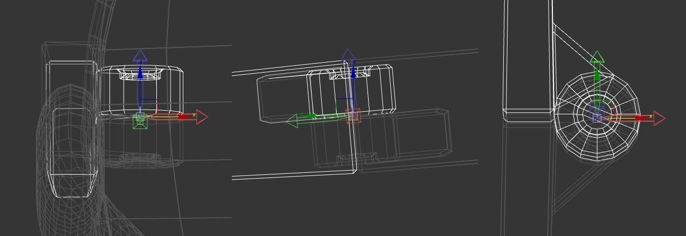
 _Pivots for the temples were adjusted to match the 3D hinges. From left: front view, side view, top view._

These aligned pivots allow the earhooks to be rotated without disconnecting them inadvertently from the neighboring meshes.

## Materials & Textures

The materials are set to use mostly numerical values; this keeps the file small and efficient. 

Textures often incur the most file size and memory storage for an asset, so minimizing their use whenever possible allows the file to be efficient. 

This asset uses only one texture, for the Khronos Group logos on the black earhooks. The image is 1024 x 128 pixels, which is the closest resolution using powers-of-two dimensions which can contain both logos comfortably without causing blurriness when shown on the model. It is best to use powers-of-two dimensions for textures to support mip-mapping, which improves rendering performance and reduces aliasing artifacts.

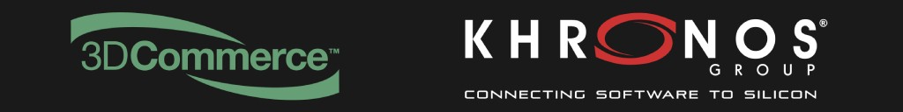
 _The SunglassesKhronos.png texture._

[PNG](http://www.libpng.org/pub/png/spec/1.2/PNG-Contents.html) was chosen as the initial texture format because the image contains mostly larger areas of flat colors, which is ideal for PNG compression. The glTF Sample Assets repository aims to reduce or eliminate compression artifacts in assets, to provide the highest quality content with the widest compatibility.

[WebP](https://github.com/KhronosGroup/glTF/blob/main/extensions/2.0/Vendor/EXT_texture_webp/README.md) was chosen for the compressed version because small file sizes are essential for many e-commerce assets, which reduces the download time for consumers. The longer users have to wait for a file to download, the more likely they are to abandon a 3D experience.

[KTX](https://www.khronos.org/ktx/) was not chosen for texture compression because WebP produces smaller files at comparable quality. KTX works well for applications where video memory is a constraint, for example when multiple models are being loaded together in a room planner and video memory is limited on a mobile device. Another strong use case for KTX is when GPU loading time needs to be optimized, for example when loading/unloading assets dynamically as in a product configurator.

## Iridescence

The material for the lenses will use a non-metallic coating with partial transmission, which presents a couple challenges in glTF PBR:
1. Transmission is disabled if a surface is metallic.
2. Transmission is disabled if the baseColorFactor is black.

A partial metallic value could be used, but this is not advisable because partial metalness is not physically correct, and therefore it can cause unpredictable results in different renderers. For this material it is better to use a dielectric (non-metal) material.

For the iridescence on the lenses there are seven material controls to be adjusted:
1. `baseColorFactor`: this can use a dark color for stronger iridescence, but it cannot be completely black or else transmission will disappear.
1. `metallicFactor`: this should be zero to keep transmission active, and to be physically accurate.
1. `ior`: this is for the glass material, setting it to 1.0 creates a stronger iridescence but also disables refraction, which is OK since the glass is very thin. 
1. `iridescenceFactor`: this is the strength of the iridescence.
1. `iridescenceIor`: this is the IOR for the iridescent film, and has a strong influence on the iridescent colors.
1. `iridescenceThicknessMaximum`: this is the thickness of the iridescent film, and also has a strong influence on which iridescent colors will appear.
1. `transmissionFactor`: this controls the amount of refraction for the glass lens underneath the iridescent film. It can be set to full strength and the baseColorFactor can then be darkened to reduce the transmission amount as much as desired.

In the glTF Sample Assets repository there is a helpful asset called [iridescenceDielectricSpheres.gltf](https://github.com/KhronosGroup/glTF-Sample-Assets/tree/main/Models/iridescenceDielectricSpheres#screenshot) which can be used interactively to arrive at the desired look and derive the corresponding values to be used. 

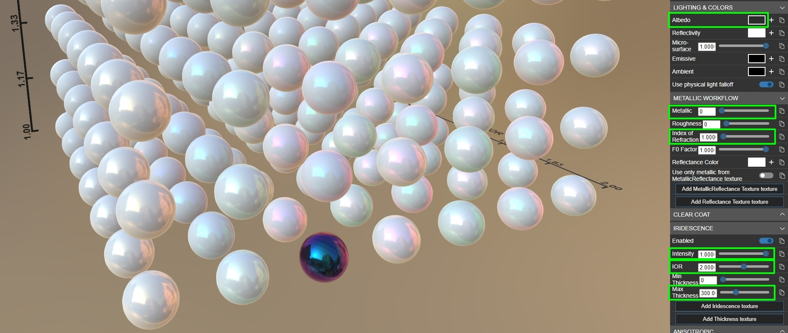
 _Adjusting material values in the [Babylon.js Sandbox](https://sandbox.babylonjs.com/)._

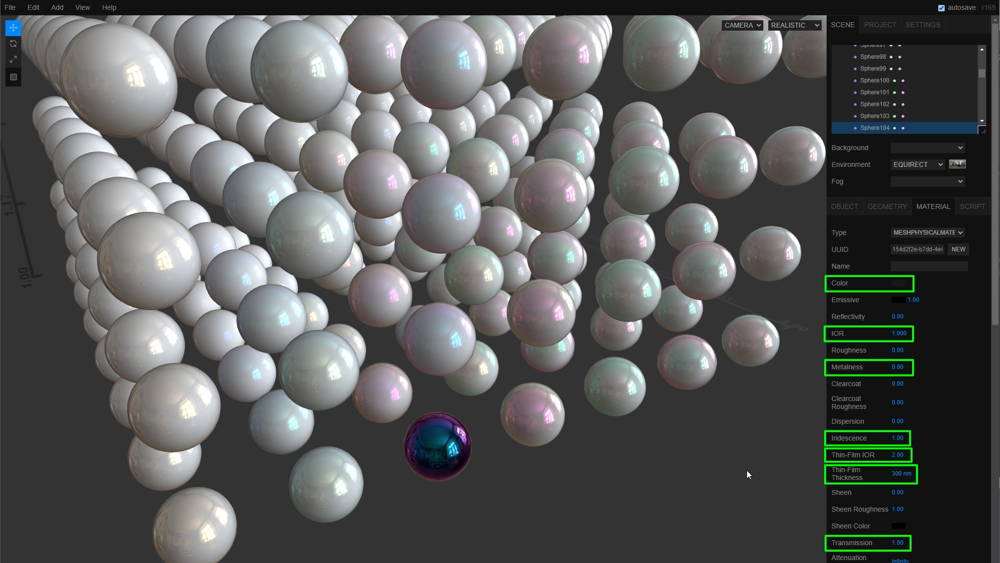
 _Adjusting material values in the [three.js Editor](https://threejs.org/editor/)._

To figure out which values to use, the sample asset can be opened in a glTF editor like the [Babylon.js Sandbox](https://sandbox.babylonjs.com/) or the [three.js Editor](https://threejs.org/editor/). The sphere with the nearest colors can be picked, and its material adjusted. The following values were determined through visual experimentation:

* `baseColorFactor`: 0.1
* `metallicFactor`: 0.0
* `ior`: 1.0 
* `iridescenceFactor`: 1.0
* `iridescenceIor`: 2.0
* `iridescenceThicknessMaximum`: 300
* `transmissionFactor`: 1.0

These values can then be input into the asset's material to achieve the desired iridescence effect.

## Texture Coordinates

Only the earhooks use a texture, to place the Khronos Group logos there. The logos have been packed into a single texture, because this reduces the number of materials needed which improves performance. 

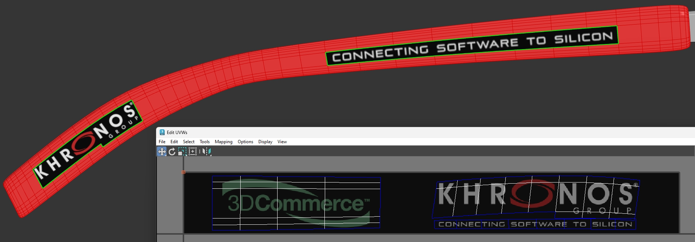
 _Texture coordinates in 3ds Max._

Homogeneous texture coordinates are only assigned to the polygons where the logos are displayed. All the other polygons (marked here in red) are collapsed to a single coordinate point (upper left corner in the editor) to reduce texture coordinate data for the unmapped vertices... they only need a solid color, so an unused corner of the texture works fine.  

Only the earhook meshes need texture coordinates. Because unused data increases the file size, it is best to remove unused texture coordinates from meshes that don't need them. All the meshes except the earhooks have had their texcoord data removed.

The [glTF Validator](https://github.khronos.org/glTF-Validator/) can be used to identify when there are unused texcoords in an asset.

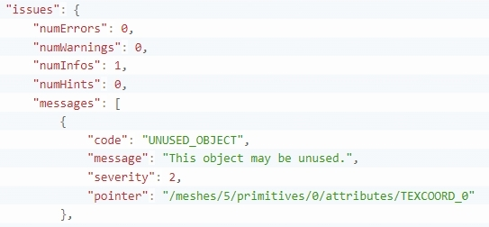
 _Output from the glTF Validator, showing unused texture coordinates._

3ds Max was used to create the asset; it includes the Map Channel Info tool for examining and removing unwanted mesh data.

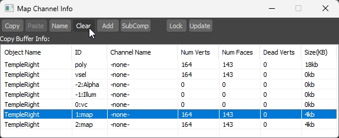
 _The Map Channel Info tool in 3ds Max can remove unused texture coordinates._

## Export, Conversion, and Optimization

Materials were created using [Autodesk 3ds Max](https://www.autodesk.com/products/3ds-max/overview) and [Chaos V-Ray](https://www.chaos.com/vray/b), then the tool [RapidPipeline DCC Importer](https://docs.rapidpipeline.com/docs/componentDocs/DccImporter/dcc-importer-overview) was used to convert from V-Ray into glTF. This allows the asset to be used both for offline V-Ray rendering, and also allows it to be automatically optimized for real-time WebGL rendering.

Copyright metadata was added using [Microsoft Visual Studio Code](https://code.visualstudio.com) with the [Cesium glTF Tools Extension](https://marketplace.visualstudio.com/items?itemName=cesium.gltf-vscode).

After conversion, the resulting glTF was then optimized with [RapidPipeline 3D Processor](https://docs.rapidpipeline.com/docs/componentDocs/3dProcessor/3d-processor-overview) to compact the data by removing unneeded information. In this case no decimation was required since the model uses only 13,396 triangles. 

A variant with lossy compression was created with another run of RapidPipeline 3D Processor, applying Draco geometry compression and WebP texture compression. This compressed the glTF from 371,212 bytes down to 63,146 bytes, a 83% reduction in size.

## Legal

&copy; 2024, Darmstadt Graphics Group GmbH. [CC BY 4.0 International](https://creativecommons.org/licenses/by/4.0/legalcode)

 - Eric Chadwick for Model and textures and all images in the README.md

&copy; 2015, Khronos Group. [Khronos Trademark or Logo]()

 - Non-copyrightable logo for Khronos logo

&copy; 2017, Khronos Group. [Khronos Trademark or Logo]()

 - Non-copyrightable logo for 3D Commerce logo

#### Assembled by modelmetadata