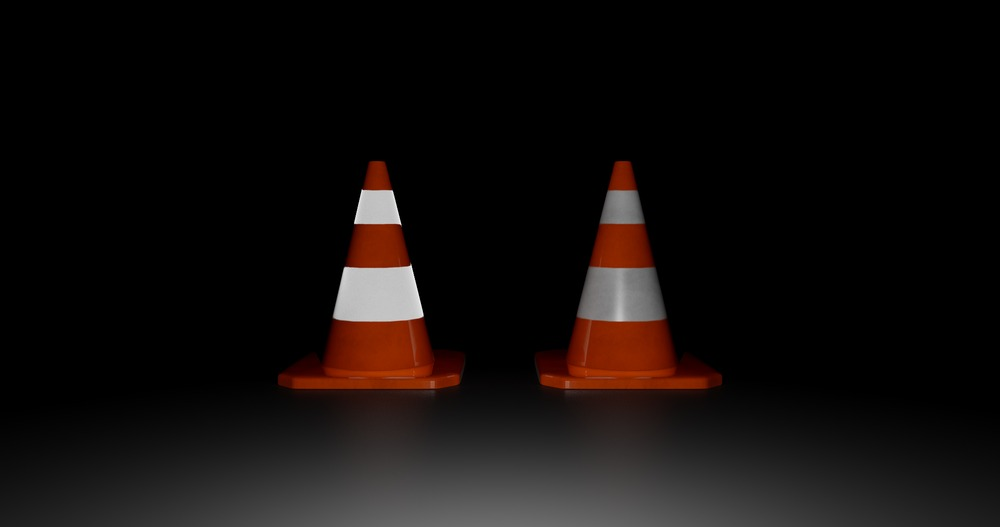

# Traffic Cone

<!-- This file is auto-generated by modelmetadata. Do not edit by hand. -->

## Tags

[extension](../Models-extension.md)

## Extensions Used

* KHR_lights_punctual
* KHR_materials_retroreflection
* KHR_materials_specular

## Summary

A traffic cone demonstrating the KHR_materials_retroreflection extension, which simulates materials that reflect light back toward its source.

## Operations

* [Display](https://github.khronos.org/glTF-Sample-Viewer-Release/?model=https://raw.githubusercontent.com/KhronosGroup/glTF-Sample-Assets/main/./Models/TrafficCone/glTF/TrafficCone.gltf) in SampleViewer
* [Model Directory](./)

## Screenshot

(above) Screenshot from [vk_gltf_renderer](https://github.com/nvpro-samples/vk_gltf_renderer/) showing the traffic cone with retroreflection enabled (left) and without (right).

## Description

This is a test model for the [KHR_materials_retroreflection](https://github.com/KhronosGroup/glTF/tree/main/extensions/2.0/Khronos/KHR_materials_retroreflection) extension. The asset is a traffic cone originally created by [hinndia](https://sketchfab.com/hinndia) on Sketchfab ([original model](https://sketchfab.com/3d-models/traffic-cone-573feef839d7450cb3e12da9986e7a98), [CC BY 4.0](https://creativecommons.org/licenses/by/4.0/)), adapted to demonstrate the extension.

The scene contains two identical cones placed side by side on a dark ground plane. The left cone uses `KHR_materials_retroreflection` while the right cone uses the same material without the extension, allowing a direct visual comparison of the retroreflection effect.

## Retroreflection

Retroreflection is the property of a surface that reflects light back toward its source, rather than scattering it in all directions. This effect is commonly seen in road signs, safety vests, and traffic cones, where highly visible markings are needed at night under vehicle headlights.

The `KHR_materials_retroreflection` extension adds this physically-based behavior to glTF materials. The extension uses a `retroreflectionFactor` scalar and an optional `retroreflectionTexture` to control the blend weight and spatial variation of the retroreflective response.

In this asset, the white reflective bands on the cone use a `retroreflectionTexture` to mask the retroreflective regions, so only the bands — not the entire cone — exhibit retroreflection.

## Materials and the role of `KHR_materials_specular`

Both cones share the same physically-based material: `metallicFactor` is `0` (the cone is a dielectric plastic) and the dielectric reflectance is raised through `KHR_materials_specular`. The two materials are identical; the left cone simply adds `KHR_materials_retroreflection`, which keeps the retroreflection as the single variable being demonstrated.

`KHR_materials_retroreflection` is based on the Minimal Retroreflective Microfacet (MRM) model, which produces retroreflection by redirecting the material's **specular** lobe back toward the light. The brightness of the effect is therefore the material's specular reflectance, and `retroreflectionFactor` only blends between the ordinary and retroreflective lobes — it is not an intensity control. A plain dielectric reflects only about 4% of the light (F0 ≈ 0.04), so the retroreflective return is almost invisible, whereas real retroreflective sheeting (glass-bead or corner-cube) returns far more.

For this reason the reflective tape is given an elevated dielectric reflectance with `KHR_materials_specular` (`specularColorFactor` of `4`, giving F0 ≈ 0.16) rather than by raising `metallicFactor`, which would be non-physical. `specularColorFactor` values above 1 are explicitly permitted for this purpose; the resulting F0 is clamped to 1 so the material stays energy-conserving.

The scene is lit by a single `KHR_lights_punctual` point light placed just in front of the cones, near the camera. Retroreflection peaks when the light and view directions are aligned, so this headlight-like placement is what makes the bands light up — move the light away from the camera and the effect fades.

## Legal

&copy; 2024, hinndia. [Creative Commons Attribution 4.0 International](https://creativecommons.org/licenses/by/4.0/legalcode)

 - hinndia for Everything

<!-- This file is auto-generated by modelmetadata. Do not edit by hand. -->
