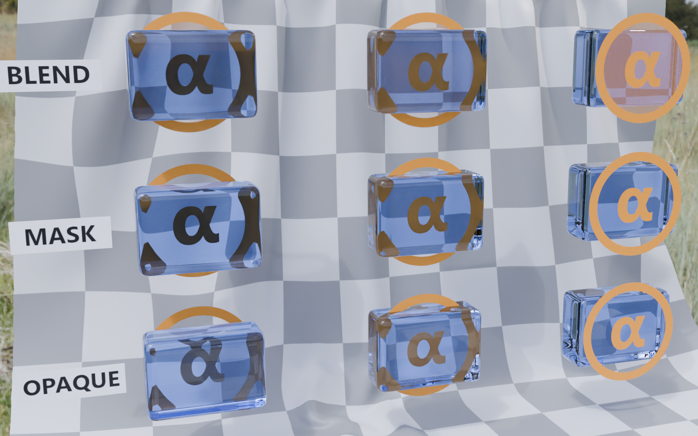

## Screenshot

## Description

This model tests the interactions between blend modes and transmission.  Along the upper row, the $\alpha$ symbol appears on an orange material using `"alphaMode" : "BLEND"`, and along the lower row, the same symbol appears using `"alphaMode" : "MASK"`.  Each test area also features a small blue gem that uses the `KHR_materials_transmission` and `KHR_materials_volume` glTF extensions.  In the left column, the symbol appears behind the gem.  In the center column, the symbol is embedded, intersecting the gem.  In the right column, the symbol appears in front of the gem.

## Path Tracers

When full path tracing is available, one can expect the $\alpha$ symbol to appear correctly relative to the blue gem.  Compare this to the real-time rendered screenshot at the top of this document, where the right-most column shows echos of the symbol being refracted in the gem behind it.

## Missing Alpha Blend

In some real-time engines, the $\alpha$ symbol may appear to be missing from the blue gems across the top row (left and center columns, top row).  This may be the result of choices in the engine related to how the different render passes are ordered.

There's some informal conversation about this in the glTF Sample Viewer source code, under Git commit [`f4cd6b11`](https://github.com/KhronosGroup/glTF-Sample-Viewer/commit/f4cd6b11de9787db0cd35c06dfa46be7b5440aab).  The rendering strategy outlined there suggests that alpha-blended materials should be rendered after opaque materials, and included in the "opaque" render texture.  After the opaque and alpha-blend passes are done, the finished texture is used as a screen-space lookup texture for objects using transmission, such as the blue gems shown here.  The alpha-blended materials must be present in that texture in order for the symbols to be visible through the gems.  Of course, all of this is an imperfect approximation when compared to full path tracing as shown in the previous section above.

Note also that the bottom row shows that alpha masked materials did not disappear in this example.  Alpha masking allows the object with the $\alpha$ symbol to be considered opaque, and so is included in the texture lookup for the gems.  This corrects the bottom-left and bottom-center gems, but returns the familiar problem with the bottom-right gem where echos of an object placed in front of the gem have appeared refracted within the gem.  There's no perfect solution here with this kind of rendering, and it's likely that full ray-tracing or path tracing will be needed to completely solve it.
