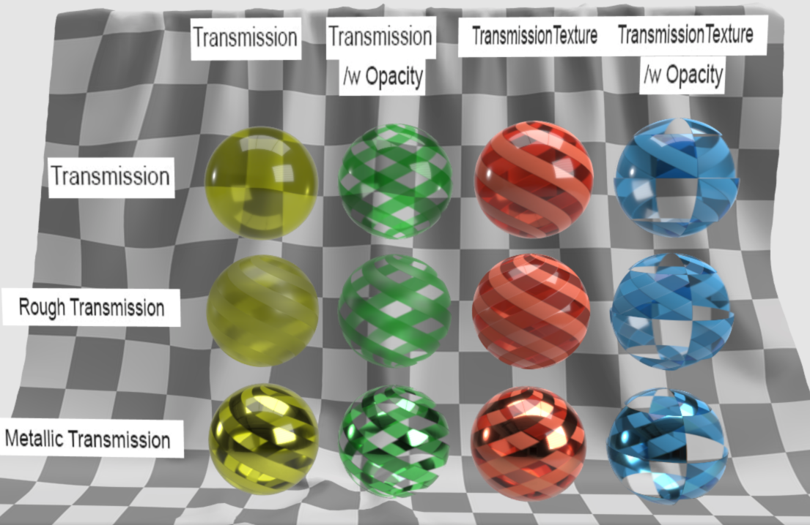

# Transmission Test

## Tags

[testing](../../Models-testing.md), [extension](../../Models-extension.md)

## Extensions Used

* KHR_materials_transmission
* KHR_xmp

## Summary

Tests if the KHR_materials_transmission extension is supported properly.

## Operations

* [Display](https://github.khronos.org/glTF-Sample-Viewer-Release/?model=https://raw.GithubUserContent.com/KhronosGroup/glTF-Sample-Assets/main/./Models/TransmissionTest/glTF-Binary/TransmissionTest.glb) in SampleViewer
* [Download GLB](https://raw.GithubUserContent.com/KhronosGroup/glTF-Sample-Assets/main/./Models/TransmissionTest/glTF-Binary/TransmissionTest.glb)
* [Model Directory](./)

## Screenshot

## Description

This model demonstrates the usage of the `KHR_materials_transmission`. The grid of spheres demonstrate different combinations of uniform transmission and textured transmission and how they should render in conjunction with opacity (`baseColor.a`) and surface roughness/metalicity.

## Legal

&copy; 2020, Public. [CC0 1.0 Universal](https://creativecommons.org/publicdomain/zero/1.0/legalcode)

 - Adobe for Everything

#### Assembled by modelmetadata