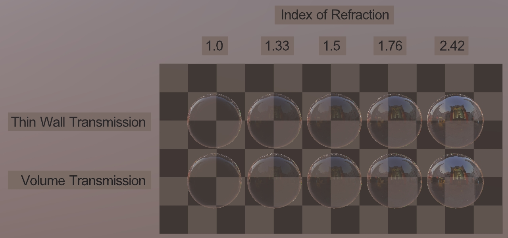

## Screenshot

 _Screenshot from [glTF Sample Viewer](https://github.khronos.org/glTF-Sample-Viewer-Release/)._

## Description

This asset tests the differences in index of refraction between thin-wall and volumetric transmission, using extensions [KHR_materials_ior](https://github.com/KhronosGroup/glTF/tree/main/extensions/2.0/Khronos/KHR_materials_ior), [KHR_materials_transmission](https://github.com/KhronosGroup/glTF/tree/main/extensions/2.0/Khronos/KHR_materials_transmission), and [KHR_materials_volume](https://github.com/KhronosGroup/glTF/tree/main/extensions/2.0/Khronos/KHR_materials_volume). The top row of spheres omits the volume extension to cause thin-wall behavior.

The spheres in the bottom row are 2m in diameter with a volume `thicknessFactor` of 1m, to approximate an average thickness through each volume.