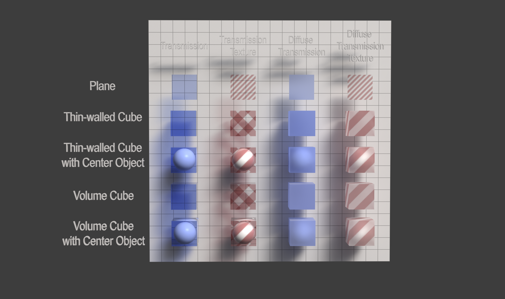
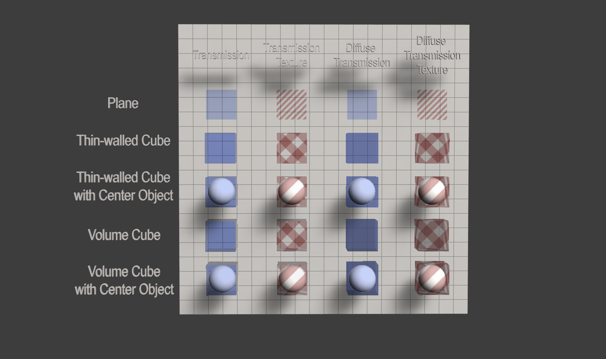

## Screenshot

 _Screenshot from [Adobe Substance 3D Stager](https://www.adobe.com/products/substance3d/apps/stager.html)._

 _Screenshot from [Babylon.js](https://www.babylonjs.com/)._

## Description

This asset tests the surface-tinting functionality of the [KHR_materials_transmission](https://github.com/KhronosGroup/glTF/tree/main/extensions/2.0/Khronos/KHR_materials_transmission) and [KHR_materials_diffuse_transmission](https://github.com/KhronosGroup/glTF/tree/main/extensions/2.0/Khronos/KHR_materials_diffuse_transmission) extensions used in conjunction with thin-walled meshes as well as volumetric (with the [KHR_materials_volume](https://github.com/KhronosGroup/glTF/tree/main/extensions/2.0/Khronos/KHR_materials_volume) extension).
