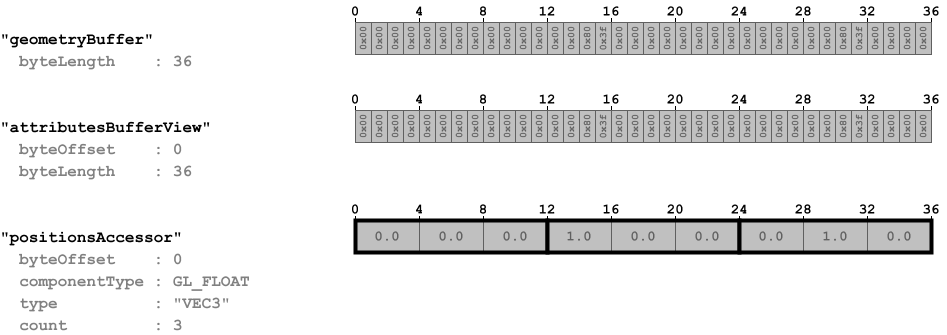

## Screenshot

## Description

Simple collection of explicit triangles. It is similar to the asset that is described in the
[Minimal glTF File](https://github.com/KhronosGroup/glTF-Tutorials/blob/master/gltfTutorial/gltfTutorial_003_MinimalGltfFile.md)
section of the glTF tutorial, but without any index information.

## Data layout

The following image shows the data layout of this sample:

