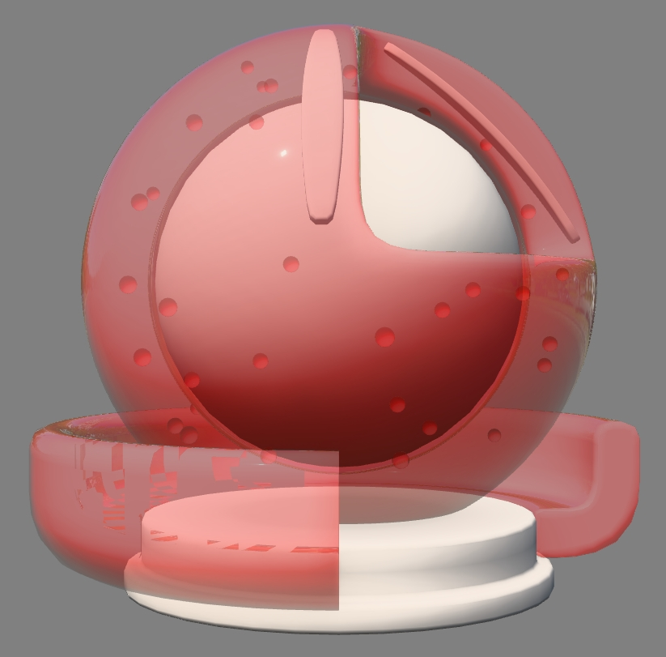
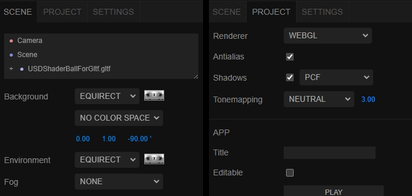
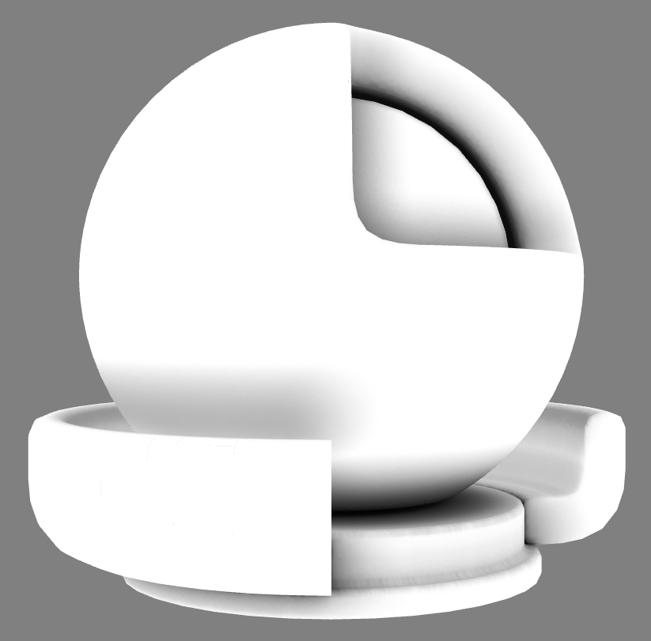
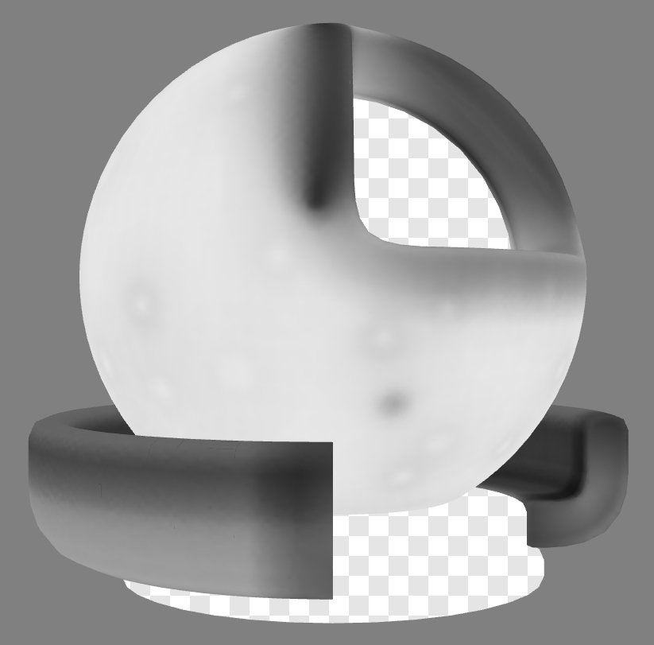

# USD Shader Ball for glTF

<!-- This file is auto-generated by modelmetadata. Do not edit by hand. -->

## Tags

[showcase](../Models-showcase.md), [extension](../Models-extension.md)

## Extensions Used

* KHR_materials_transmission
* KHR_materials_volume

## Summary

USD Shader Ball converted for glTF

## Operations

* [Display](https://github.khronos.org/glTF-Sample-Viewer-Release/?model=https://raw.GithubUserContent.com/KhronosGroup/glTF-Sample-Assets/main/./Models/USDShaderBallForGltf/glTF-Binary/USDShaderBallForGltf.glb) in SampleViewer
* [Download GLB](https://raw.GithubUserContent.com/KhronosGroup/glTF-Sample-Assets/main/./Models/USDShaderBallForGltf/glTF-Binary/USDShaderBallForGltf.glb)
* [Model Directory](./)

## Screenshot

 _Screenshot from [three.js editor](https://threejs.org/editor/) with the environment Studio Neutral, "Realistic" (pathtraced) versus "Solid" (rasterized)._

 _Environment lighting settings were adjusted in the three.js editor, to match the lighting as seen in the [glTF Sample Viewer](https://github.khronos.org/glTF-Sample-Viewer-Release/)._

## Description

This is an adaptation and conversion of the [USD Standard Shader Ball](https://github.com/usd-wg/assets/tree/main/full_assets/StandardShaderBall) asset. The readme for the original asset has a wealth of information about the decisions made for how it was constructed, well worth a read.

## Alterations

Various adjustments were made to the original USD asset, for optimal use with glTF real-time rendering scenarios:
 - The floor, lights, and camera were removed. 
 - The shader ball meshes were edited to create a more even amount of subdivision. 
 - One of the sss_bars was adjusted to avoid interpenetration with the outer "material" surface. 
 - One of the bubbles was moved to avoid penetrating the inner "core" surface. 
 - UVs were adjusted on the outer material ball to reduce seams, by attaching an isolated UV island on the rear, and relaxing the result.
 - An ambient occlusion texture was baked for the outer material ball. 
 - A "thickness" texture was created for use with [KHR_materials_volume](https://github.com/KhronosGroup/glTF/blob/main/extensions/2.0/Khronos/KHR_materials_volume/README.md#khr_materials_volume), by inverting the normals of the outer material ball mesh, then baking an ambient occlusion texture. This creates something similar to a thickness texture.
 - UVs were created for the "core" and "base" meshes, and a shared ambient occlusion texture was baked for these two meshes.

 _Ambient occlusion textures shown on the 3d model._

 _Thickness texture shown on the 3d model._

## Alpha Sorting
The triangles for the red "material" surface were re-ordered to improve alpha sorting, by detaching and re-attaching chunks of triangles. 

This was done to force them to be drawn in the order they would most likely be drawn for alpha blending by a real-time rasterizer renderer, from far to near. 

The inside surface of the red ball was assigned the first set of triangle numbers, then the 3/4-circle base, then the bubble voids, then finally the outer surface of the red ball. 

## Materials

The material ball features two materials, one for the outer "material" surface which is meant to be replaced with whatever material is desired, and the other for the inner surfaces which use a fully-rough and 18%-gray material.

The outer "material" surface has been assigned a material with [KHR_materials_transmission](https://github.com/KhronosGroup/glTF/blob/main/extensions/2.0/Khronos/KHR_materials_transmission/README.md#khr_materials_transmission-) and [KHR_materials_volume](https://github.com/KhronosGroup/glTF/blob/main/extensions/2.0/Khronos/KHR_materials_volume/README.md#khr_materials_volume). The `thicknessFactor` was set to 1cm to match the thickest parts of the surface. The attenuationColor and attenuationDistance were adjusted to look similar to the USD glass renders.

A flat normal map was added to both materials, to force the generation of tangents since they may be needed by subsequent materials. 

The occlusionTexture strength has been set to 0.5 for both materials; this can be adjusted as needed for subsequent materials.

## Editing and Export

The USD asset was edited using [Autodesk 3ds Max](https://www.autodesk.com/products/3ds-max/overview), exported with [Hayashi Satoshi glTF exporter](https://nu1963u.wixsite.com/custom3dsmax/gltfpluginfor3dsmax), then tangents were generated using [glTF Editor](https://www.gltfeditor.com/), and the asset was iterated until all warnings were fixed to get a clean report from the [glTF Validator](https://github.khronos.org/glTF-Validator/).

## Legal

&copy; 2026, Eric Chadwick. [CC BY 4.0 International](https://creativecommons.org/licenses/by/4.0/legalcode)

 - Geometry and textures: Chris Rydalch; original specification and validation: André Mazzone; original scene, inspiration and consultation: Thomas Anagnostou; glTF conversion: Eric Chadwick for Model and textures and all images in the README.md

<!-- This file is auto-generated by modelmetadata. Do not edit by hand. -->
