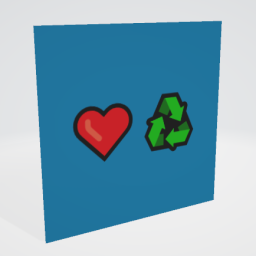

# Unicode❤♻Test

## Tags

[core](../../Models-core.md), [testing](../../Models-testing.md)

## Summary

A sample with Unicode characters in file, material, and mesh names

## Operations

* [Display](https://github.khronos.org/glTF-Sample-Viewer-Release/?model=https://raw.GithubUserContent.com/KhronosGroup/glTF-Sample-Assets/main/./Models/Unicode❤♻Test/glTF-Binary/Unicode❤♻Test.glb) in SampleViewer
* [Download GLB](https://raw.GithubUserContent.com/KhronosGroup/glTF-Sample-Assets/main/./Models/Unicode❤♻Test/glTF-Binary/Unicode❤♻Test.glb)
* [Model Directory](./)

## Screenshot

## Description

Sample glTF model where everything contains Unicode characters:

- Main file name.
- Binary file name.
- Texture file name.
- Material name.
- Mesh name.

## Legal

&copy; 2017, Public. [CC0 1.0 Universal](https://creativecommons.org/publicdomain/zero/1.0/legalcode)

 - Viktor Kovács for Everything

#### Assembled by modelmetadata