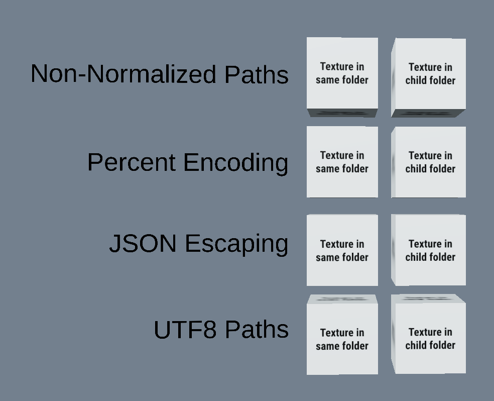
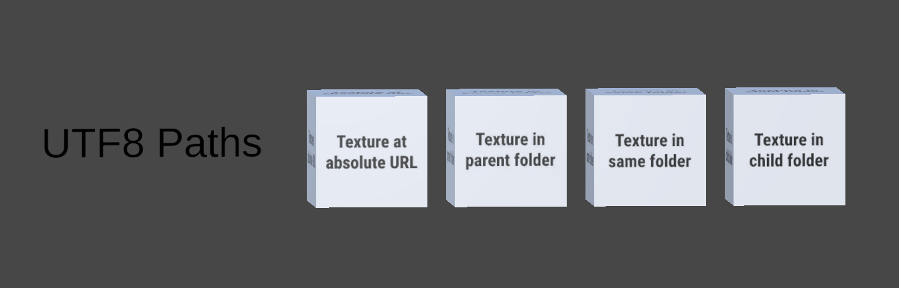

## Screenshots

  

## Description

This asset demonstrates allowed usage of URIs in glTF.

- URIs using percent encoding
- URIs using JSON-string escaping
- URIs using utf8 paths
- URIs pointing at child folders
- URIs pointing at parent folders

According to the glTF spec, these URI types MAY be supported:
- http:// or https:// URIs pointing at absolute paths
- Non-normalized URIs

See [glTF-2.0#uris](https://registry.khronos.org/glTF/specs/2.0/glTF-2.0.html#uris) for more information.

## Creation Details

The asset was created using [UnityGLTF](https://github.com/KhronosGroup/UnityGLTF), and the files were edited in [Visual Studio Code](https://code.visualstudio.com/) with [glTF Tools](https://github.com/AnalyticalGraphicsInc/gltf-vscode#gltf-tools-extension-for-visual-studio-code).