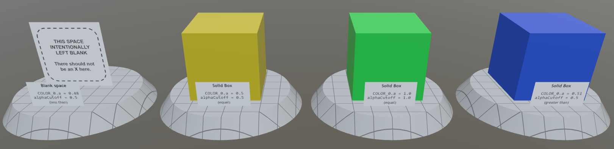
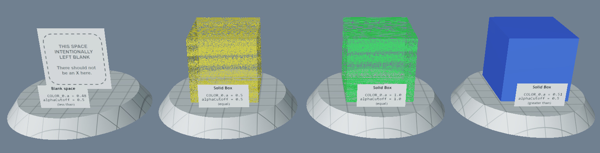
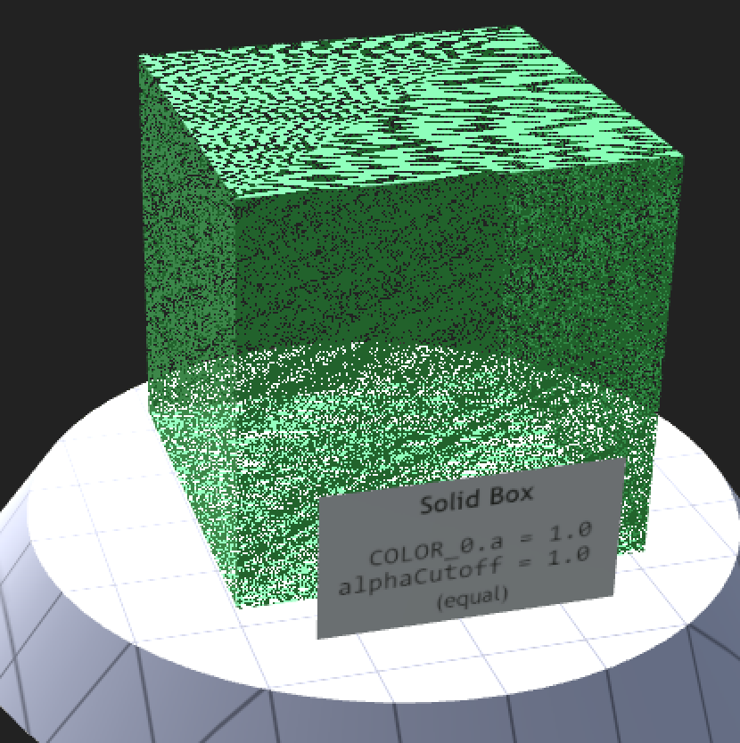
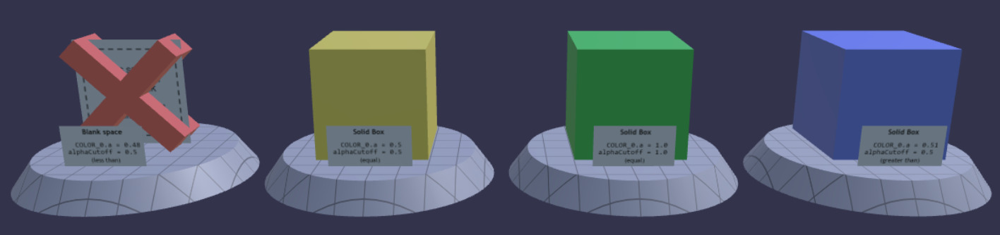
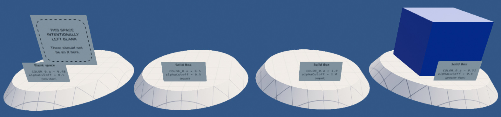

## Screenshot



## Description

This model tests what happens when vertex colors contain alpha values and a material uses `alphaCutoff`.  The above screenshot shows what this model looks like when the test passes.

## Common Problems

### Problem: Noisy alpha clipping



The two middle cubes (yellow and green) show a lot of fragment noise in the above screenshot. Here's a zoomed-in view to show detail on the green cube:



The exact reason this noise is present can vary by rendering engine implementation.  One possibile cause may be a comparison of a float without an epsilon.  The `COLOR_0` vertex colors here include alpha values, and in the case of this third sample with the green cube, the alpha values are all `1.0`. These values pass through the vertex shader and on to rasterization.  The rasterizer linearly interpolates between vertices, and the result at any one fragment may be the sum of fractional values that are intended to add up to `1.0`.  But on some fragments, the sum is not exact, and an exact test against a perfect `1.0` value has some chance of failure.

The use of `"alphaCutoff": 1.0` in the cube's material will punch holes in the cube wherever there are fragments that don't sum up completely.  One possible fix is to add a small epsilon to `alphaCutoff` in the shader.

### Problem: No alpha mask



The above screenshot shows a renderer that is not doing any alpha masking against vertex color alpha values.  In this case, a large red "X" appears over the left-most sample that is intended to be left blank.  This indicates a test failure.

### Problem: Incorrect alpha comparison



In the above screenshot, the two middle cubes are missing, indicating that when the alpha value exactly matches the `alphaCutoff`, the result is clipped.

The glTF specification [Alpha Coverage section](https://registry.khronos.org/glTF/specs/2.0/glTF-2.0.html#alpha-coverage) has this to say:

> When `alphaMode` is set to `MASK` the `alphaCutoff` property specifies the cutoff threshold. If the alpha value is greater than or equal to the `alphaCutoff` value then it is rendered as fully opaque, otherwise, it is rendered as fully transparent.

The specification makes special mention of the equality case presented here by the two middle cubes in yellow and green.  They should be rendered fully opaque.  So a rendering similar to the above screenshot with the missing middle cubes is a test failure.

Here too, adding a small epsilon to `alphaCutoff` during load or render of a glTF may be enough to fix the problem.

## Label Text

In case the text on the labels is hard to read or needs translation, it is reproduced below:

### Far left sample

```
THIS SPACE INTENTIONALLY LEFT BLANK

There should not be an X here.
```

```
   Blank space
  COLOR_0.a = 0.48
alphaCutoff = 0.5
   (less than)
```

### Second sample, yellow box

```
   Solid Box
  COLOR_0.a = 0.5
alphaCutoff = 0.5
   (equal)
```

### Third sample, green box

```
   Solid Box
  COLOR_0.a = 1.0
alphaCutoff = 1.0
   (equal)
```

### Far right sample, blue box

```
   Solid Box
  COLOR_0.a = 0.51
alphaCutoff = 0.5
  (greater than)
```

