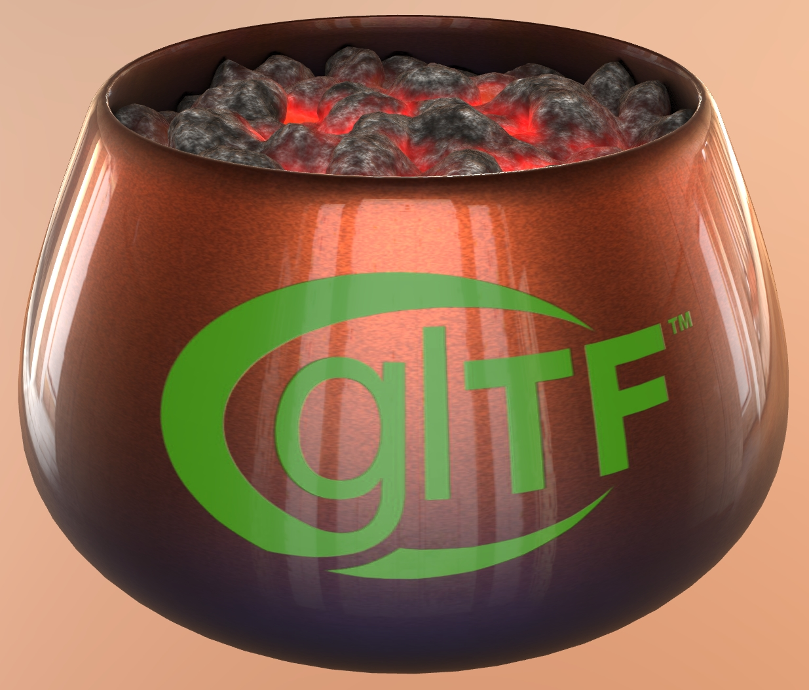

## Screenshot

 _Screenshot from [glTF Sample Viewer](https://github.khronos.org/glTF-Sample-Viewer-Release/) with the environment Dining Room and the Exposure set to 4._

 _Additional views of the asset, from the rear and from below._

## Description

This asset represents a copper pot using emissive for glowing hot coals, coated with a clearcoat layer on the exterior, and including the glTF and Khronos Group and DGG logos. 

The textures are compressed with JPEG to reduce file size, but the normal bump texture for the copper pot has been kept in PNG format to preserve the emboss details around the logos.
