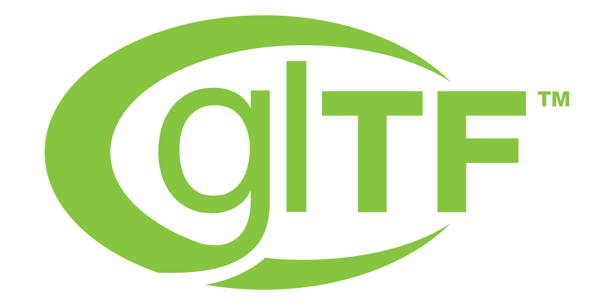

# Pull Request Review Process

## Status

This document is a working draft maintained by the Khronos 3D Formats Tooling TSG. It is being kept separate from [CONTRIBUTING.md](CONTRIBUTING.md) while the checks and tooling it describes are implemented and refined. Once that work is complete, this content is intended to be merged into that guide. Several sections below are marked **Open Item** where the TSG has not yet reached a final decision.

## Review Responsibility

* Assets created by, or submitted in support of, a specific Khronos Technical Sub Group (TSG) should be reviewed and approved by that TSG.
  * A member of the sponsoring TSG may merge the PR directly once it is approved, if they have the necessary repository permissions.
* Assets without a specific TSG affiliation follow the general community review process described in [CONTRIBUTING.md](CONTRIBUTING.md).

## Draft Pull Requests

Reviewers should not evaluate a PR for approval while the contributor is still working on it. Use GitHub's built-in "Draft" pull request state to mark work that is not yet ready for review; convert the PR to "Ready for review" once it is complete.

**Open Item:** a convention for identifying and labeling PRs that predate adoption of this practice has not yet been finalized.

## Automated Formatting Checks

Contributions include both Markdown documentation (model `README.body.md` files) and glTF asset content. To keep review focused on substantive issues, checks are split into two tiers:

### Tier 1 — Automatically corrected

Issues that can be fixed mechanically, with no judgment required, are corrected automatically rather than left for the contributor to fix by hand. Examples include:

* Trailing whitespace
* Missing or inconsistent end-of-line / terminal newline formatting

These checks run on every push to a PR (and on pushes to forks with GitHub Actions enabled), so contributors can see the result before or shortly after opening a PR. Where these are surfaced at all, they appear as non-blocking warnings, not failures — they should not block a PR from being merged.

### Tier 2 — Requires human judgment

Issues that cannot be safely auto-corrected are flagged explicitly and **block merge** until resolved by the contributor or a reviewer. Examples include:

* Broken links
* Invalid internal anchors/references

The specific set of glTF-level content checks (for example, handling of the `extras` field) has not yet been defined; until then, these are reviewed and addressed case-by-case by reviewers rather than checked automatically.

The initial implementation of these checks is based on scripts already in use in the glTF-Community repository (see [KhronosGroup/glTF#2645](https://github.com/KhronosGroup/glTF/pull/2645)); a related PR has begun applying formatting fixes in this repository, but the automated checks themselves have not yet been ported here.

**Open Item:** whether auto-correction runs pre-merge (via bot commit to the PR branch) or post-merge (via bot commit directly to `main`) has not yet been decided.

## Content Conditions

Some conditions on submitted content require a documented decision before they can be enforced. Any such condition should be filed as a GitHub issue against this repository so it can be tracked and discussed individually rather than folded into this process document. Known conditions under discussion include:

* Use of AI-generated or significantly AI-processed images (textures, screenshots) in submitted assets.
* Enforcing an authentic "screenshot chain" — i.e., that a model's catalog screenshot is an unmodified capture of the actual glTF asset being submitted, not a rendering from another source.

## Relationship to the glTF-Community Repository

The glTF-Community repository will follow the same two-tier framework described above (auto-corrected vs. blocking), but with its own rule set appropriate to vendor extension submissions. Those rules are tracked and discussed separately from this document.

## Open Items / Next Steps

* Finalize the draft-PR labeling convention for pre-existing PRs.
* Define glTF-level (non-Markdown) content checks, starting with the `extras` field.
* Decide whether Tier 1 auto-correction commits to the PR branch or to `main` post-merge.
* File and resolve GitHub issues for the content conditions listed above (AI-generated imagery, screenshot chain enforcement).
* Port the Tier 1/Tier 2 formatting checks from the glTF-Community repository into this repository's CI.
* Merge this document into `SubmittingModels.md` once the above items are resolved.

---
&copy; 2026, The Khronos Group. Licensed as CC-BY 4.0 International
